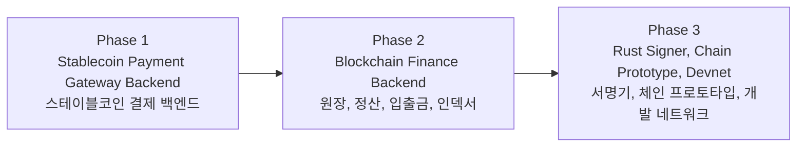
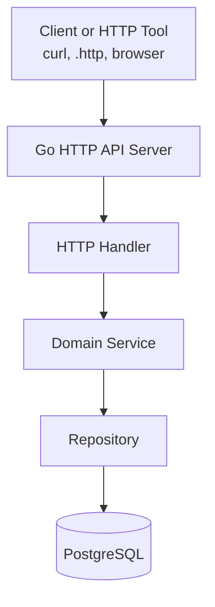
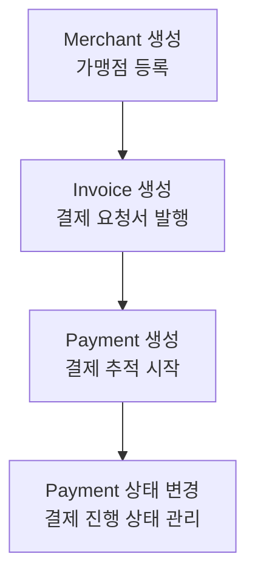
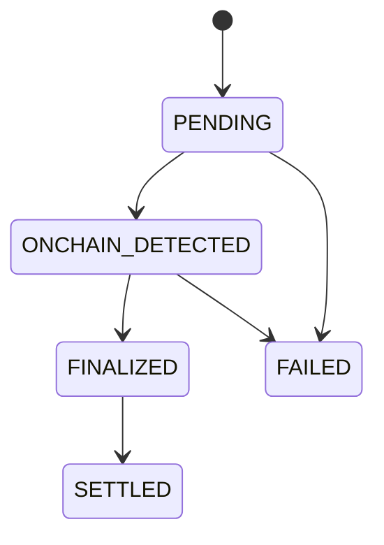
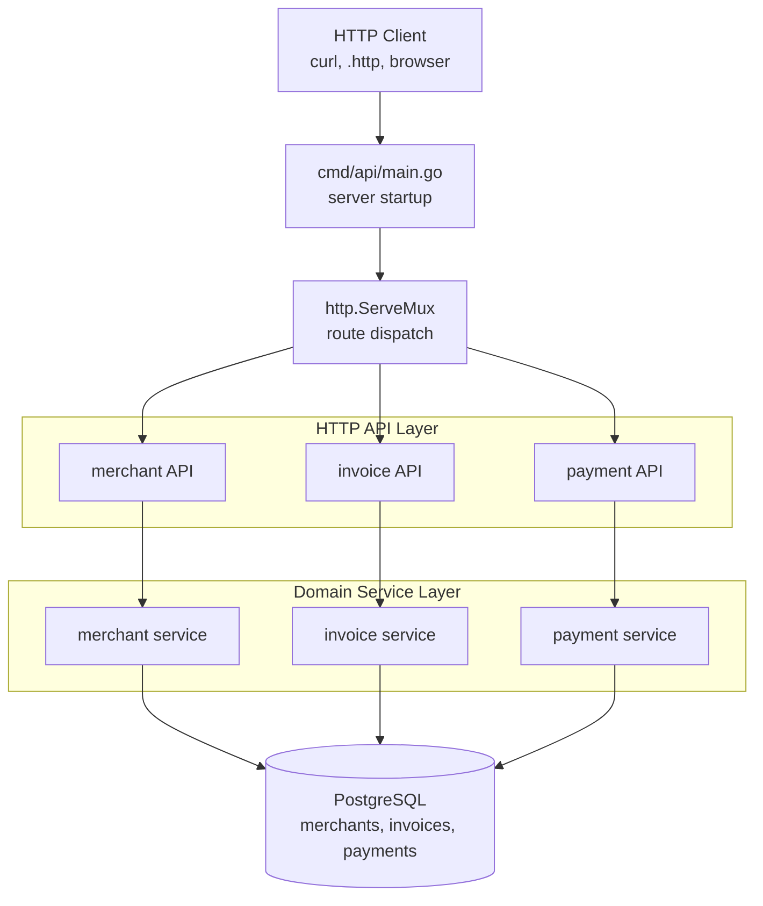
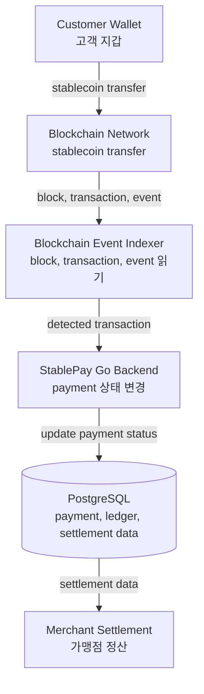
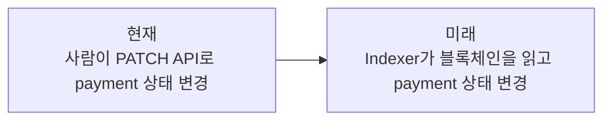
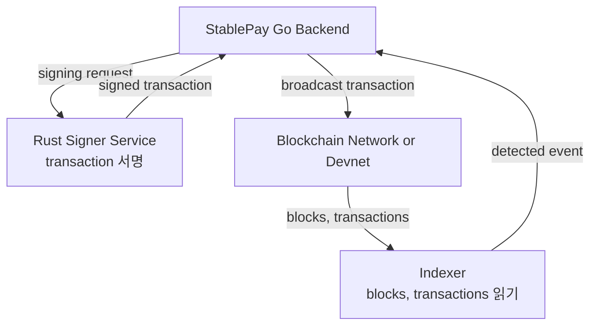
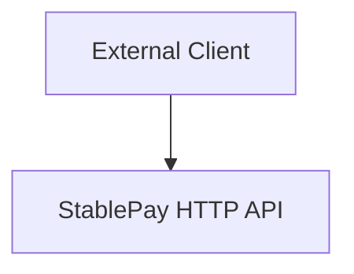

# Target Architecture

이 문서는 `2030 KOREA StablePay Network`가 어떤 방향으로 확장될 프로젝트인지 설명한다.

중요한 기준은 두 가지다.

1. 현재 구현된 Phase 1 범위를 명확히 설명한다.
2. 앞으로 확장할 Phase 2, Phase 3 범위를 현재 구현과 분리해서 설명한다.

즉, 이 문서는 "이미 다 만들었다"는 문서가 아니라 "지금은 어디까지 만들었고, 다음에는 어떤 구조로 확장할 것인가"를 보여주는 문서다.

## 전체 목표

이 프로젝트의 장기 목표는 스테이블코인 결제를 처리할 수 있는 백엔드 시스템에서 시작해, 이후 자체 네트워크와 코인 생태계를 이해하고 구현할 수 있는 기반을 만드는 것이다.

단계는 다음처럼 나눈다.



각 단계의 의미:

```text
Phase 1
= 가맹점이 결제 요청서를 만들고, 결제 상태를 관리하는 Go 백엔드

Phase 2
= 온체인 이벤트 인덱싱, 원장, 정산, 입출금, 지갑 보안을 다루는 블록체인 금융 백엔드

Phase 3
= Rust로 서명기, 체인 프로토타입, 개발 네트워크를 실험하는 네트워크/코인 영역
```

## 현재 구현된 구조

현재 구현은 Phase 1 MVP다.



현재 구현된 주요 흐름:



현재 Payment 상태 흐름:



실패 흐름은 `PENDING` 또는 `ONCHAIN_DETECTED` 상태에서 `FAILED`로 이동하는 경우다.

현재는 실제 블록체인 RPC와 연결되어 있지 않다.

따라서 `ONCHAIN_DETECTED`, `FINALIZED` 같은 상태는 API 호출로 직접 변경한다. 미래에는 이 역할을 Blockchain Event Indexer가 자동으로 수행한다.

## 현재 패키지 경계

현재 Go 프로젝트 구조는 다음 의도를 가진다.

```text
cmd/api
= 실행 진입점

internal/httpapi
= HTTP 요청/응답 처리와 route 등록

internal/merchant
= 가맹점 도메인

internal/invoice
= 결제 요청서 도메인

internal/payment
= 결제 상태와 상태 전이 도메인

internal/platform/database
= PostgreSQL 연결 같은 기술 기반 코드

migrations
= DB schema 변경 기록

api
= 로컬에서 직접 API를 호출해보는 HTTP 예시

docs
= API, 아키텍처, 로드맵, 포트폴리오 설명 문서
```

이 구조는 Java/Spring에서 흔히 보는 `controller`, `service`, `repository`를 최상위 패키지로 모으는 방식과 조금 다르다.

Go에서는 프로젝트가 작고 명확할수록 도메인 단위 패키지를 먼저 만들고, 그 안에 service와 repository를 두는 방식이 자주 쓰인다.

```text
Java에서 자주 보는 방식

controller/
service/
repository/
domain/

Go에서 현재 프로젝트가 쓰는 방식

merchant/
  service.go
  repository.go
  merchant.go

invoice/
  service.go
  repository.go
  invoice.go

payment/
  service.go
  repository.go
  payment.go
```

이렇게 하면 `payment`와 관련된 규칙을 한 폴더에서 확인하기 쉽다.

## Phase 1 Runtime Architecture

현재 런타임 기준으로 보면 구조는 다음과 같다. 이 다이어그램은 현재 구현된 Phase 1 코드 기준이다.



`http.ServeMux`는 HTTP 요청을 알맞은 handler로 보내는 분배기다.

예를 들면:

```text
POST /merchants
-> merchant handler
-> merchant service
-> merchant repository
-> PostgreSQL
```

## Phase 2 Target Architecture

Phase 2에서는 API로 사람이 직접 payment 상태를 바꾸는 구조에서 벗어나, 온체인 이벤트를 읽어 payment 상태를 자동으로 변경하는 구조로 확장한다. 아래 다이어그램은 아직 구현된 구조가 아니라 목표 구조다.



Phase 2에서 추가될 주요 구성요소:

```text
Blockchain Event Indexer
= 블록체인 RPC를 통해 block, transaction, event를 읽고 결제 여부를 감지하는 컴포넌트

Ledger
= 돈의 이동을 이중 기록 방식으로 저장하는 원장

Settlement
= 가맹점에게 정산할 금액을 계산하고 정산 상태를 관리하는 기능

Deposit
= 사용자가 외부 지갑에서 시스템으로 자산을 입금하는 흐름

Withdrawal
= 사용자가 시스템에서 외부 지갑으로 자산을 출금하는 흐름

Wallet and Key Security
= 지갑 주소, 개인키, 서명 권한, 출금 승인 정책을 관리하는 영역
```

Phase 2의 핵심 변화:



## Phase 3 Target Architecture

Phase 3에서는 Rust를 이용해 블록체인에 더 가까운 영역을 다룬다. Go 백엔드는 운영 백엔드의 중심으로 두고, Rust는 서명기와 체인 실험 영역에 붙이는 방향이다.



이 구조에서 Rust Signer는 private key 보관과 transaction signing만 담당한다.
서명된 transaction을 블록체인 네트워크에 broadcast하고, 이후 tx hash를 추적하는 책임은 Go 백엔드와 worker 계층이 담당한다.

Rust를 사용하는 후보 영역:

```text
Rust Signer Service
= 개인키를 직접 다루고 transaction을 서명하는 독립 서비스

Rust Chain Prototype
= 자체 코인과 네트워크를 이해하기 위한 작은 체인 실험

Devnet Tooling
= 로컬 개발 네트워크 실행, 노드 관리, 테스트 트랜잭션 생성
```

Go와 Rust의 역할 분리:

```text
Go
= API 서버, 도메인 로직, DB 처리, 운영 백엔드, 외부 시스템 연동

Rust
= 서명, 저수준 네트워크/체인 실험, 성능과 메모리 안전성이 중요한 컴포넌트
```

이 프로젝트에서는 Go를 버리고 Rust로 전부 대체하기보다, Go 백엔드 위에 Rust 핵심 컴포넌트를 붙이는 전략을 우선한다.

그 이유는 다음과 같다.

```text
Go
= 실무 백엔드 생산성이 높고, API 서버와 운영 도구를 만들기 좋다.

Rust
= 러닝커브가 높지만, 서명기나 체인 코어처럼 안정성과 성능이 중요한 영역에서 강점이 크다.
```

## 데이터 저장 관점

현재 PostgreSQL은 다음 데이터를 저장한다.

```text
merchants
= StablePay를 사용하는 가맹점

invoices
= 가맹점이 고객에게 발행한 결제 요청서

payments
= invoice에 대한 결제 상태 기록
```

Phase 2에서 추가될 가능성이 높은 테이블:

```text
ledger_accounts
= 사용자, 가맹점, 시스템 계정

ledger_entries
= 돈의 증가/감소를 기록하는 원장 항목

deposits
= 입금 요청과 감지 결과

withdrawals
= 출금 요청, 승인, 서명, 전송 상태

blockchain_events
= 인덱서가 읽은 온체인 이벤트

wallets
= 관리 대상 지갑 주소

settlements
= 가맹점 정산 묶음
```

데이터 일관성의 핵심:

```text
Payment 상태
-> 실제 결제 진행 상태

Ledger entry
-> 돈의 이동 기록

Settlement
-> 가맹점에게 지급할 금액의 묶음
```

Payment가 `FINALIZED`가 되었다고 해서 바로 모든 처리가 끝난 것은 아니다.

`FINALIZED`는 블록체인 결제가 확정됐다는 의미이고, `SETTLED`는 가맹점 정산까지 끝났다는 의미다.

## API Boundary

현재 API는 외부 클라이언트가 직접 호출하는 HTTP API다.



미래에는 API를 두 종류로 나눌 수 있다.

```text
Public API
= merchant가 사용하는 API

Internal API
= indexer, signer, 운영 도구가 사용하는 API
```

예상 예시:

```text
Public API
POST /merchants
POST /merchants/{merchantId}/invoices
GET  /invoices/{invoiceId}

Internal API
POST /internal/blockchain-events
POST /internal/payments/{paymentId}/finalize
POST /internal/withdrawals/{withdrawalId}/sign
```

현재는 학습과 MVP 목적상 public/internal API를 강하게 분리하지 않았다.

Phase 2부터는 인증, 권한, 내부 API 경계가 중요해진다.

## Failure and Recovery

블록체인 결제 시스템에서는 실패 처리가 중요하다.

대표적인 실패 상황:

```text
transaction hash가 감지되지 않음
transaction이 감지됐지만 finality가 충분하지 않음
잘못된 금액이 입금됨
지원하지 않는 토큰이 입금됨
중복 이벤트가 들어옴
DB 업데이트 중 장애 발생
출금 서명은 됐지만 네트워크 전송 실패
```

Phase 2부터는 다음 설계가 필요하다.

```text
Idempotency
= 같은 요청이나 이벤트가 여러 번 들어와도 결과가 깨지지 않게 만드는 성질

Retry
= 일시적인 실패를 다시 시도하는 구조

Reconciliation
= DB 상태와 온체인 상태가 맞는지 다시 대조하는 작업

Audit Log
= 누가, 언제, 어떤 상태를 바꿨는지 추적하는 기록
```

## Security Boundary

현재 Phase 1에는 인증과 키 관리가 없다.

Phase 2 이후에는 다음 경계가 필요하다.

```text
API Authentication
= merchant별 API key 또는 OAuth/JWT 기반 인증

Authorization
= merchant가 자신의 invoice/payment만 조회할 수 있게 제한

Key Management
= 개인키를 DB에 평문 저장하지 않도록 분리

Withdrawal Approval
= 출금은 단순 API 호출 한 번으로 끝나지 않도록 승인 정책 적용

Rate Limit
= 외부 API 남용 방지
```

특히 개인키는 일반 DB 필드처럼 다루면 안 된다.

Rust signer service를 따로 두는 이유도 이 경계를 명확히 하기 위해서다.

## Observability

운영 가능한 결제 시스템이 되려면 단순히 API가 동작하는 것만으로는 부족하다.

필요한 관측 항목:

```text
API request count
API latency
DB query error
payment status transition count
indexer latest block height
failed withdrawal count
settlement amount
```

Phase 2 이후에는 log, metric, trace를 분리해서 생각해야 한다.

```text
Log
= 어떤 일이 발생했는지 남기는 기록

Metric
= 수치로 집계할 수 있는 운영 지표

Trace
= 하나의 요청이 여러 컴포넌트를 거치는 흐름
```

## Roadmap Mapping

현재 Jira 에픽과 아키텍처 영역의 관계는 다음과 같다.

```text
Public Portfolio Packaging
-> README, API 문서, 아키텍처 문서, 포트폴리오 설명

Blockchain Backend Core
-> 현재 Go API 구조 고도화, 인증, 공통 에러 처리

Ledger and Settlement
-> 원장, 정산, 회계적 데이터 정합성

Deposit and Withdrawal
-> 입금/출금 요청과 상태 관리

Blockchain Event Indexer
-> 온체인 이벤트 감지와 payment 자동 상태 변경

Wallet and Key Security
-> 지갑, 개인키, 서명 보안

Rust Signer Lab
-> Rust 기반 transaction 서명 실험

Rust Chain Prototype
-> 자체 코인/네트워크 이해를 위한 체인 실험

Devnet and Operations
-> 로컬 개발 네트워크, 배포, 모니터링
```

## What This Project Demonstrates

이 프로젝트가 보여주려는 역량:

```text
Go backend service design
HTTP API design
PostgreSQL persistence
Domain-oriented package structure
Payment state machine
Unit testing
Stablecoin payment domain understanding
Blockchain backend expansion planning
Rust component strategy
```

현재 이 프로젝트는 "완성된 블록체인 네트워크"가 아니다.

현재의 가치는 결제 도메인을 Go 백엔드로 단단히 만들고, 그 위에 블록체인 인덱서와 Rust 컴포넌트를 붙일 수 있는 구조를 설계해둔 것에 있다.
