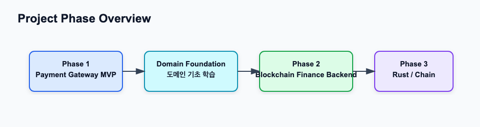

# 2030 KOREA StablePay Network

Confluence 문서: [2030 KOREA StablePay Network](https://aslan0.atlassian.net/wiki/spaces/SPN/overview)

이 Space는 `2030 KOREA StablePay Network` 프로젝트 전용 Confluence 문서 공간입니다.

GitHub에는 코드와 원본 Markdown을 남기고, Confluence에는 학습용 요약, 다이어그램, Jira 작업과 연결된 참고 문서를 정리합니다.

## 문서 운영 원칙

| 위치 | 역할 |
| --- | --- |
| GitHub | 코드, 원본 Markdown, 커밋 이력 관리 |
| Confluence | 학습용 요약, 다이어그램, 도메인/아키텍처 문서 관리 |
| Jira | 작업 단위, 진행 상태, 완료 기준 관리 |

## 문서 구조

| 섹션 | 역할 |
| --- | --- |
| [프로젝트 개요와 로드맵](project-overview-and-roadmap.md) | 프로젝트 범위, 목표 아키텍처, Phase 2 구현 로드맵을 모아둡니다. |
| [Phase 2 도메인 학습](phase-2-domain-learning.md) | Ledger, Settlement, Indexer, Deposit, Withdrawal, Wallet, Key Security 학습 문서를 모아둡니다. |

## 현재 집중 영역

현재는 Phase 2에 들어가기 전에 블록체인 결제/금융 백엔드 도메인을 정리하는 단계입니다.

## 핵심 질문

1. Phase 1에서는 무엇을 만들었는가?
2. Phase 2에서는 왜 Ledger, Settlement, Indexer가 필요한가?
3. Payment Gateway MVP가 Blockchain Finance Backend로 확장된다는 말은 무엇인가?
4. 이후 Rust Signer와 자체 네트워크 실험은 어디에 붙는가?

## 관련 GitHub 저장소

- Public repo: <https://github.com/HoBaeBang/2030-korea-stablepay-network>
