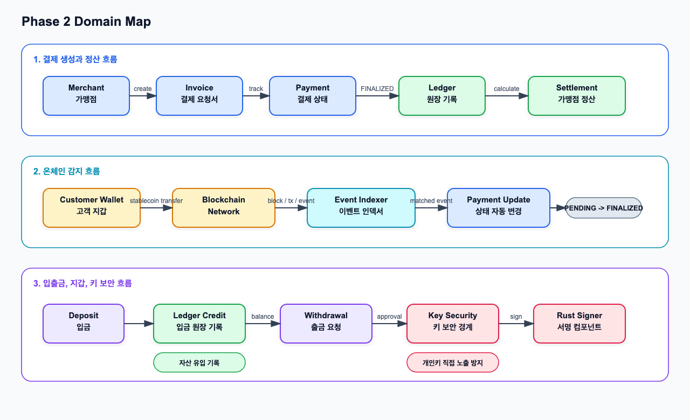
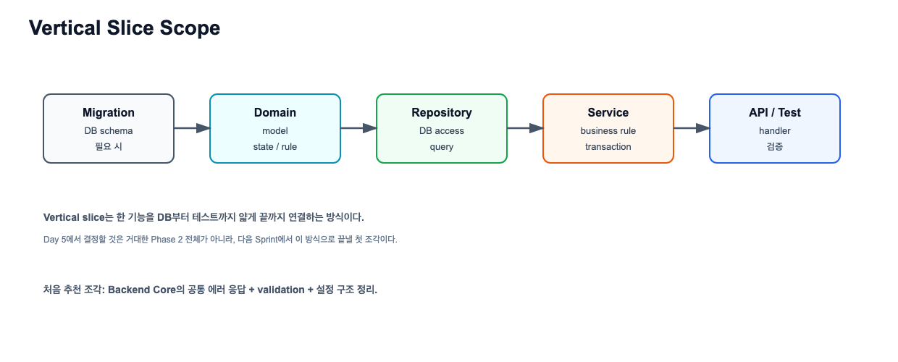

# Phase 2 Day 1~5 종합 교재

관련 Jira: [SPN-23](https://aslan0.atlassian.net/browse/SPN-23)

이 문서는 `2030 KOREA StablePay Network`의 Phase 2 Day 1~5 내용을 하나로 묶은 종합 교재입니다.

Day6의 `Review Checkpoint` 문서가 "내가 이해했는지 점검하는 문서"라면, 이 문서는 "처음부터 다시 읽어도 전체 내용을 따라갈 수 있는 설명 문서"입니다.

## 이 문서를 읽는 목적

Phase 2는 단순히 API를 몇 개 더 만드는 단계가 아닙니다.

Phase 1에서 만든 `Merchant`, `Invoice`, `Payment` 기반 결제 백엔드를 실제 블록체인 금융 백엔드에 가까운 구조로 확장하는 단계입니다.

이 문서를 읽고 나면 다음 질문에 답할 수 있어야 합니다.

```text
1. Phase 1에서 만든 결제 백엔드는 무엇이 부족했는가?
2. Phase 2에서 Ledger와 Settlement가 왜 필요한가?
3. Deposit과 Withdrawal은 왜 일반 CRUD처럼 만들면 안 되는가?
4. Wallet과 Key Security는 왜 별도 경계로 분리해야 하는가?
5. Event Indexer는 어디에서 실행되고 무엇을 안전하게 처리해야 하는가?
6. 왜 Sprint 2에서는 화려한 블록체인 연결보다 Backend Core를 먼저 정리하려 하는가?
```

## 전체 흐름 한 장 요약



Phase 1의 핵심 흐름은 비교적 단순했습니다.

```text
Merchant -> Invoice -> Payment
```

가맹점이 결제 요청서를 만들고, 그 결제 요청서에 대해 결제 상태를 관리하는 백엔드였습니다.

Phase 2에서는 여기에 다음 흐름이 붙습니다.

```text
Blockchain Event -> Indexer -> Payment FINALIZED -> Ledger -> Settlement

Wallet / Key Security -> Deposit / Withdrawal -> Ledger
```

즉 Phase 2의 핵심은 `상태 관리`에서 `돈의 이동과 블록체인 이벤트 처리`로 확장하는 것입니다.

## 기본 용어 먼저 잡기

| 용어 | 한글 의미 | 쉬운 설명 | 우리 프로젝트에서 이어지는 기능 |
| --- | --- | --- | --- |
| Merchant | 가맹점 | 결제를 받는 주체 | `merchants` API와 정산 대상 |
| Invoice | 결제 요청서 | 얼마를 어떤 통화로 결제해야 하는지 나타내는 요청 | `invoices` API |
| Payment | 결제 상태 | 결제가 어디까지 진행됐는지 나타내는 상태 | `PENDING`, `FINALIZED`, `SETTLED` |
| Blockchain | 블록체인 | transaction이 기록되는 네트워크 | 온체인 결제/입출금의 실제 근거 |
| On-chain | 온체인 | 블록체인 위에 실제로 기록된 상태 | tx hash, block, event, finality |
| Off-chain | 오프체인 | 우리 서버와 DB 안에서 관리되는 상태 | payment, ledger, settlement |
| RPC | 원격 호출 창구 | 우리 서버가 블록체인 노드에게 질문하는 방식 | block/tx/event 조회 |
| Block | 블록 | transaction들이 묶여 기록된 단위 | indexer가 어디까지 읽었는지 판단 |
| Transaction | 트랜잭션 | 블록체인에 제출된 실제 행위 | 송금, 계약 실행, 출금 전송 |
| Event / Log | 이벤트 / 로그 | transaction 실행 중 남는 세부 기록 | ERC-20 `Transfer` 감지 |
| Tx Hash | 트랜잭션 해시 | transaction을 식별하는 고유한 값 | 입금/출금 추적 |
| Confirmation | 확인 수 | 특정 transaction 이후 몇 개의 block이 더 쌓였는지 | finality 판단 후보 |
| Finality | 최종성 | 거래가 되돌아가기 어렵다고 판단되는 확정 수준 | `FINALIZED` 전환 기준 |
| Ledger | 원장 | 돈이 왜 어떻게 이동했는지 기록하는 장부 | `ledger_accounts`, `ledger_entries` |
| Settlement | 정산 | 가맹점에게 지급 가능한 묶음을 계산하는 과정 | `settlements`, `settlement_items` |
| Deposit | 입금 | 외부 지갑에서 우리 시스템으로 자산이 들어오는 흐름 | 입금 감지와 ledger credit |
| Withdrawal | 출금 | 우리 시스템에서 외부 지갑으로 자산이 나가는 흐름 | 출금 승인, 서명, 전송 |
| Wallet | 지갑 | 블록체인 주소와 키를 다루는 단위 | deposit address, withdrawal address |
| Private Key | 개인키 | 자산을 움직일 수 있는 비밀 키 | signer 경계에서만 사용 |
| Public Key | 공개키 | private key에서 파생되는 공개 키 | 주소 생성/검증과 연결 |
| Address | 주소 | public key 등을 기반으로 만든 식별자 | 입금/출금 대상 |
| Signing | 서명 | private key로 transaction을 승인하는 암호학적 행위 | Rust signer 후보 |
| Idempotency | 멱등성 | 같은 이벤트가 여러 번 와도 결과가 한 번 처리한 것과 같게 유지되는 성질 | 중복 ledger 반영 방지 |
| Reconciliation | 대사, 대조 확인 | 내부 DB 상태와 온체인 상태가 맞는지 비교하는 작업 | 장애 복구와 누락 탐지 |

## Day 1. Phase 2 Domain Map

Day 1의 목표는 구현이 아니라 큰 그림을 잡는 것이었습니다.

Phase 1에서는 다음을 만들었습니다.

```text
1. 가맹점을 만든다.
2. 가맹점이 결제 요청서(invoice)를 만든다.
3. invoice에 대해 payment를 만든다.
4. payment 상태를 API로 변경한다.
```

이 구조는 결제 백엔드 MVP로는 괜찮지만, 블록체인 결제 서비스라고 부르기에는 아직 부족합니다.

왜냐하면 실제 블록체인을 읽지 않고, 돈의 이동을 장부로 기록하지 않고, 가맹점 정산을 하지 않기 때문입니다.

### Phase 1과 Phase 2의 차이

| 구분 | Phase 1 | Phase 2 |
| --- | --- | --- |
| 목표 | 결제 백엔드 MVP | 블록체인 금융 백엔드 기반 |
| 중심 도메인 | Merchant, Invoice, Payment | Ledger, Settlement, Indexer, Deposit, Withdrawal, Wallet |
| 결제 상태 변경 | 사람이 API로 직접 변경 | Indexer가 온체인 이벤트를 읽고 자동 변경 |
| 돈의 이동 기록 | 없음 또는 Payment 상태 중심 | Ledger entry로 기록 |
| 정산 | 없음 | Settlement로 가맹점 지급 묶음 관리 |
| 보안 경계 | 일반 백엔드 수준 | Wallet, Private Key, Signing 경계 필요 |

### Payment 상태의 의미

| 상태 | 의미 |
| --- | --- |
| `PENDING` | 아직 온체인 결제나 입금이 감지되지 않은 상태 |
| `ONCHAIN_DETECTED` | transaction 또는 event는 감지했지만 finality를 기다리는 상태 |
| `FINALIZED` | 충분히 확정되어 내부 원장 반영이 가능한 상태 |
| `SETTLED` | 가맹점 정산까지 완료된 상태 |
| `FAILED` | 실패하거나 더 진행할 수 없는 상태 |

중요한 점은 `FINALIZED`와 `SETTLED`가 다르다는 것입니다.

```text
FINALIZED = 블록체인 결제가 충분히 확정됨
SETTLED   = 가맹점에게 지급할 정산 처리까지 완료됨
```

## Day 2. Ledger와 Settlement

Day 2의 핵심은 `Payment`, `Ledger`, `Settlement`의 책임을 분리하는 것이었습니다.


### 왜 Payment만으로 부족한가

`Payment`는 결제의 상태를 알려줍니다.

예를 들어 다음 질문에는 답할 수 있습니다.

```text
이 결제는 아직 대기 중인가?
온체인에서 감지됐는가?
충분히 확정됐는가?
정산까지 끝났는가?
```

하지만 Payment만으로는 다음 질문에 답하기 어렵습니다.

```text
돈이 어느 계정에서 어느 계정으로 이동했는가?
왜 그 돈이 이동했는가?
같은 결제가 두 번 반영되지는 않았는가?
정산 가능한 금액은 정확히 얼마인가?
장애가 났을 때 어디까지 처리됐는가?
```

이 질문에 답하기 위해 필요한 것이 `Ledger`, 즉 원장입니다.

### Ledger의 구성 요소

| 구성 요소 | 의미 | 예시 |
| --- | --- | --- |
| Ledger Account | 돈이 귀속되는 주체 | 고객 계정, 가맹점 pending 계정, 수수료 계정 |
| Ledger Transaction | 하나의 돈 이동 사건 | 결제 1건, 환불 1건, 출금 1건 |
| Ledger Entry | 특정 계정의 증가/감소 기록 | `Customer -10`, `Merchant +10` |
| Balance | entry를 합산한 결과 | 현재 잔액 |

Ledger에서 중요한 것은 balance만 저장하는 것이 아닙니다.

왜 balance가 그렇게 되었는지 설명할 수 있는 entry를 남기는 것입니다.

### Double-entry, 복식부기


10 USDC 결제가 확정되었다고 가정하면 원장에는 다음처럼 기록할 수 있습니다.

```text
Customer Account     -10 USDC
Merchant Pending     +10 USDC
```

합계는 0입니다.

```text
-10 + 10 = 0
```

이렇게 기록하면 돈이 갑자기 생기거나 사라지는 일을 막을 수 있습니다.

### Settlement란 무엇인가

`Settlement`는 한글로 `정산`입니다.

정산은 확정된 결제 금액을 가맹점에게 지급 가능한 묶음으로 계산하고 처리하는 과정입니다.


결제가 `FINALIZED` 되었다고 해서 바로 가맹점에게 돈을 지급하는 것은 아닙니다.

다음 확인이 필요합니다.

| 확인 항목 | 이유 |
| --- | --- |
| finality가 충분한가 | 되돌아갈 가능성이 낮아야 함 |
| ledger entry가 중복되지 않았는가 | 과지급 방지 |
| 환불/실패 상태와 충돌하지 않는가 | 실제 지급 가능 금액 확인 |
| 수수료나 정산 정책을 반영했는가 | 운영 정책 반영 |
| 정산 주기와 최소 금액을 만족하는가 | 지급 묶음 생성 기준 |

### Day 2에서 기억할 문장

```text
Payment는 상태다.
Ledger는 돈의 이동 기록이다.
Settlement는 가맹점에게 지급할 금액을 계산하고 처리하는 과정이다.
```

## Day 3. Deposit, Withdrawal, Wallet, Key Security

Day 3의 핵심은 입금과 출금이 단순한 CRUD가 아니라는 점입니다.

`Deposit`과 `Withdrawal`은 둘 다 자산 이동을 다루지만 방향과 위험이 완전히 다릅니다.

### Deposit, 입금

`Deposit`은 외부 지갑에서 우리 시스템이 관리하거나 추적하는 주소로 자산이 들어오는 흐름입니다.


단순히 사용자가 "입금했어요"라고 말한다고 해서 바로 내부 잔액을 올리면 안 됩니다.

다음 확인이 필요합니다.

```text
transaction hash가 실제로 존재하는가?
받는 주소가 우리 시스템의 주소인가?
토큰 종류가 맞는가?
금액이 맞는가?
transaction이 성공했는가?
충분한 confirmation 또는 finality가 확보됐는가?
이미 처리한 transaction은 아닌가?
```

Deposit은 이미 발생한 온체인 transaction을 감지하고, 그것을 내부 DB와 Ledger에 안전하게 반영하는 문제입니다.

### 잘못된 입금 감지란 무엇인가

잘못된 입금 감지는 "입금이 없는데 있다고 처리하는 문제"만 의미하지 않습니다.

다음 같은 케이스를 포함합니다.

| 케이스 | 설명 |
| --- | --- |
| 잘못된 주소 | 우리 시스템 주소가 아닌데 입금으로 처리하는 경우 |
| 잘못된 토큰 | USDC를 기대했는데 다른 토큰 transfer를 입금으로 처리하는 경우 |
| 실패한 transaction | transaction이 실패했는데 성공으로 처리하는 경우 |
| 금액 불일치 | 기대 금액과 실제 transfer 금액이 다른 경우 |
| 중복 이벤트 | 같은 tx/event를 두 번 읽고 두 번 credit하는 경우 |

### Withdrawal, 출금

`Withdrawal`은 우리 시스템에서 외부 지갑으로 자산을 내보내는 흐름입니다.


출금은 입금보다 더 위험합니다.

입금은 이미 발생한 일을 감지하는 쪽에 가깝지만, 출금은 우리가 직접 transaction을 만들고 서명하고 전송하기 때문입니다.

### Withdrawal 상태

| 상태 | 의미 |
| --- | --- |
| `REQUESTED` | 사용자가 출금을 요청함 |
| `APPROVED` | 내부 정책상 출금 가능하다고 승인됨 |
| `SIGNED` | 블록체인에 전송할 transaction에 서명 완료 |
| `BROADCASTED` | 블록체인 네트워크에 transaction 전송 완료 |
| `CONFIRMED` | 온체인에서 충분히 확정됨 |
| `FAILED` | 출금 실패 |
| `CANCELED` | 출금 취소 |

`SIGNED`는 내부 원장에 서명했다는 뜻이 아닙니다.

블록체인 네트워크에 제출할 transaction을 private key로 서명했다는 뜻입니다.

### Deposit과 Withdrawal 비교

| 구분 | Deposit | Withdrawal |
| --- | --- | --- |
| 방향 | 외부 지갑에서 우리 시스템으로 들어옴 | 우리 시스템에서 외부 지갑으로 나감 |
| 핵심 작업 | 이미 발생한 transaction 감지 | transaction 생성, 승인, 서명, 전송 |
| 주요 위험 | 잘못된 입금 감지, 중복 반영 | 잘못된 주소, 키 노출, 중복 출금 |
| Ledger 연결 | 확정 후 credit | 요청/확정에 따라 debit |
| 보안 중요도 | 주소 검증과 중복 방지 | 승인, 서명, 키 보안이 매우 중요 |

### Wallet과 Key Security

`Wallet`은 블록체인 주소와 자산 전송 권한을 다루는 영역입니다.

| 개념 | 의미 |
| --- | --- |
| Address | 외부에 공개 가능한 블록체인 주소 |
| Private Key | 해당 주소의 자산을 움직일 수 있는 비밀 키 |
| Public Key | private key에서 파생되는 공개 키 |
| Signing | private key로 transaction에 서명하는 행위 |

핵심 구분은 다음입니다.

```text
Address는 공개되어도 된다.
Private key는 노출되면 안 된다.
Signing은 자산 이동 권한을 실제로 사용하는 행위다.
```


그래서 개인키를 Go API 서버의 일반 DB 컬럼에 평문으로 저장하는 것은 위험합니다.

더 나은 방향은 API 서버와 signer 경계를 나누는 것입니다.

```text
Go API Server
-> 출금 요청 검증
-> 출금 승인 상태 저장
-> Rust Signer에 서명 요청
-> 서명된 transaction을 네트워크에 전송
```

## Day 4. Blockchain Event Indexer

Day 4의 핵심은 블록체인 이벤트를 어떻게 읽고, 중복 없이, 장애 후에도 안전하게 처리할 것인가입니다.

`Event Indexer`는 블록체인 안에서 실행되는 코드가 아닙니다.

우리 백엔드의 `off-chain worker`입니다.


### Indexer가 읽는 데이터

| 데이터 | 의미 | 왜 필요한가 |
| --- | --- | --- |
| Block | transaction들이 묶인 단위 | 어디까지 처리했는지 판단 |
| Transaction | 블록체인에 제출된 거래 | tx hash, status, from/to 확인 |
| Event / Log | transaction 실행 중 발생한 세부 기록 | token transfer 같은 이벤트 감지 |
| Receipt | transaction 실행 결과 | 성공/실패, gas, logs 확인 |
| Finality | 충분히 확정됐는지 판단하는 기준 | 내부 Ledger 반영 가능 여부 판단 |

### Polling 방식

초기 구현에서는 polling 방식이 현실적입니다.


예시 흐름:

```text
1. Scheduler가 5초마다 Indexer를 실행한다.
2. Indexer가 마지막 처리 block height를 checkpoint DB에서 읽는다.
3. Blockchain RPC로 다음 block range를 조회한다.
4. 각 block의 transaction/event를 파싱한다.
5. 우리 deposit address와 관련된 event인지 검증한다.
6. 중복 이벤트가 아니면 deposit/payment/ledger 상태를 반영한다.
7. 안전하게 처리한 block height를 checkpoint로 저장한다.
```

### Checkpoint

`Checkpoint`는 Indexer가 어디까지 처리했는지 저장하는 기준점입니다.

예:

```text
last_processed_height = 1000
```

그러면 다음 실행에서는 1001번 block부터 읽을 수 있습니다.

Checkpoint가 없으면 장애 후 재시작 시 어디서부터 다시 읽어야 하는지 알 수 없습니다.

### Idempotency

`Idempotency`, 멱등성은 같은 작업을 여러 번 실행해도 결과가 한 번 실행한 것과 같게 유지되는 성질입니다.


Indexer에서는 같은 event를 여러 번 읽을 수 있습니다.

그래서 다음 같은 key로 이미 처리한 이벤트인지 확인할 수 있습니다.

```text
chain + tx_hash + log_index
```

같은 이벤트를 두 번 읽더라도 Ledger credit은 한 번만 생성되어야 합니다.

### Reconciliation

`Reconciliation`은 한글로 `대사`, 더 쉽게 말하면 `대조 확인`입니다.

말하는 대사(台詞)가 아니라, 서로 다른 장부나 시스템의 상태가 맞는지 비교하는 의미입니다.

우리 프로젝트에서는 다음을 비교합니다.

```text
온체인 상태
= 실제 블록체인에 기록된 tx/event/finality

내부 DB 상태
= deposits, payments, ledger_entries, checkpoints
```

예를 들어 다음 문제를 찾습니다.

```text
온체인에는 입금이 있는데 내부 DB에는 deposit이 없다.
내부 DB에는 deposit이 있는데 ledger credit이 없다.
transaction은 실패했는데 payment가 FINALIZED로 되어 있다.
checkpoint는 앞으로 갔는데 중간 block event가 누락됐다.
```

## Day 5. 첫 구현 범위 결정

Day 5의 핵심은 "무엇부터 만들 것인가"를 결정하는 것이었습니다.

Day 1~4를 배우면 만들고 싶은 것이 많아집니다.

```text
Ledger도 만들고 싶다.
Settlement도 만들고 싶다.
Indexer도 만들고 싶다.
Deposit/Withdrawal도 만들고 싶다.
Rust Signer도 만들고 싶다.
```

하지만 실무형 프로젝트에서는 모든 것을 한 번에 만들면 위험합니다.

그래서 Day 5에서는 첫 구현 범위를 작게 자릅니다.


### 첫 구현 후보

| 후보 | 장점 | 위험 | 판단 |
| --- | --- | --- | --- |
| Backend Core | 이후 모든 기능의 공통 패턴을 만든다 | 블록체인 기능처럼 화려해 보이지 않을 수 있다 | 가장 먼저 추천 |
| Ledger Core | 돈의 이동 기록이라는 핵심에 바로 들어간다 | 공통 에러/검증/테스트 구조가 약하면 흔들릴 수 있다 | Backend Core 이후 추천 |
| Indexer Skeleton | 블록체인 연결을 빨리 보여줄 수 있다 | Ledger/idempotency/상태 전이 기반이 약하면 위험하다 | 뒤에서 추천 |

### 왜 Backend Core를 먼저 하는가

Backend Core는 블록체인 기능 자체는 아니지만 이후 모든 기능이 의존하는 기반입니다.

예를 들어 Ledger, Settlement, Indexer, Withdrawal을 만들 때 모두 다음이 필요합니다.

```text
공통 에러 응답
요청 validation
config 구조
logging
service/repository 테스트 패턴
상태 변경 실패 처리
```

이 기반이 없으면 기능을 추가할 때마다 코드 스타일이 흔들리고 테스트하기 어려워집니다.

### Vertical Slice



`Vertical slice`는 한 기능을 얇게라도 끝까지 연결하는 방식입니다.

```text
DB migration
-> domain model
-> repository
-> service
-> API handler
-> test
```

Phase 2 전체를 한 번에 구현하는 것이 아니라, 다음 Sprint에서 끝낼 수 있는 첫 조각을 고르는 것이 Day5의 목적입니다.

### Sprint 2 추천 백로그 후보


| 후보 | 설명 | 완료 기준 |
| --- | --- | --- |
| 공통 에러 응답 | API 실패 응답 형식을 통일 | 모든 handler가 같은 error envelope를 반환 |
| 요청 validation 정리 | request body, path variable 검증 일관화 | 잘못된 요청에 명확한 400 응답 |
| 설정 구조 정리 | PORT, DATABASE_URL 등을 config 구조로 모음 | main에서 config를 읽고 의존성에 전달 |
| logging 정리 | 요청, 실패, 상태 변경 로그 기록 | 주요 상태 변경 시 로그가 남음 |
| API boundary 정리 | public API와 internal API 방향 정리 | 외부 공개 API와 내부 책임 문서화 |
| 테스트 패턴 정리 | handler/service 테스트 전략 정리 | 새 기능 추가 시 따라갈 테스트 예시 생성 |

## Day1~Day5를 하나로 연결하면

Day1~Day5는 따로 떨어진 주제가 아닙니다.

다음 순서로 연결됩니다.

```text
Day 1:
Phase 1 결제 백엔드가 Phase 2에서 어떤 금융 백엔드로 확장되는지 큰 그림을 잡는다.

Day 2:
Payment 상태만으로 부족한 돈의 이동 기록과 정산 개념을 배운다.

Day 3:
실제 자산이 들어오고 나가는 입출금, 지갑, 키 보안 경계를 배운다.

Day 4:
블록체인 이벤트를 읽어 내부 DB 상태로 안전하게 반영하는 Indexer를 배운다.

Day 5:
이 모든 것을 한 번에 구현하지 않고, Sprint 2에서 먼저 만들 작고 검증 가능한 범위를 고른다.
```

## 프로젝트 관점의 최종 그림

Phase 2가 진행되면 우리 프로젝트는 다음 방향으로 확장됩니다.

```text
Merchant / Invoice / Payment
-> Payment 상태 관리 고도화
-> Ledger로 돈의 이동 기록
-> Settlement로 가맹점 지급 묶음 계산
-> Event Indexer로 온체인 이벤트 자동 반영
-> Deposit / Withdrawal로 입출금 흐름 추가
-> Wallet / Key Security / Rust Signer로 키와 서명 경계 분리
```

## 자주 헷갈리는 지점 정리

### Payment와 Ledger는 같은가?

아닙니다.

Payment는 결제 상태입니다.

Ledger는 돈의 이동 기록입니다.

### FINALIZED면 정산 완료인가?

아닙니다.

`FINALIZED`는 블록체인 결제가 충분히 확정됐다는 뜻입니다.

정산 완료는 `SETTLED` 또는 Settlement의 `PAID` 같은 상태로 따로 봐야 합니다.

### Deposit은 사용자가 요청하면 바로 반영하는가?

아닙니다.

온체인 transaction이 실제로 존재하는지, 주소/토큰/금액이 맞는지, finality가 충분한지, 중복 처리가 아닌지 확인해야 합니다.

### Withdrawal의 SIGNED는 원장에 서명했다는 뜻인가?

아닙니다.

블록체인에 제출할 transaction에 private key로 서명했다는 뜻입니다.

### Indexer는 블록체인 안에서 도는가?

아닙니다.

우리 백엔드의 off-chain worker로 실행됩니다.

### Idempotency는 왜 중요한가?

같은 온체인 event를 두 번 읽을 수 있기 때문입니다.

한 번 들어온 입금을 두 번 credit하면 내부 잔액이 실제보다 커집니다.

### Reconciliation은 왜 필요한가?

Indexer, DB, RPC, 네트워크 장애 때문에 내부 DB와 온체인 상태가 어긋날 수 있기 때문입니다.

## Day6로 넘어가기 전 체크 질문

1. Phase 1과 Phase 2의 차이를 설명할 수 있는가?
2. Payment, Ledger, Settlement의 책임 차이를 설명할 수 있는가?
3. Ledger Account, Ledger Transaction, Ledger Entry의 차이를 설명할 수 있는가?
4. Deposit과 Withdrawal의 방향과 위험 차이를 설명할 수 있는가?
5. Wallet address와 private key의 차이를 설명할 수 있는가?
6. Signing이 무엇을 의미하는지 설명할 수 있는가?
7. Event Indexer가 어디에서 실행되는지 설명할 수 있는가?
8. Checkpoint가 왜 필요한지 설명할 수 있는가?
9. Idempotency key 후보로 `chain + tx_hash + log_index`가 나오는 이유를 설명할 수 있는가?
10. Reconciliation이 무엇을 대조하는지 설명할 수 있는가?
11. 왜 Sprint 2에서 Backend Core를 먼저 정리하려는지 설명할 수 있는가?

## 관련 문서

| 구분 | 문서 |
| --- | --- |
| Day 1 | [Phase 2 Domain Map](../01_Phase2_전체지도/Phase_2_도메인_전체지도.md) |
| Day 2 | [Ledger와 Settlement 개념 학습](../02_원장과_정산/Ledger와_Settlement_개념학습.md) |
| Day 3 | [Deposit, Withdrawal, Wallet, Key Security 개념 학습](../03_입출금과_지갑보안/Deposit_Withdrawal_Wallet_KeySecurity_개념학습.md) |
| Day 4 | [Blockchain Event Indexer 개념 학습](../04_블록체인_이벤트_인덱서/Blockchain_Event_Indexer_개념학습.md) |
| Day 5 | [Phase 2 첫 구현 범위 결정 개념 학습](../05_구현범위와_Sprint2/Phase_2_첫_구현범위_개념학습.md) |
| Day 6 | [Phase 2 통합 복습 개념 학습](Phase_2_통합복습_개념학습.md) |

## 마지막 요약

```text
Phase 2는 블록체인을 붙이는 장식 단계가 아니다.

결제 상태, 돈의 이동 기록, 정산, 입출금, 지갑 보안, 온체인 이벤트 처리,
장애 복구와 중복 방지를 하나의 금융 백엔드 흐름으로 연결하는 단계다.

Day1~Day5는 이 흐름을 이해하기 위한 기초 공사이고,
Day6는 구현에 들어가기 전에 그 기초가 제대로 잡혔는지 확인하는 날이다.
```
