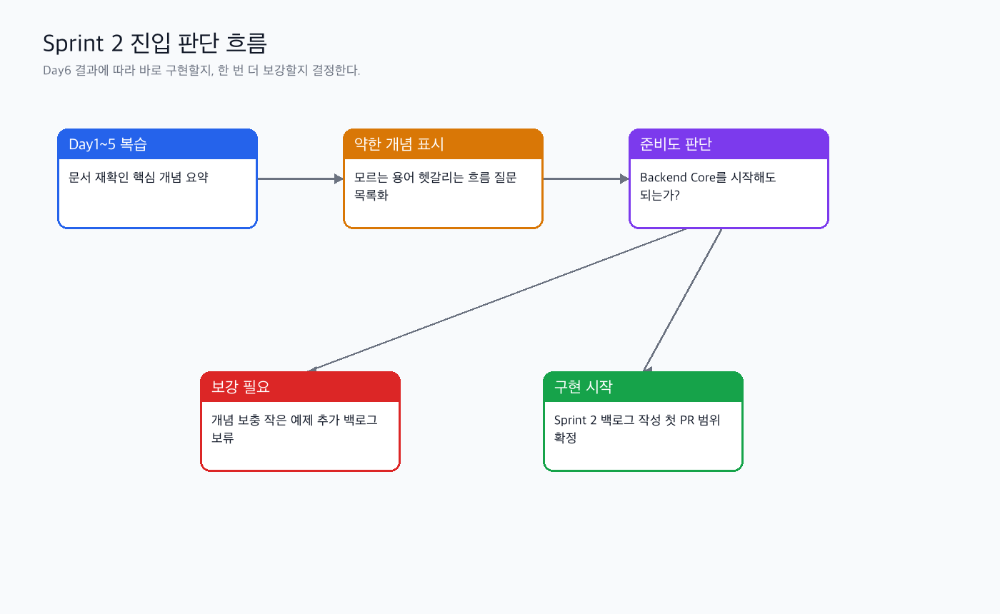

# Phase 2 통합 복습 실습 가이드

관련 Jira: [SPN-23](https://aslan0.atlassian.net/browse/SPN-23)

이 문서는 퇴근 후 직접 진행할 Day 6 실습가이드입니다.

오늘의 실습은 `docs/domain/00_종합/Phase_2_Review_Checkpoint_실습산출물.md` 파일을 직접 채우고, Sprint 2 Backend Core 구현을 시작할 준비가 되었는지 판단하는 것입니다.

## 실습 흐름


## 참고 다이어그램



## 실습 목표

1. Day 1~5 핵심 내용을 한 문장씩 요약한다.
2. 각 도메인이 우리 프로젝트의 어떤 기능으로 이어지는지 정리한다.
3. 아직 약한 개념을 솔직하게 표시한다.
4. Sprint 2 구현 시작 가능 여부를 판단한다.
5. 구현 시작 전에 확인할 질문 목록을 만든다.

## 작업 전 준비

```shell
cd /Users/banghobae/Documents/2030-korea-stablepay/2030-korea-stablepay-network
git status
```

파일은 템플릿으로 준비되어 있습니다.

```shell
docs/domain/00_종합/Phase_2_Review_Checkpoint_실습산출물.md
```

## 작성할 문서 구조

```markdown
# Phase 2 Review Checkpoint

## 한 문장 요약

## Day 1~5 핵심 요약

## 도메인별 이해 상태

## 아직 약한 개념과 질문

## Sprint 2 구현 전 체크리스트

## Sprint 2 진입 판단

## 다음 작업 후보
```

## Step 1. Day 1~5 핵심 요약 작성

아래 표를 직접 채웁니다.

| Day | 주제 | 내가 이해한 한 문장 |
| --- | --- | --- |
| Day 1 | Phase 2 Domain Map |  |
| Day 2 | Ledger & Settlement |  |
| Day 3 | Deposit / Withdrawal / Wallet / Key Security |  |
| Day 4 | Blockchain Event Indexer |  |
| Day 5 | First Implementation Scope |  |

작성 예시:

```text
Day 2: Ledger는 결제 상태가 아니라 돈의 이동 기록이고, Settlement는 확정된 돈을 가맹점에게 지급할 묶음으로 계산하는 과정이다.
```

## Step 2. 도메인별 이해 상태 체크

아래처럼 `상`, `중`, `하`로 표시합니다.

| 도메인 | 이해도 | 이유 |
| --- | --- | --- |
| Payment |  |  |
| Ledger |  |  |
| Settlement |  |  |
| Deposit |  |  |
| Withdrawal |  |  |
| Wallet / Key Security |  |  |
| Event Indexer |  |  |
| Idempotency |  |  |
| Reconciliation |  |  |

## Step 3. 아직 약한 개념 작성

약한 개념은 다음 형식으로 작성합니다.

```markdown
### 약한 개념: 개념명

- 현재 이해:
- 헷갈리는 지점:
- 구현 전에 확인할 질문:
```

예시:

```markdown
### 약한 개념: Finality

- 현재 이해: 블록체인 transaction이 충분히 확정됐는지 판단하는 기준이다.
- 헷갈리는 지점: 체인마다 finality 판단 기준이 어떻게 달라지는지 아직 약하다.
- 구현 전에 확인할 질문: 우리 Phase 2 mock chain에서는 finality를 block confirmation 개수로 처리해도 되는가?
```

## Step 4. Sprint 2 구현 전 체크리스트 작성

아래 항목을 체크합니다.

| 체크 항목 | 결과 | 메모 |
| --- | --- | --- |
| Payment와 Ledger의 책임 차이를 설명할 수 있다 |  |  |
| Ledger entry에 `+`, `-` 금액이 왜 필요한지 설명할 수 있다 |  |  |
| Settlement가 단순 합계가 아닌 이유를 설명할 수 있다 |  |  |
| Deposit과 Withdrawal의 위험 차이를 설명할 수 있다 |  |  |
| Event Indexer가 off-chain worker라는 점을 설명할 수 있다 |  |  |
| Idempotency key 후보를 말할 수 있다 |  |  |
| Reconciliation이 무엇을 비교하는지 설명할 수 있다 |  |  |
| Backend Core vertical slice를 먼저 구현해야 하는 이유를 설명할 수 있다 |  |  |

## Step 5. Sprint 2 진입 판단

아래 세 가지 중 하나를 선택합니다.

| 판단 | 의미 |
| --- | --- |
| 구현 시작 가능 | Backend Core 첫 작업을 시작해도 된다 |
| 부분 보강 후 시작 | 약한 개념 1~2개만 보강하고 시작한다 |
| 하루 더 복습 필요 | 구현보다 개념 정리가 먼저다 |

## 권장 커밋 메시지

```shell
git add docs/domain/00_종합/Phase_2_Review_Checkpoint_실습산출물.md
git commit -m "docs: SPN-23 Phase 2 통합 복습과 구현 전 점검 정리"
git push
```
