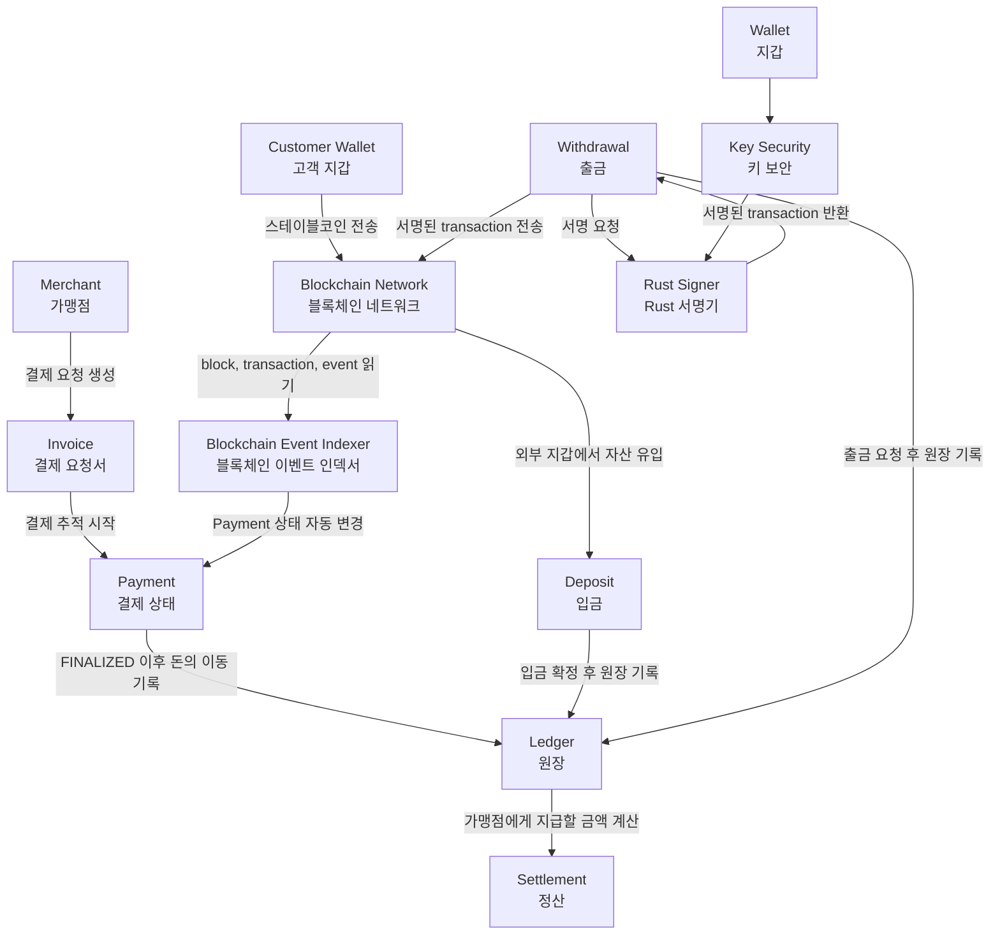
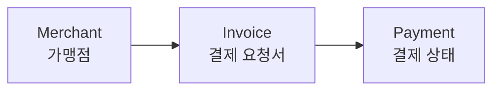
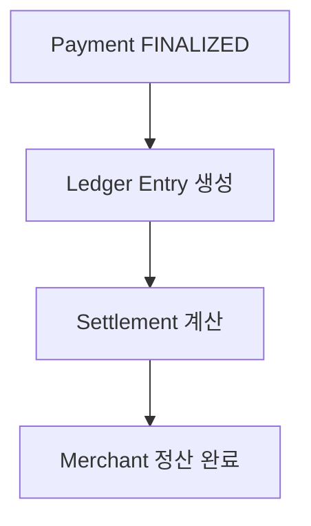
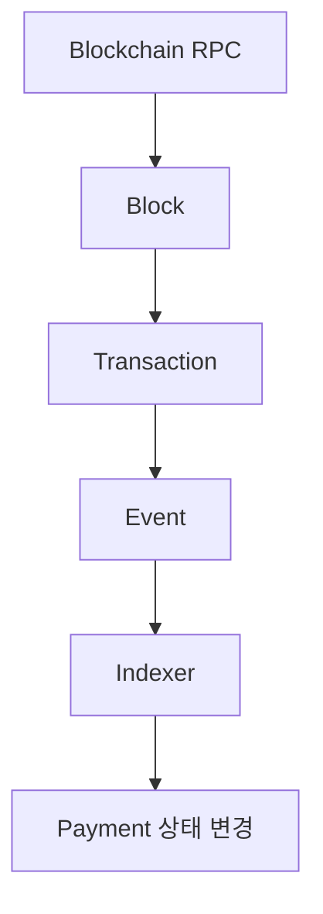
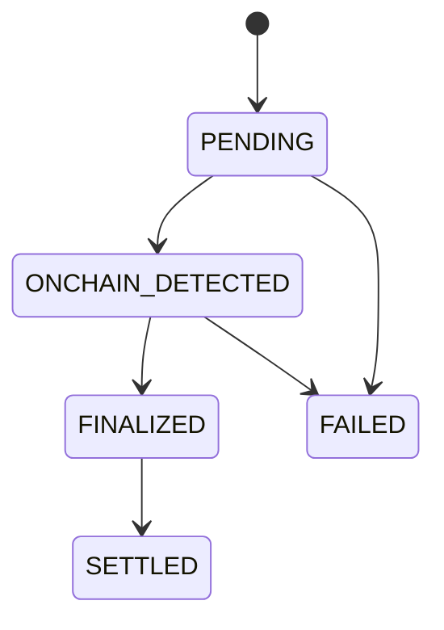

# Phase 2 Domain Map

이 문서는 `2030 KOREA StablePay Network`의 Phase 2 도메인을 한 장의 지도로 이해하기 위한 문서다.

오늘의 목표는 구현이 아니라 이해다.

```text
Phase 1에서 만든 Merchant, Invoice, Payment 흐름이
Phase 2에서 Ledger, Settlement, Indexer, Deposit, Withdrawal, Wallet, Key Security로
어떻게 확장되는지 큰 그림을 잡는다.
```

## 한 문장 요약

Phase 1은 가맹점이 결제 요청서를 만들고 결제 상태를 관리하는 결제 백엔드 MVP다.

Phase 2는 그 결제 상태를 실제 블록체인 이벤트, 원장, 정산, 입출금, 지갑 보안과 연결해 블록체인 금융 백엔드로 확장하는 단계다.

## Phase 2 전체 도메인 지도



이 다이어그램에서 중요한 흐름은 세 가지다.

```text
1. 결제 흐름
Merchant -> Invoice -> Payment -> Ledger -> Settlement

2. 온체인 감지 흐름
Blockchain Network -> Indexer -> Payment

3. 입출금/지갑 흐름
Wallet/Key Security -> Withdrawal -> Rust Signer -> Withdrawal -> Blockchain Network
```

이 지도에서는 학습 기준을 명확히 하기 위해 `Rust Signer`를 서명 전용 컴포넌트로 둔다.

```text
Rust Signer = private key 보관과 transaction signing 담당
Go Backend  = withdrawal 상태 관리, signed tx broadcast, tx hash 추적 담당
```

## Phase 1과 Phase 2의 차이

| 구분 | Phase 1 | Phase 2 |
| --- | --- | --- |
| 목표 | 스테이블코인 결제 백엔드 MVP | 블록체인 금융 백엔드로 확장 |
| 핵심 도메인 | Merchant, Invoice, Payment | Ledger, Settlement, Indexer, Deposit, Withdrawal, Wallet, Key Security |
| 결제 상태 변경 | 사람이 API로 직접 변경 | Indexer가 블록체인을 읽고 자동 변경 |
| 블록체인 연결 | 실제 RPC 연결 없음 | Blockchain RPC를 통해 block, transaction, event 읽기 |
| 돈의 이동 기록 | Payment 상태 중심 | Ledger entry로 돈의 이동 기록 |
| 정산 | 아직 없음 | Settlement로 가맹점 지급 금액과 상태 관리 |
| 입출금 | 아직 없음 | Deposit/Withdrawal 상태 흐름 추가 |
| 지갑/키 보안 | 아직 없음 | Wallet과 Key Security 경계 설계 |
| Rust 역할 | 없음 | Rust Signer와 Chain Prototype으로 확장 |
| 검증 관점 | API와 service test 중심 | 중복 이벤트, 원장 정합성, 대사, finality까지 검증 |

## Phase 1 흐름 복습

Phase 1의 흐름은 비교적 단순하다.



예시:

```text
1. Cafe Korea라는 가맹점을 만든다.
2. Cafe Korea가 10,000 USDC 결제 요청서인 invoice를 만든다.
3. invoice에 대해 payment를 만든다.
4. 사람이 API로 payment 상태를 ONCHAIN_DETECTED, FINALIZED로 바꾼다.
```

현재 핵심 한계:

```text
실제 블록체인을 읽지 않는다.
돈의 이동을 ledger로 기록하지 않는다.
가맹점 정산을 하지 않는다.
입금, 출금, 지갑, 키 보안이 없다.
```

## Phase 2에서 추가되는 흐름

Phase 2에서는 결제 이후의 금융 백엔드 영역이 붙는다.



또한 블록체인 이벤트를 직접 읽는다.



여기서 `RPC`는 우리 서버가 블록체인 노드에게 질문하는 통신 창구다.

예를 들면 다음처럼 물어본다.

```text
최근 block 번호가 몇 번인가?
이 transaction hash가 존재하는가?
이 block 안에 어떤 transaction이 있는가?
USDC Transfer event가 발생했는가?
```

여기서 자주 나오는 단어는 다음처럼 이해하면 된다.

| 용어 | 한글 의미 | 쉬운 설명 |
| --- | --- | --- |
| Block | 블록 | 여러 transaction을 묶어 블록체인에 기록한 한 묶음 |
| Transaction | 트랜잭션, 거래 | 송금이나 스마트컨트랙트 실행처럼 블록체인에 기록되는 실제 행위 |
| Event | 이벤트, 로그 | 스마트컨트랙트가 남기는 알림 기록. 예를 들어 USDC `Transfer` 발생 기록 |
| RPC | 원격 호출 창구 | 우리 서버가 블록체인 노드에게 block, transaction, event 정보를 물어보는 통신 방식 |

`Reconciliation`의 한글 의미인 대사는 말하는 대사(台詞)가 아니라, 대조해서 검사한다는 뜻의 대사(對査)에 가깝다.

```text
우리 DB 상태
vs
실제 블록체인 상태

두 상태가 맞는지 비교하고, 다르면 원인을 찾는 작업
```

## 핵심 용어 10개 한 줄 정의

| 번호 | 용어 | 한글 의미 | 한 줄 정의 |
| --- | --- | --- | --- |
| 1 | Ledger | 원장 | 돈이 어느 계정에서 어느 계정으로 왜 이동했는지 기록하는 장부 |
| 2 | Settlement | 정산 | 확정된 결제 금액을 가맹점에게 지급 가능한 금액으로 계산하고 처리하는 과정 |
| 3 | Blockchain Event Indexer | 블록체인 이벤트 인덱서 | 블록체인에서 block, transaction, event를 읽어 우리 서비스와 관련된 일을 찾아내는 작업자 |
| 4 | Deposit | 입금 | 외부 지갑에서 우리 시스템으로 자산이 들어오는 흐름 |
| 5 | Withdrawal | 출금 | 우리 시스템에서 외부 지갑으로 자산이 나가는 흐름 |
| 6 | Wallet | 지갑 | 블록체인 주소와 자산 전송의 기준이 되는 계정 또는 주소 관리 단위 |
| 7 | Key Security | 키 보안 | 개인키가 노출되거나 오용되지 않도록 서명 권한과 저장 경계를 분리하는 설계 |
| 8 | Idempotency | 멱등성 | 같은 요청이나 이벤트가 여러 번 들어와도 최종 결과가 한 번 처리한 것과 같게 유지되는 성질 |
| 9 | Reconciliation | 대사(對査), 대조 확인 | 우리 DB 상태와 실제 온체인 상태가 맞는지 대조하고 차이를 찾는 작업 |
| 10 | Finality | 최종성 | 블록체인 거래가 되돌아가기 어렵다고 판단할 수 있는 확정 수준 |

## 각 용어가 우리 프로젝트 기능으로 이어지는 방식

| 용어 | 우리 프로젝트에서 이어지는 기능 |
| --- | --- |
| Ledger | `payments` 이후 `ledger_accounts`, `ledger_entries`를 만들어 결제 확정 이후 돈의 이동을 기록한다 |
| Settlement | `FINALIZED` 된 payment를 모아 가맹점에게 지급할 정산 묶음과 상태를 만든다 |
| Blockchain Event Indexer | 블록체인 RPC를 읽어 `PENDING -> ONCHAIN_DETECTED -> FINALIZED` 상태 변경을 자동화한다 |
| Deposit | 외부 지갑에서 들어온 자산을 감지하고 ledger에 credit 기록을 만든다 |
| Withdrawal | 출금 요청을 승인, 서명, 전송, 확정 단계로 나누어 관리한다 |
| Wallet | 입금 주소, 출금 주소, 가맹점 주소 같은 블록체인 주소 정보를 관리한다 |
| Key Security | 개인키를 Go API와 분리하고 Rust Signer 같은 별도 컴포넌트에서 서명하도록 설계한다 |
| Idempotency | 같은 transaction hash나 event id가 여러 번 들어와도 ledger/payment가 한 번만 변경되게 한다 |
| Reconciliation | DB에는 PENDING인데 온체인에서는 확정된 transaction 같은 불일치를 찾아 수정한다 |
| Finality | transaction이 몇 block 이상 확인됐을 때 `FINALIZED`로 바꿀지 판단하는 기준이 된다 |

## 결제 상태와 Phase 2 도메인의 연결

현재 Payment 상태:



Phase 2에서는 각 상태가 다음 도메인과 연결된다.

| Payment 상태 | 의미 | Phase 2에서 연결되는 도메인 |
| --- | --- | --- |
| PENDING | 아직 온체인 transaction을 감지하지 못함 | Indexer가 감지 대상 payment로 조회 |
| ONCHAIN_DETECTED | transaction hash를 감지함 | Indexer가 transaction hash와 event를 저장 |
| FINALIZED | finality가 충분히 확보됨 | Ledger entry 생성 가능 |
| SETTLED | 가맹점 정산까지 완료됨 | Settlement 완료 상태와 연결 |
| FAILED | 결제 실패 또는 진행 불가 | 실패 사유, 재시도, 운영 확인 대상 |

## Phase 2에서 생길 수 있는 테이블 후보

아직 구현 확정은 아니지만, 도메인을 코드로 옮기면 다음 테이블들이 후보가 된다.

| 후보 테이블 | 목적 |
| --- | --- |
| `ledger_accounts` | 사용자, 가맹점, 시스템 계정 관리 |
| `ledger_entries` | 돈의 증가/감소 기록 |
| `ledger_transactions` | 여러 ledger entry를 하나의 거래로 묶음 |
| `settlements` | 가맹점 정산 묶음 |
| `settlement_items` | 어떤 payment가 어떤 settlement에 포함됐는지 기록 |
| `blockchain_events` | 인덱서가 읽은 온체인 이벤트 저장 |
| `indexer_checkpoints` | 인덱서가 어디까지 block을 읽었는지 저장 |
| `deposits` | 입금 요청과 감지/확정 상태 저장 |
| `withdrawals` | 출금 요청, 승인, 서명, 전송, 확정 상태 저장 |
| `wallets` | 관리 대상 지갑 주소와 metadata 저장 |

## 오늘 기준으로 이해해야 할 것

오늘 완벽히 구현 방법을 알 필요는 없다.

오늘은 다음 질문에 대답할 수 있으면 충분하다.

```text
Phase 1은 무엇을 만들었는가?
Phase 2는 왜 필요한가?
Ledger와 Payment는 무엇이 다른가?
Indexer는 왜 필요한가?
Deposit과 Withdrawal은 왜 별도 도메인인가?
Wallet과 Key Security는 왜 일반 CRUD처럼 다루면 안 되는가?
멱등성과 대사는 왜 운영에서 중요한가?
```

## 내가 아직 더 공부해야 할 부분

아래 항목은 Day 2~Day 5에서 더 자세히 다룬다.

```text
Ledger의 double-entry 구조
Settlement 계산 방식
Deposit 상태 흐름
Withdrawal 승인/서명/전송 흐름
Blockchain RPC와 event 구조
Indexer checkpoint와 retry
Idempotency key 설계
Reconciliation batch 설계
Rust Signer API 경계
```

## 완료 기준 체크

SPN-18의 완료 기준에 대해 현재 문서는 다음을 만족한다.

```text
[x] Phase 2 전체 도메인 지도가 문서로 생성된다.
[x] Phase 1과 Phase 2의 차이가 표로 정리된다.
[x] 핵심 용어 10개가 한 줄씩 정의된다.
[x] 각 용어가 어떤 기능으로 이어지는지 1문장 이상 설명된다.
[x] 다음 날 Ledger/Settlement 학습으로 넘어갈 준비가 된다.
```
