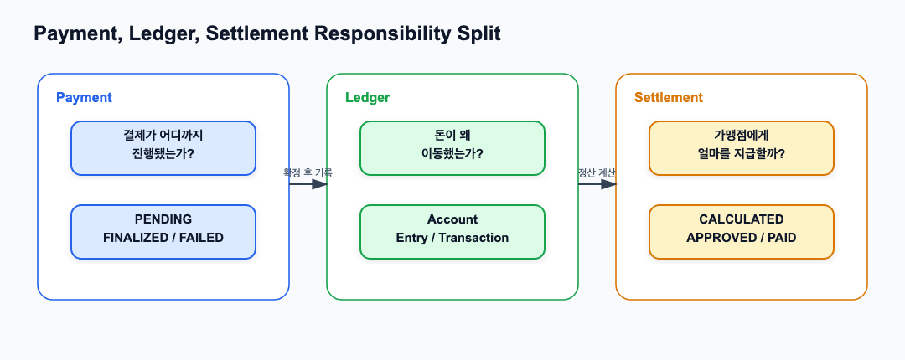
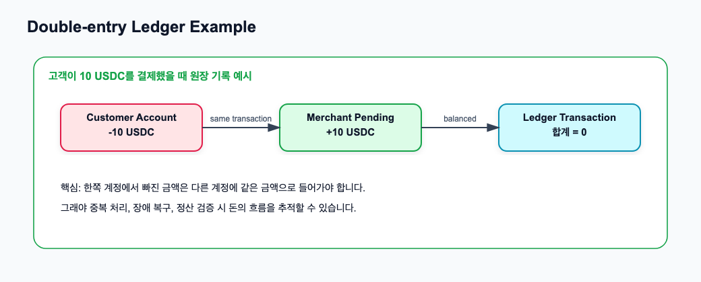
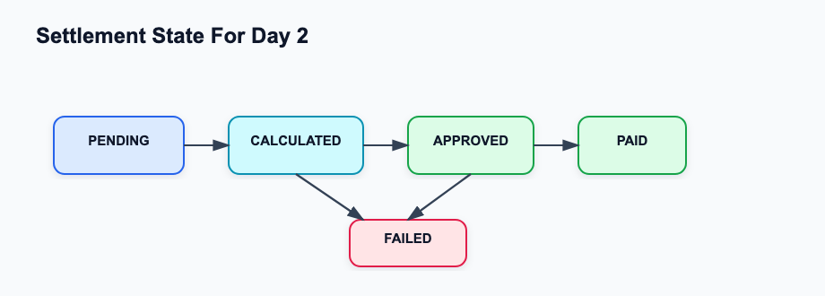
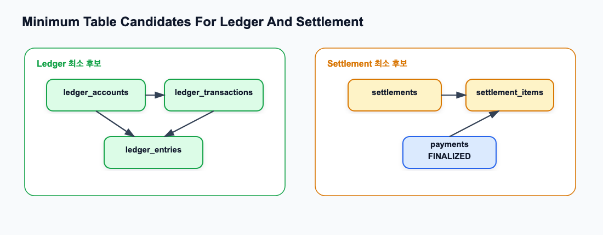

# Ledger와 Settlement 개념 학습

관련 Jira: [SPN-19](https://aslan0.atlassian.net/browse/SPN-19)

Confluence 문서: [Ledger와 Settlement 개념 학습](https://aslan0.atlassian.net/wiki/spaces/SPN/pages/4948055)

이 문서는 출퇴근 시간에 읽는 Ledger와 Settlement 개념 학습자료입니다.

오늘은 코드를 바로 작성하기보다 `Payment`, `Ledger`, `Settlement`가 각각 무엇을 책임지는지 이해하는 것이 중요합니다.

## 1. 왜 Ledger가 필요한가

`Payment`는 결제의 진행 상태를 나타냅니다.

예를 들어 `PENDING`, `ONCHAIN_DETECTED`, `FINALIZED`, `SETTLED`, `FAILED` 같은 상태입니다.

하지만 Payment만으로는 다음 질문에 답하기 어렵습니다.

```text
돈이 어느 계정에서 어느 계정으로 이동했는가?
왜 그 돈이 이동했는가?
같은 결제가 두 번 처리되지는 않았는가?
장애가 났을 때 어디까지 처리됐는가?
정산 가능한 금액은 얼마인가?
```

이 질문에 답하기 위한 장부가 `Ledger`, 즉 원장입니다.

## 2. Payment, Ledger, Settlement 책임 분리



| 도메인 | 한글 의미 | 책임 | 예시 질문 |
| --- | --- | --- | --- |
| Payment | 결제 상태 | 결제가 어디까지 진행됐는지 관리 | 이 결제는 확정됐는가? 실패했는가? |
| Ledger | 원장 | 돈이 왜 어떻게 이동했는지 기록 | 고객 돈이 빠지고 가맹점 pending 금액이 늘었는가? |
| Settlement | 정산 | 확정된 금액을 가맹점에게 지급 가능한 묶음으로 계산 | 이번 정산 주기에 가맹점에게 얼마를 지급할까? |

핵심은 다음과 같습니다.

```text
Payment FINALIZED
= 블록체인 결제가 충분히 확정되었다.

Settlement PAID
= 가맹점에게 지급해야 할 정산 처리가 끝났다.
```

따라서 `FINALIZED`와 `PAID`는 같은 의미가 아닙니다.

## 3. Double-entry란 무엇인가

`Double-entry`는 한글로 보통 `복식부기`라고 합니다.

간단히 말하면 돈의 이동을 한 줄로만 기록하지 않고, 어느 계정에서 빠지고 어느 계정으로 들어갔는지를 함께 기록하는 방식입니다.



예시:

```text
고객이 10 USDC를 결제했다.

Customer Account     -10 USDC
Merchant Pending     +10 USDC
```

합계는 0이 되어야 합니다.

```text
-10 USDC + 10 USDC = 0
```

이렇게 해야 돈이 어디서 사라지거나 갑자기 생기는 일을 막을 수 있습니다.

## 4. Account, Entry, Transaction

| 용어 | 한글 의미 | 설명 |
| --- | --- | --- |
| Account | 계정 | 돈이 들어가거나 나가는 주체입니다. 예: 고객 계정, 가맹점 pending 계정, 수수료 계정 |
| Entry | 원장 항목 | 특정 account에 기록되는 증가 또는 감소 기록입니다 |
| Ledger Transaction | 원장 거래 묶음 | 여러 entry를 하나의 사건으로 묶는 단위입니다 |
| Balance | 잔액 | entry들을 합산한 결과입니다 |

중요한 것은 `balance`만 저장하는 것이 아니라, balance가 왜 그렇게 되었는지 설명할 수 있는 `entry`를 남기는 것입니다.

## 5. Settlement는 왜 따로 필요한가

결제가 `FINALIZED` 되었다고 해서 가맹점에게 바로 돈이 지급되는 것은 아닙니다.

실제 결제 시스템에서는 보통 다음 과정이 필요합니다.

1. 정산 대상 결제를 모은다.
2. 수수료, 환불, 실패 건을 고려한다.
3. 가맹점별 지급 가능 금액을 계산한다.
4. 승인 또는 지급 처리를 한다.
5. 지급 완료 상태를 남긴다.

이 흐름이 `Settlement`, 즉 정산입니다.



## 6. 최소 테이블 후보

Day 2에서는 실제 구현을 하지 않습니다.

다만 이후 구현을 위해 최소 테이블 후보를 이해해야 합니다.



| 테이블 후보 | 역할 |
| --- | --- |
| `ledger_accounts` | 고객, 가맹점, 시스템, 수수료 같은 계정을 저장 |
| `ledger_transactions` | 하나의 돈 이동 사건을 묶음으로 저장 |
| `ledger_entries` | 각 계정의 증가/감소 기록을 저장 |
| `settlements` | 가맹점별 정산 묶음을 저장 |
| `settlement_items` | 어떤 payment가 어떤 settlement에 포함됐는지 저장 |

## 7. 오늘 기억할 요약

```text
Payment는 상태다.
Ledger는 돈의 이동 기록이다.
Settlement는 가맹점에게 지급할 금액을 계산하고 처리하는 과정이다.

Payment FINALIZED는 정산 완료가 아니다.
Ledger가 있어야 Settlement를 신뢰할 수 있다.
```
