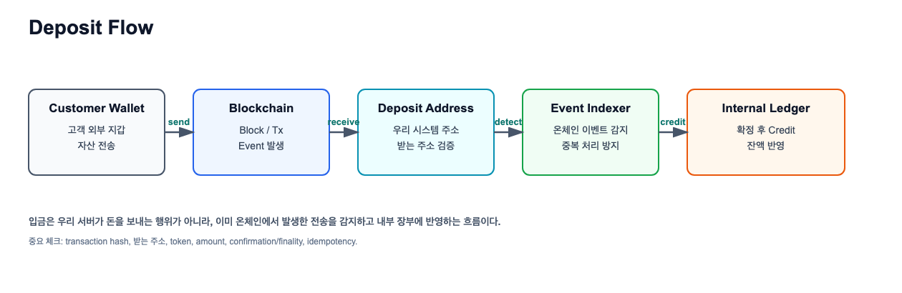
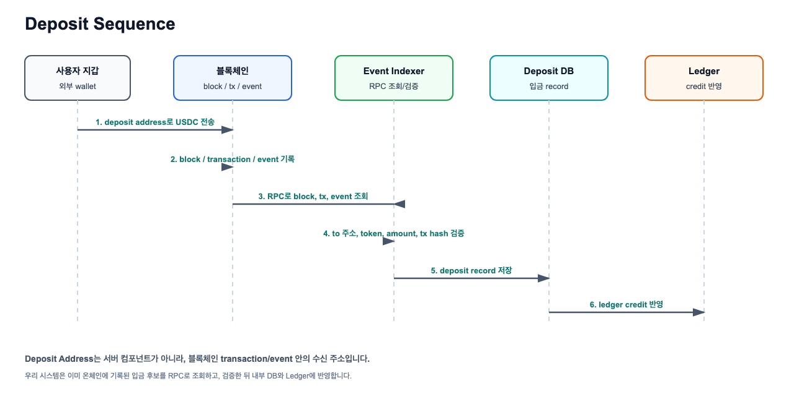
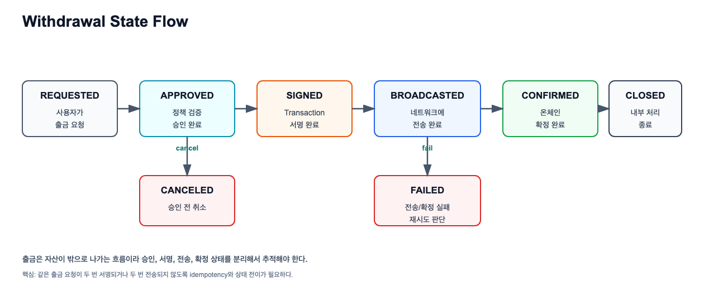
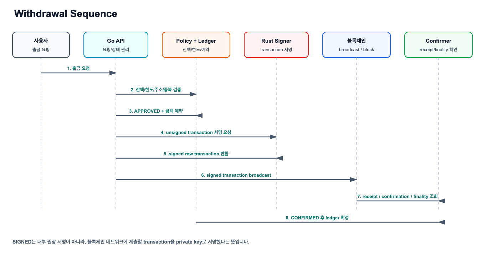
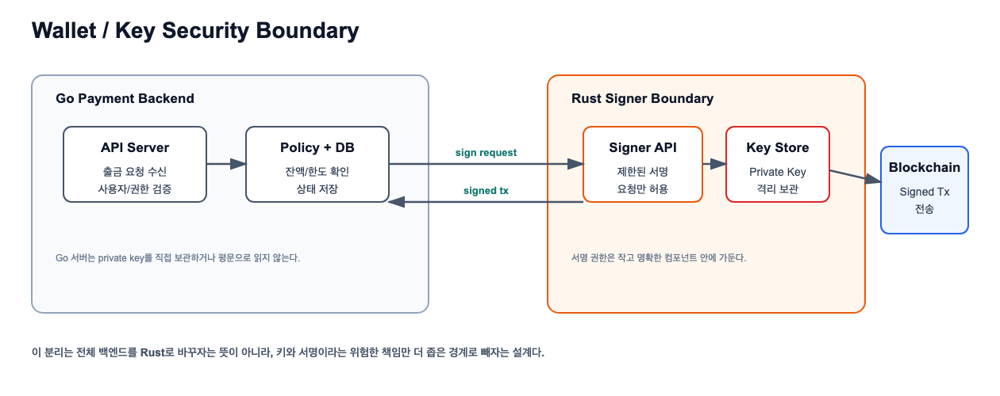

# Deposit, Withdrawal, Wallet, Key Security 개념 학습

관련 Jira: [SPN-20](https://aslan0.atlassian.net/browse/SPN-20)

이 문서는 출퇴근 시간에 읽는 Day 3 개념 학습자료입니다.

오늘은 입금과 출금이 왜 단순한 `create/update` 기능이 아닌지, 그리고 지갑과 키 보안이 왜 별도 경계로 분리되어야 하는지 이해하는 것이 중요합니다.

## 1. Deposit이란 무엇인가

`Deposit`은 한글로 `입금`입니다.

블록체인 결제/월렛/거래소 백엔드에서 Deposit은 보통 외부 지갑에서 우리 시스템이 관리하는 주소로 자산이 들어오는 흐름을 의미합니다.



```text
Customer Wallet
-> Blockchain Network
-> Deposit Address
-> Blockchain Event Indexer
-> Internal Ledger Credit
```

위 그림은 개념을 단순화한 흐름입니다. 더 정확히 말하면 `Deposit Address`는 서버 컴포넌트가 아니라, 블록체인 transaction/event 안에 들어있는 수신 주소입니다.

### Deposit 실행 시퀀스



Event Indexer는 블록체인 네트워크 내부에서 실행되는 것이 아니라, 우리 백엔드의 off-chain worker/indexer layer에서 실행되는 별도 프로세스입니다. 처음에는 일정 주기로 블록체인 RPC를 조회하는 polling 방식으로 구현하고, 이후 WebSocket subscription과 재처리/backfill을 섞은 hybrid 방식으로 확장할 수 있습니다.

중요한 점은 사용자가 "입금했다"고 말하는 시점과 우리 시스템이 "입금으로 인정한다"고 판단하는 시점이 다를 수 있다는 것입니다.

예를 들어 다음 확인이 필요할 수 있습니다.

```text
transaction hash가 실제로 존재하는가?
받는 주소가 우리 시스템 주소인가?
토큰 종류가 맞는가?
금액이 맞는가?
충분한 confirmation 또는 finality가 확보됐는가?
이미 처리한 transaction은 아닌가?
```

## 2. Withdrawal이란 무엇인가

`Withdrawal`은 한글로 `출금`입니다.

Withdrawal은 우리 시스템 안에 있는 사용자의 출금 가능 잔액을 외부 지갑으로 보내는 흐름입니다.

출금은 보통 입금보다 더 위험합니다. 한 번 잘못 서명해서 전송하면 되돌리기 어렵기 때문입니다.

그래서 출금은 보통 여러 단계로 나뉩니다.



```text
REQUESTED
-> APPROVED
-> SIGNED
-> BROADCASTED
-> CONFIRMED
```

### Withdrawal 실행 시퀀스



`SIGNED`는 내부 원장에 서명했다는 뜻이 아니라, 블록체인 네트워크에 제출할 transaction을 private key로 서명했다는 뜻입니다.

상태 의미:

| 상태 | 의미 |
| --- | --- |
| REQUESTED | 사용자가 출금을 요청함 |
| APPROVED | 내부 정책상 출금 가능하다고 승인됨 |
| SIGNED | transaction에 서명 완료 |
| BROADCASTED | 블록체인 네트워크에 transaction 전송 완료 |
| CONFIRMED | 온체인에서 충분히 확정됨 |
| FAILED | 출금 실패 |
| CANCELED | 출금 취소 |

## 3. Deposit과 Withdrawal의 차이

| 구분 | Deposit | Withdrawal |
| --- | --- | --- |
| 방향 | 외부 지갑에서 시스템으로 들어옴 | 시스템에서 외부 지갑으로 나감 |
| 주요 위험 | 잘못된 입금 감지, 중복 반영 | 잘못된 주소 전송, 개인키 노출, 중복 출금 |
| 온체인 역할 | 이미 발생한 transaction을 감지 | transaction을 만들어 서명하고 전송 |
| Ledger 연결 | 입금 확정 후 사용자 계정 credit | 출금 요청/확정에 따라 사용자 계정 debit |
| 보안 중요도 | 주소 검증과 중복 방지 중요 | 승인, 서명, 키 보안이 매우 중요 |

## 4. Wallet이란 무엇인가

`Wallet`은 한글로 `지갑`입니다.

블록체인에서 지갑은 보통 다음 개념을 함께 다룹니다.

| 개념 | 의미 |
| --- | --- |
| Address | 외부에 공개 가능한 블록체인 주소 |
| Private Key | 해당 주소의 자산을 움직일 수 있는 비밀 키 |
| Public Key | private key에서 파생되는 공개 키 |
| Signing | private key로 transaction에 서명하는 행위 |

중요한 구분:

```text
Address는 공개되어도 된다.
Private key는 노출되면 안 된다.
Signing은 자산 이동 권한을 실제로 사용하는 행위다.
```

## 5. Key Security가 왜 중요한가

`Key Security`는 한글로 `키 보안`입니다.

개인키는 일반 사용자 이름, 이메일, 주문번호 같은 데이터와 다릅니다.

개인키가 노출되면 그 주소의 자산을 다른 사람이 움직일 수 있습니다. 그래서 개인키는 일반 DB 컬럼에 평문으로 저장하면 안 됩니다.

위험한 설계:

```text
wallets table
- address
- private_key_plain_text
```

더 나은 방향:



```text
API Server
-> withdrawal request 검증
-> signer service에 서명 요청
-> signer service가 제한된 방식으로 transaction 서명
```

## 6. Rust Signer가 왜 나오는가

Rust signer는 전체 백엔드를 Rust로 바꾸자는 뜻이 아닙니다.

Go 백엔드는 API, 도메인 서비스, DB 저장, 상태 관리를 담당하고, Rust signer는 개인키와 transaction 서명처럼 더 엄격한 안정성과 메모리 안전성이 필요한 작은 컴포넌트를 담당하는 방향입니다.

```text
Go API Server
-> 출금 요청 검증
-> 출금 승인 상태 저장
-> Rust Signer에 서명 요청
-> 서명된 transaction을 네트워크에 전송
```

이렇게 분리하면 개인키를 다루는 경계를 좁힐 수 있고, 보안 사고의 범위를 줄일 수 있습니다.

## 7. 오늘 기억할 요약

```text
Deposit은 들어오는 돈을 감지하고 내부 장부에 반영하는 흐름이다.
Withdrawal은 나가는 돈을 검증, 승인, 서명, 전송, 확정하는 흐름이다.
Wallet address는 공개 가능하지만 private key는 절대 일반 데이터처럼 다루면 안 된다.
Rust signer는 키와 서명 경계를 좁히기 위한 별도 컴포넌트 후보이다.
```
