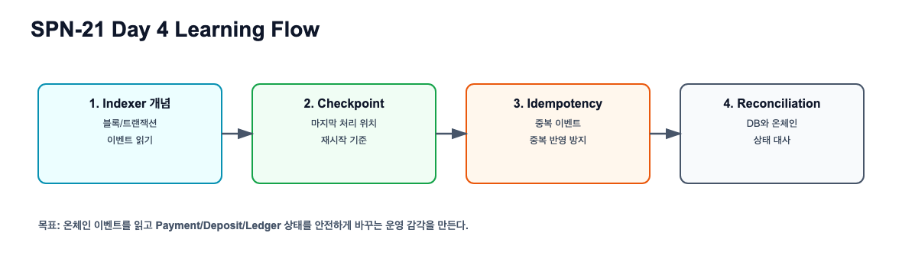
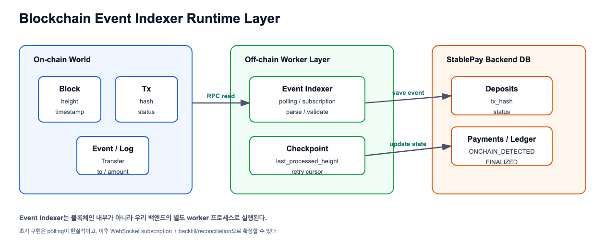
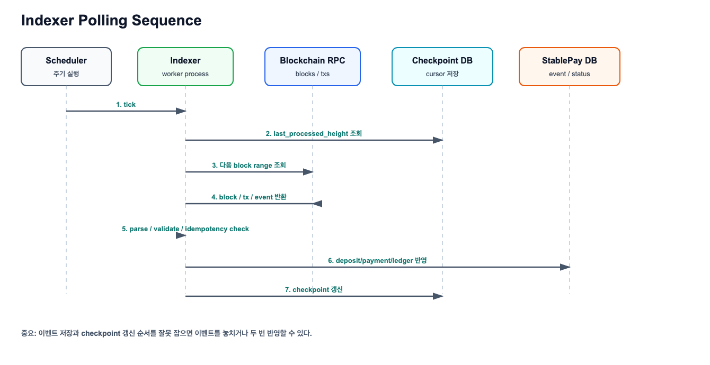
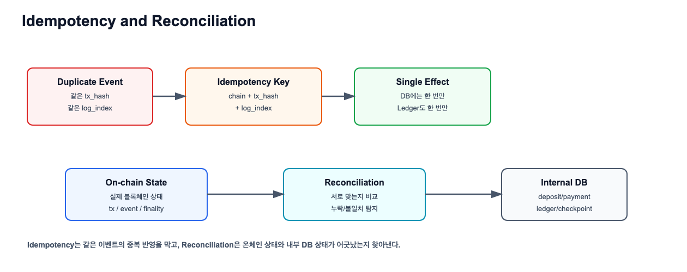

# Blockchain Event Indexer 실습 가이드

관련 Jira: [SPN-21](https://aslan0.atlassian.net/browse/SPN-21)

이 문서는 퇴근 후 직접 진행할 Day 4 실습가이드입니다.

오늘의 실습은 코드를 구현하는 것이 아니라, 이후 Event Indexer 구현에 들어가기 전 도메인/운영 문서를 직접 작성하는 것입니다.

## 실습 흐름



## 참고 다이어그램

아래 그림을 보면서 `docs/domain/04_블록체인_이벤트_인덱서/Blockchain_Event_Indexer_실습산출물.md`를 직접 작성합니다.







## 실습 목표

`docs/domain/04_블록체인_이벤트_인덱서/Blockchain_Event_Indexer_실습산출물.md` 파일을 직접 만들고, 다음 내용을 정리합니다.

1. Event Indexer의 역할
2. Indexer가 읽는 온체인 데이터
3. Indexer가 저장하거나 변경하는 내부 데이터
4. Polling과 checkpoint 흐름
5. Idempotency와 중복 이벤트 처리
6. Reconciliation과 장애 복구
7. Phase 2 Indexer 구현 전 체크리스트

## 작업 전 준비

로컬 public repo 위치에서 작업합니다.

```shell
cd /Users/banghobae/Documents/2030-korea-stablepay/2030-korea-stablepay-network
git status
```

새 파일을 만듭니다.

```shell
touch docs/domain/04_블록체인_이벤트_인덱서/Blockchain_Event_Indexer_실습산출물.md
```

## 작성할 문서 구조

아래 목차를 그대로 사용해도 됩니다.

```markdown
# Blockchain Event Indexer

## 한 문장 요약

## Event Indexer의 역할

## Indexer가 읽는 데이터

## Indexer가 저장하거나 변경하는 데이터

## Polling과 Checkpoint 흐름

## Idempotency와 중복 이벤트 처리

## Reconciliation과 장애 복구

## Payment 상태 변경 흐름

## Phase 2 구현 전 체크리스트

## 아직 모르는 것과 다음 질문

## 검증 체크리스트
```

## 섹션별 작성 가이드

### 1. 한 문장 요약

아래 문장을 참고하되, 본인 말로 바꿔보세요.

```text
Event Indexer는 블록체인에 이미 기록된 block, transaction, event를 읽고,
우리 서비스의 deposit/payment/ledger 상태로 변환하는 off-chain worker다.
```

### 2. Indexer가 읽는 데이터

아래 표를 직접 채웁니다.

| 데이터 | 의미 | 왜 필요한가 |
| --- | --- | --- |
| block |  |  |
| transaction |  |  |
| event/log |  |  |
| receipt |  |  |
| finality |  |  |

### 3. Indexer가 저장하거나 변경하는 데이터

아래 표를 직접 채웁니다.

| 내부 데이터 | 역할 |
| --- | --- |
| deposits |  |
| payments |  |
| ledger_entries |  |
| indexer_checkpoints |  |
| processed_events |  |

### 4. Polling과 Checkpoint 흐름

다음 흐름을 본인 말로 설명합니다.

```text
last_processed_height 조회
-> 다음 block range 조회
-> event 파싱
-> DB 반영
-> checkpoint 갱신
```

### 5. Idempotency와 Reconciliation

다음 질문에 답합니다.

```text
같은 tx_hash를 두 번 읽으면 어떤 문제가 생기는가?
chain + tx_hash + log_index가 왜 idempotency key 후보인가?
온체인에는 입금이 있는데 내부 DB에 없다면 어떻게 찾아야 하는가?
checkpoint만 믿으면 왜 위험할 수 있는가?
```

## 권장 커밋 메시지

```shell
git add docs/domain/04_블록체인_이벤트_인덱서/Blockchain_Event_Indexer_실습산출물.md
git commit -m "docs: SPN-21 블록체인 이벤트 인덱서 도메인 정리"
git push
```
