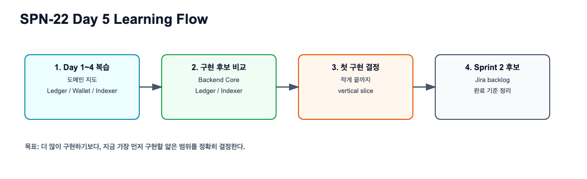
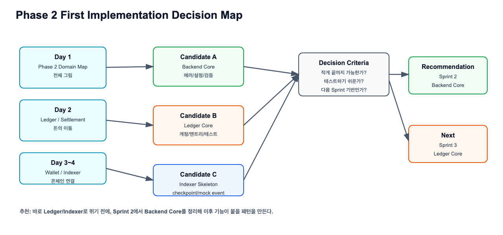
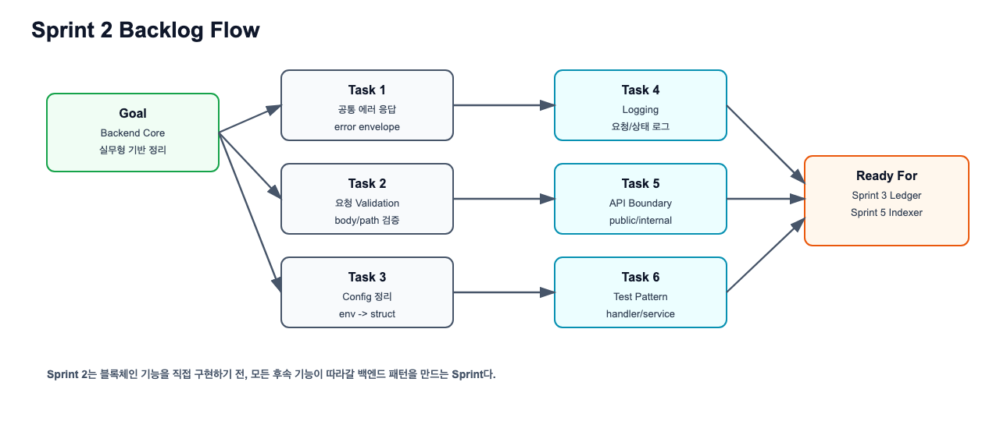

# Phase 2 Study Summary 실습 가이드

관련 Jira: [SPN-22](https://aslan0.atlassian.net/browse/SPN-22)

이 문서는 퇴근 후 직접 진행할 Day 5 실습가이드입니다.

오늘의 실습은 `docs/domain/05_구현범위와_Sprint2/Phase_2_Study_Summary_실습산출물.md`를 직접 작성하고, Phase 2 첫 구현 범위와 Sprint 2 백로그 후보를 정리하는 것입니다.

## 실습 흐름



## 참고 다이어그램





## 실습 목표

`docs/domain/05_구현범위와_Sprint2/Phase_2_Study_Summary_실습산출물.md` 파일을 직접 채우고, 다음 내용을 정리합니다.

1. Day 1~4 학습 요약
2. 아직 약한 개념 목록
3. Phase 2 첫 구현 후보 3개 비교
4. 추천 첫 구현 작업 1개 선택
5. Sprint 2 백로그 후보 작성
6. Day 6에서 다시 확인할 질문 목록 작성

## 작업 전 준비

```shell
cd /Users/banghobae/Documents/2030-korea-stablepay/2030-korea-stablepay-network
git status
```

파일은 템플릿으로 준비되어 있습니다.

```shell
docs/domain/05_구현범위와_Sprint2/Phase_2_Study_Summary_실습산출물.md
```

## 작성할 문서 구조

```markdown
# Phase 2 Study Summary

## 한 문장 요약

## Day 1~4 학습 요약

## 아직 약한 개념

## Phase 2 첫 구현 후보 비교

## 추천 첫 구현 작업

## Sprint 2 백로그 후보

## Day 6에서 다시 확인할 질문

## 검증 체크리스트
```

## 후보 비교 가이드

아래 표를 직접 채웁니다.

| 후보 | 지금 시작해도 되는 이유 | 아직 위험한 이유 | 내 판단 |
| --- | --- | --- | --- |
| Backend Core |  |  |  |
| Ledger Core |  |  |  |
| Indexer Skeleton |  |  |  |

## 권장 커밋 메시지

```shell
git add docs/domain/05_구현범위와_Sprint2/Phase_2_Study_Summary_실습산출물.md
git commit -m "docs: SPN-22 Phase 2 학습 요약과 첫 구현 범위 정리"
git push
```
