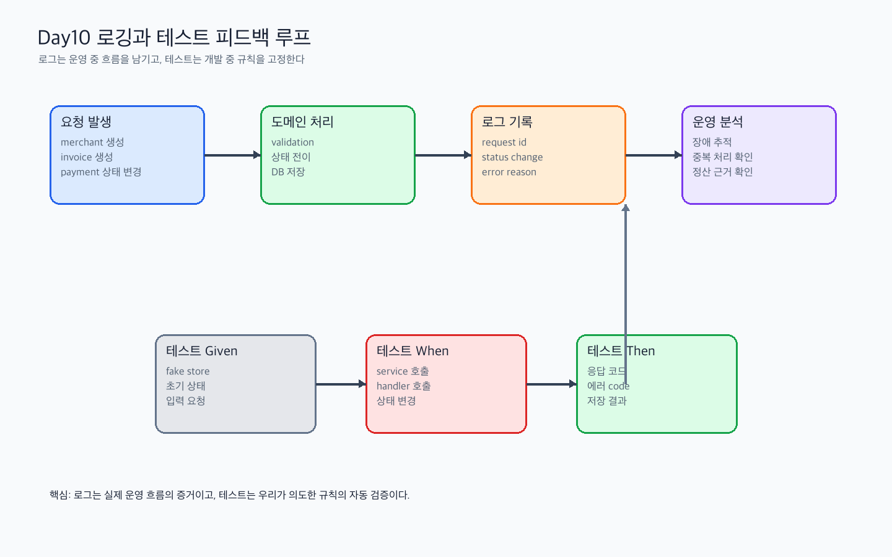

# Day 10 실습산출물 - 로깅과 테스트 패턴

관련 Jira: [SPN-27](https://aslan0.atlassian.net/browse/SPN-27)

이 문서는 Day10 실습을 하면서 직접 채우는 산출물입니다.

중요한 전제:

```text
서비스 전체 흐름을 이미 다 안다고 가정하지 않는다.
오늘은 payment 상태 전이 테스트 하나를 기준으로 작성한다.
Ledger/Indexer/Withdrawal은 아직 구현 전이므로 "미래에 필요할 테스트 후보" 수준으로만 작성한다.
```

## 실습 흐름



## 작성 순서

아래 순서대로 작성합니다.

| 순서 | 먼저 할 일 | 그 다음 산출물에 적을 것 |
| --- | --- | --- |
| 1 | `internal/payment/service_test.go`를 연다 | 기존 테스트가 어떤 규칙을 검증하는지 적는다 |
| 2 | `TestService_UpdatePaymentStatus`를 찾는다 | payment 상태 변경 흐름을 적는다 |
| 3 | transaction_hash 없는 실패 테스트를 추가한다 | 테스트 이름, given/when/then, 막아주는 버그를 적는다 |
| 4 | 실패 케이스를 운영 관점으로 본다 | 어떤 로그가 필요할지 적는다 |
| 5 | 로그 후보를 보안 관점으로 본다 | 로그에 남기면 안 되는 값을 적는다 |
| 6 | 미래 Ledger 구현을 상상한다 | 돈 기록에서 막아야 할 테스트 후보를 적는다 |

## 1. 기존 테스트 구조 관찰

보는 파일:

```text
internal/payment/service_test.go
```

먼저 아래 함수를 찾습니다.

```text
TestService_UpdatePaymentStatus
```

작성 방법:

```text
테스트 이름을 보고 "이 테스트가 어떤 규칙을 설명하는지" 한 문장으로 적는다.
코드 전체를 완벽히 이해하지 못해도 괜찮다.
지금은 테스트 이름, 시작 상태, 요청 상태, 기대 결과만 먼저 본다.
```

| 테스트 파일 | 테스트하는 대상 | 확인한 규칙 | 내가 이해한 의미 |
| --- | --- | --- | --- |
| `internal/payment/service_test.go` | `Service.UpdatePaymentStatus` | `PENDING`에서 `ONCHAIN_DETECTED`로 변경할 수 있다 | 온체인 거래가 감지되면 payment 상태를 다음 단계로 진행할 수 있다 |
| `internal/payment/service_test.go` | `Service.UpdatePaymentStatus` | `FINALIZED`에서 `PENDING`으로 되돌릴 수 없다 | 최종 확정된 결제는 이전 상태로 되돌리면 안 된다 |
| `internal/payment/service_test.go` | `Service.UpdatePaymentStatus` | `FINALIZED`가 되면 `finalized_at`을 저장한다 | 최종 확정 시각은 나중에 정산/추적에 필요하다 |
| `internal/payment/service_test.go` | `Service.UpdatePaymentStatus` | 내가 추가한 테스트 이름: | 내가 이해한 의미: |

관찰 메모:

```text
테스트 이름이 가장 이해하기 쉬웠던 케이스:

아직 읽기 어려운 테스트 코드:

Java 테스트와 비교했을 때 다른 점:
```

## 2. 오늘 추가한 테스트 정리

오늘 추가한 테스트 이름:

```text
transaction_hash 없이 ONCHAIN_DETECTED로 변경할 수 없다
```

이 테스트가 확인하는 규칙:

```text
ONCHAIN_DETECTED는 블록체인에서 transaction을 감지했다는 의미이므로,
어떤 transaction을 감지했는지 추적할 수 있는 transaction_hash가 필요하다.
```

내가 실제로 작성한 코드 위치:

```text
파일:
함수:
테스트 이름:
```

이 테스트가 막아주는 버그:

```text
예시: transaction_hash 없이 ONCHAIN_DETECTED 상태가 저장되면, 나중에 어떤 온체인 거래를 근거로 결제 상태가 바뀌었는지 추적할 수 없다.
내가 작성한 답:
```

## 3. 로그가 필요한 이벤트 후보

오늘은 모든 로그를 설계하는 날이 아닙니다.

먼저 오늘 추가한 테스트에서 바로 떠올릴 수 있는 로그 후보를 작성합니다.

### 3-1. 오늘 코드에서 바로 나온 로그 후보

| 이벤트 | 로그가 필요한 이유 | 포함할 값 |
| --- | --- | --- |
| `payment status transition rejected` | transaction_hash 없이 ONCHAIN_DETECTED로 바꾸려는 잘못된 요청을 추적하기 위해 | `payment_id`, `current_status`, `requested_status`, `reason` |
| `payment status changed` | 결제 상태가 실제로 바뀐 이력을 추적하기 위해 | `payment_id`, `old_status`, `new_status`, `transaction_hash` |

내가 추가로 생각한 로그 후보:

| 이벤트 | 로그가 필요한 이유 | 포함할 값 |
| --- | --- | --- |
|  |  |  |
|  |  |  |

### 3-2. 미래 기능에서 필요할 수 있는 로그 후보

아래는 아직 구현 전입니다. 지금 완벽히 알 필요는 없고, "돈과 온체인 이벤트를 추적하려면 이런 로그가 필요하겠구나" 정도로 적습니다.

| 미래 기능 | 로그 후보 | 왜 필요할까 |
| --- | --- | --- |
| Ledger | `ledger transaction created` | 돈의 이동 기록이 생성된 시점을 추적하기 위해 |
| Indexer | `duplicate blockchain event ignored` | 같은 온체인 이벤트를 두 번 반영하지 않았음을 확인하기 위해 |
| Withdrawal | `withdrawal transaction signed` | 출금 transaction 서명 시점을 추적하기 위해 |
| Settlement | `settlement batch created` | 정산 묶음이 언제 어떤 기준으로 만들어졌는지 추적하기 위해 |

내가 아직 헷갈리는 로그 후보:

```text

```

## 4. 로그에 포함하면 안 되는 값

작성 기준:

```text
유출되면 자산을 이동시킬 수 있는 값
유출되면 시스템에 접근할 수 있는 값
유출되면 사용자를 과도하게 식별할 수 있는 값
```

| 값 이름 | 포함하면 안 되는 이유 |
| --- | --- |
| `private_key` | 노출되면 지갑 자산을 직접 이동시킬 수 있다 |
| `seed_phrase` | 지갑 전체를 복구할 수 있는 비밀값이다 |
| `full_access_token` | 사용자의 인증 권한이 탈취될 수 있다 |
| `database_password` | DB 접근 권한이 노출될 수 있다 |
| `raw_request_body` | 카드정보, 토큰, 개인정보가 섞여 있을 수 있다 |

마스킹이 필요할 수 있다고 생각한 값:

```text
예시: email, wallet_address, phone_number
내가 작성한 답:
```

## 5. 한글 subtest 후보

작성 방법:

```text
"어떤 조건이면 어떤 동작을 할 수 없다/있다" 형태로 쓴다.
테스트 이름만 봐도 깨진 규칙을 알 수 있게 작성한다.
```

오늘 반드시 포함할 후보:

```text
1. transaction_hash 없이 ONCHAIN_DETECTED로 변경할 수 없다
```

추가 후보:

```text
2. FINALIZED에서 PENDING으로 되돌릴 수 없다
3. FINALIZED가 되면 finalized_at을 저장한다
4.
5.
```

## 6. given / when / then 테스트 패턴

오늘 추가한 테스트를 아래 형식으로 풀어 씁니다.

```text
테스트 이름: transaction_hash 없이 ONCHAIN_DETECTED로 변경할 수 없다

given:
PENDING 상태의 payment가 존재한다.

when:
transaction_hash 없이 ONCHAIN_DETECTED 상태 변경을 요청한다.

then:
에러가 발생한다.
payment 상태는 PENDING으로 유지된다.
```

내가 작성한 given/when/then:

```text
테스트 이름:

given:

when:

then:
```

## 7. Ledger 구현 전 필요한 테스트 후보

주의:

```text
이 부분은 오늘 구현하는 내용이 아니다.
다음 단계에서 Ledger를 만들기 전에 어떤 위험을 테스트로 막아야 하는지 미리 생각하는 칸이다.
```

Ledger는 payment 상태만으로 부족한 "돈의 이동 기록"을 남기는 영역입니다.

예를 들어 payment가 `FINALIZED`라고만 되어 있으면 아래 질문에 충분히 답하기 어렵습니다.

```text
누가 누구에게 얼마를 보냈는가?
어떤 통화 단위인가?
수수료는 얼마인가?
같은 온체인 이벤트가 두 번 반영되지는 않았는가?
장애 후 재처리해도 돈이 중복 기록되지 않는가?
```

테스트 후보 작성:

| 막고 싶은 위험 | 테스트 이름 후보 |
| --- | --- |
| 같은 온체인 이벤트를 두 번 반영함 | 같은 tx_hash와 log_index는 한 번만 Ledger에 반영된다 |
| 금액이 0 이하인데 Ledger entry가 생성됨 | 금액이 0 이하이면 Ledger entry를 생성할 수 없다 |
| debit과 credit 합계가 맞지 않음 | 하나의 Ledger transaction은 debit과 credit 합계가 같아야 한다 |
| payment는 실패했는데 Ledger만 저장됨 | payment 처리 실패 시 Ledger 기록도 생성되지 않는다 |

내가 추가로 생각한 후보:

```text
- 막고 싶은 위험:
  테스트 이름 후보:

- 막고 싶은 위험:
  테스트 이름 후보:
```

## 8. 오늘 실행한 명령

실행한 명령과 결과를 적습니다.

```text
gofmt 또는 go fmt 실행 여부:

go test ./internal/payment 결과:

go test ./... 결과:
```

## 9. 오늘의 결론

아래 문장을 내 말로 완성합니다.

```text
Day 10을 통해 내가 이해한 로그와 테스트의 역할은 ...

특히 payment 상태 변경 테스트에서 중요하다고 느낀 점은 ...

아직 헷갈리는 부분은 ...
```
