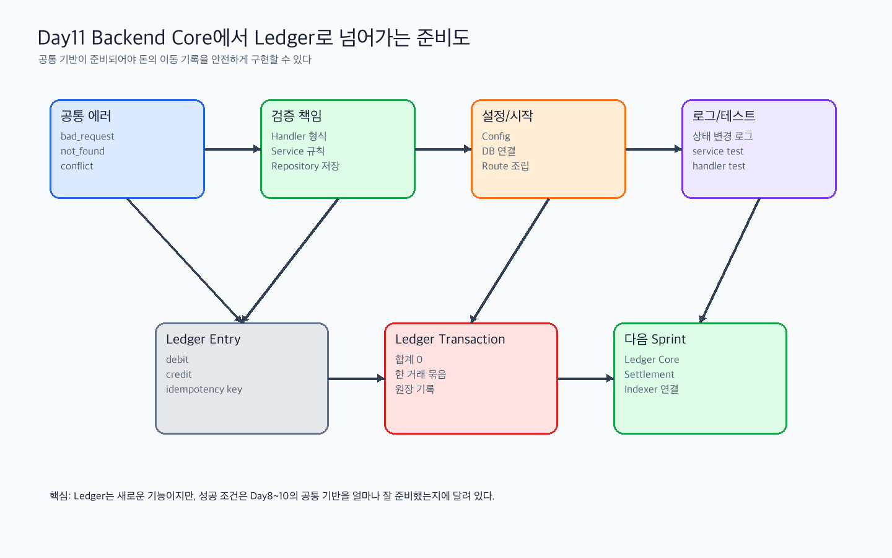

# Day 11 실습산출물 - Backend Core 통합 복습과 Ledger 구현 준비

관련 Jira: [SPN-28](https://aslan0.atlassian.net/browse/SPN-28)

## 실습 흐름



## 1. Backend Core 통합 체크리스트

| 영역 | 준비 여부 | 내가 이해한 내용 | 추가 질문 |
| --- | --- | --- | --- |
| Error Response |  | 실패 응답을 code/message/field 구조로 통일한다 | Ledger 실패도 같은 구조로 표현할 수 있는가 |
| Validation |  | Handler는 요청 형식, Service는 도메인 규칙을 검증한다 | Ledger debit/credit 검증은 어느 계층에 둘 것인가 |
| Config |  | 실행 환경 설정을 Config로 모아 시작 시점에 검증한다 | Ledger/Indexer 프로세스별 필수 설정은 무엇인가 |
| Logging |  | 돈과 상태가 바뀌는 순간을 추적 가능하게 남긴다 | Ledger 생성 로그에는 어떤 값을 남길 것인가 |
| Test Pattern |  | given/when/then과 한글 subtest로 규칙을 고정한다 | Ledger 중복 방어 테스트는 어떻게 작성할 것인가 |

## 2. Day 8~10에서 가장 약한 개념

```text
1. 예: Config 필수/선택 설정 판단
2. 예: conflict와 bad_request의 경계
3. 예: Ledger debit/credit 방향
```

## 3. Ledger 구현 전 위험 요소

```text
- payment finalized를 중복 처리하면 ledger transaction이 두 번 생길 수 있다.
- debit/credit 합계가 맞지 않으면 내부 장부상 돈이 생기거나 사라진 것처럼 보일 수 있다.
- DB transaction 없이 ledger transaction과 entry를 따로 저장하면 일부만 저장될 수 있다.
- 로그가 부족하면 어떤 payment에서 ledger가 생성됐는지 추적하기 어렵다.
```

## 4. 다음 구현 티켓 후보

| 후보 | 먼저 해야 하는 이유 | 예상 난이도 |
| --- | --- | --- |
| Ledger migration 작성 | account/transaction/entry 구조를 먼저 고정해야 한다 | 중 |
| Ledger repository 작성 | DB 저장/조회 경계를 만든다 | 중 |
| Ledger service 작성 | debit/credit 합계 검증과 중복 방어 정책을 둔다 | 상 |
| Payment finalized와 Ledger 연결 | 결제 확정이 돈의 이동 기록으로 이어져야 한다 | 상 |
| Ledger 테스트 작성 | 중복 생성과 불균형 entry를 자동으로 막아야 한다 | 상 |

## 5. SPN-2 완료 판단

```text
SPN-2를 완료로 볼 수 있는가?
아직 부족하다면 무엇이 부족한가?
```

판단 예시:

```text
일부 보강 후 완료로 볼 수 있다.
공통 기반의 문서 기준은 잡혔고, 다음 단계에서는 실제 코드 구현으로 넘어가면 된다.
다만 Ledger 구현 전에 공통 error response와 config 구조를 코드로 먼저 작게 구현하는 것이 좋다.
```

## 6. 오늘의 결론

작성할 내용:

```text
Backend Core를 마치고 Ledger 구현으로 넘어가기 위해 내가 준비한 것은 ...
```
