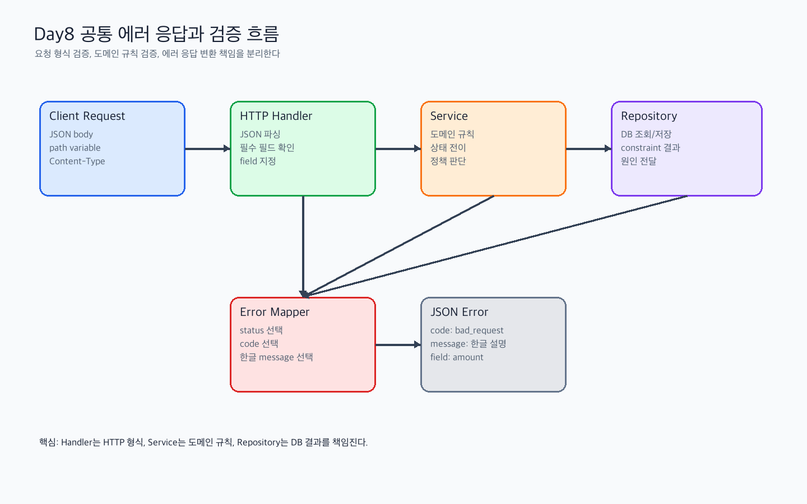

# Day 8 기초학습 - 공통 에러 응답과 요청 검증

관련 Jira: [SPN-25](https://aslan0.atlassian.net/browse/SPN-25)

Day 8의 목표는 API 실패 응답과 요청 검증을 정리하는 것입니다.

Phase 2에서는 Ledger, Deposit, Withdrawal, Settlement처럼 돈과 상태가 연결된 기능이 많아집니다.

이때 API마다 에러 응답 형식이 다르면 클라이언트도 혼란스럽고, 나중에 장애를 추적하기도 어렵습니다.

## 오늘의 큰 그림



Day8에서 가장 중요하게 봐야 하는 것은 “어디에서 에러가 발생했는가?”가 아니라 “어느 계층이 어떤 책임으로 에러를 해석해야 하는가?”입니다.

HTTP Handler는 요청 형식에 가까운 문제를 봅니다. JSON body가 깨졌는지, path variable이 비어 있는지, 필수 필드가 빠졌는지 같은 문제입니다.

Service는 도메인 규칙에 가까운 문제를 봅니다. 결제 금액이 0보다 커야 하는지, payment 상태 전이가 가능한지, 지원하는 currency인지 같은 문제입니다.

Repository는 DB 조회와 저장을 맡습니다. DB constraint 때문에 실패할 수는 있지만, 비즈니스 규칙을 판단하는 중심 계층은 아닙니다.

## 오늘의 목표

1. 공통 에러 응답이 왜 필요한지 설명할 수 있다.
2. `bad_request`, `not_found`, `conflict`, `internal_server_error` 같은 error code 후보를 정리한다.
3. handler와 service의 validation 책임을 구분한다.
4. 기존 merchant, invoice, payment API에 어떤 에러 응답이 필요한지 찾는다.
5. 실습산출물에 우리 프로젝트의 에러 응답 정책 초안을 작성한다.

## 출퇴근 학습

출퇴근 시간에는 코드를 외우려고 하지 말고, 다음 질문에 답할 수 있게 읽습니다.

```text
왜 에러 메시지만 반환하면 부족할까?
왜 error code가 필요할까?
handler validation과 service validation은 어떻게 다를까?
왜 repository가 요청 검증까지 담당하면 안 될까?
```

## 퇴근 후 작업

퇴근 후에는 기존 코드를 보면서 다음을 정리합니다.

1. 현재 API에서 에러 응답이 만들어지는 위치를 찾는다.
2. 공통 에러 응답 JSON 초안을 작성한다.
3. merchant, invoice, payment 요청별 validation 후보를 적는다.
4. handler/service/repository 책임을 나눈다.

## 오늘 꼭 잡아야 하는 문장

```text
Validation은 사용자의 요청을 믿지 않기 위한 장치이고,
Error Response는 실패를 예측 가능한 언어로 표현하기 위한 장치다.
```

Day8을 지나면 “에러가 났다”가 아니라 다음처럼 말할 수 있어야 합니다.

| 질문 | 답할 수 있어야 하는 내용 |
| --- | --- |
| 어떤 HTTP status인가? | 400, 404, 409, 415, 500 중 무엇이 맞는가 |
| 어떤 error code인가? | `bad_request`, `not_found`, `conflict`처럼 프로그램이 분기할 값 |
| 사용자가 볼 message는 무엇인가? | 한글로 이해 가능한 설명 |
| field가 필요한가? | 특정 요청 필드 문제인지, 전체 요청/서버 문제인지 |

## 완료 기준

- [ ] 공통 에러 응답 형식을 설명했다.
- [ ] error code 후보를 작성했다.
- [ ] handler validation과 service validation을 구분했다.
- [ ] 실습산출물을 작성했다.
- [ ] 검증문제를 풀고 답변가이드와 비교했다.
