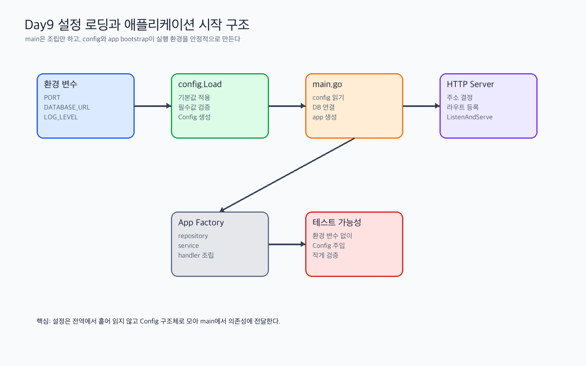

# Day 9 실습산출물 - 설정 로딩과 애플리케이션 시작 구조

관련 Jira: [SPN-26](https://aslan0.atlassian.net/browse/SPN-26)

이 문서는 직접 채우는 실습산출물입니다.

정답 예시는 `Day9_실습가이드.md`와 `Day9_검증문제_답변가이드.md`에서 확인하고, 이 문서에는 먼저 본인이 이해한 내용을 적습니다.

## 실습 흐름



## 1. main.go 실행 순서

아래 순서를 실제 `cmd/api/main.go`를 읽고 프로젝트 기준으로 채운다.

| 순서 | 코드에서 확인한 동작 | 관련 파일/함수 | 내가 이해한 의미 |
| --- | --- | --- | --- |
| 1 |  |  |  |
| 2 |  |  |  |
| 3 |  |  |  |
| 4 |  |  |  |
| 5 |  |  |  |

메모:

```text

```

## 2. 현재 필요한 설정값

| 설정 | 필수 여부 | 기본값 가능 여부 | 이유 |
| --- | --- | --- | --- |
|  |  |  |  |
|  |  |  |  |
|  |  |  |  |

판단 기준 메모:

```text
필수 설정이라고 생각한 이유:

기본값을 둘 수 있다고 생각한 이유:

아직 판단이 어려운 설정:
```

## 3. Phase 2에서 추가될 설정값

| 설정 | 필요한 기능 | 설명 |
| --- | --- | --- |
|  |  |  |
|  |  |  |
|  |  |  |
|  |  |  |
|  |  |  |

추가로 필요할 것 같은 설정:

```text

```

## 4. config 구현 후보

```text
패키지 위치:
구조체 이름:
함수 후보:
```

고민할 점:

```text
config가 어디까지 책임져야 한다고 생각하는가?

기본값 적용은 어디에서 하는 것이 좋다고 생각하는가?

설정 누락 에러는 어떤 메시지로 보여주는 것이 좋다고 생각하는가?
```

## 5. 설정 누락 처리 기준

| 구분 | 설정 후보 | 이유 |
| --- | --- | --- |
| 서버 시작 시 반드시 실패해야 하는 설정 |  |  |
| 기본값을 사용해도 되는 설정 |  |  |
| 특정 기능 실행 시점에 검증해도 되는 설정 |  |  |

추가 메모:

```text

```

## 6. 오늘 헷갈린 개념

```text
-
-
-
```

## 7. 오늘의 결론

```text
Day 9를 통해 내가 이해한 config의 역할은 ...
```
