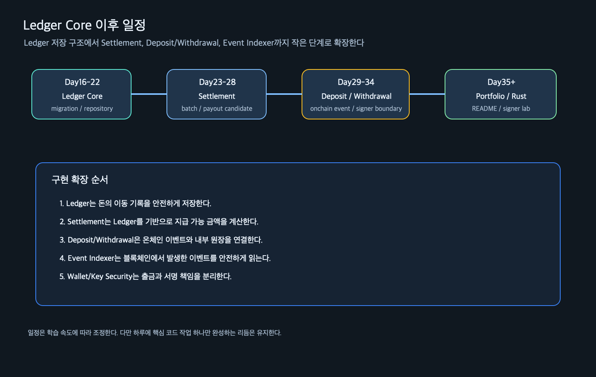

# Ledger Core 앞으로의 일정

이 문서는 Day16 이후 `2030 KOREA StablePay Network`의 Ledger, Settlement, Deposit/Withdrawal, Event Indexer 학습과 구현 흐름을 한눈에 보기 위한 일정표입니다.

현재 리듬은 아래 원칙을 따릅니다.

```text
작은 코드 작업 하나
-> 코드 흐름 설명
-> 테스트 또는 SQL 검증
-> 짧은 산출물
-> 리뷰
-> Git/Jira/Confluence 정리
```

## 현재 위치

```text
Day12: Ledger 도메인 타입 초안
Day13: Ledger 균형 검증 테스트 자료
Day14: Ledger Core 회고와 검증
Day15: Ledger Service 균형 검증 구현 자료
Day16: Ledger DB Migration 작성
```

## 전체 흐름



## Day16 이후 일정

| Day | 주제 | 핵심 산출물 | 목적 |
| --- | --- | --- | --- |
| Day16 | Ledger DB Migration 작성 | `000002_create_ledger_core_tables.up/down.sql` | Ledger 타입을 DB 테이블 구조로 옮긴다 |
| Day17 | Ledger Repository 초안 | `internal/ledger/repository.go` | 검증된 Ledger Transaction을 DB에 저장할 준비를 한다 |
| Day18 | Repository 저장 테스트 | repository integration test 후보 | `ledger_transactions`와 `ledger_entries` 저장 흐름을 검증한다 |
| Day19 | Ledger Service와 Repository 연결 | `CreateTransaction` 흐름 | Service 검증 후 Repository 저장으로 이어지게 만든다 |
| Day20 | Idempotency Key 중복 방지 | 중복 저장 방지 규칙 | 같은 원장 거래가 두 번 저장되지 않게 한다 |
| Day21 | Payment FINALIZED와 Ledger 연결 설계 | payment -> ledger 연결 테스트 후보 | 결제 확정이 돈의 이동 기록으로 이어지게 한다 |
| Day22 | Ledger Core 중간 회고 | 체크리스트와 보강 | 타입, 검증, DB, 저장 흐름을 복습한다 |
| Day23 | Settlement 도메인 타입 | settlement batch 타입 | Ledger Entry를 정산 묶음으로 계산할 준비를 한다 |
| Day24 | Settlement 계산 서비스 | 정산 대상 금액 계산 | 가맹점 지급 예정 금액을 계산한다 |
| Day25 | Settlement DB Migration | settlement 테이블 | 정산 결과를 DB에 보존한다 |
| Day26 | Settlement 상태 흐름 | requested/approved/paid 후보 | 정산 처리 상태를 설계한다 |
| Day27 | Reconciliation 기초 | DB 상태와 원장 상태 비교 | 누락, 중복, 불일치를 찾는 흐름을 이해한다 |
| Day28 | Ledger/Settlement 회고 | 종합 산출물 | 돈의 이동 기록과 정산 흐름을 연결해서 설명한다 |
| Day29 | Deposit 도메인 모델 | deposit status, tx hash | 온체인 입금을 백엔드 상태로 반영하는 구조를 잡는다 |
| Day30 | Processed Event 모델 | `processed_events` 후보 | 같은 온체인 이벤트를 두 번 처리하지 않게 한다 |
| Day31 | Event Indexer Mock | block polling mock | 블록체인 이벤트를 읽는 백엔드 작업 구조를 만든다 |
| Day32 | Withdrawal 도메인 모델 | withdrawal request/status | 출금 요청과 승인/서명/전송 흐름을 설계한다 |
| Day33 | Wallet/Key Security 경계 | signer boundary | Go 백엔드와 Rust signer 역할을 분리한다 |
| Day34 | Deposit/Withdrawal 회고 | 입출금 종합 검증 | 온체인 이벤트와 백엔드 상태 흐름을 복습한다 |
| Day35 | Portfolio 정리 | README/API/검증문서 보강 | 채용 담당자가 이해할 수 있는 결과물로 정리한다 |

## 구현 순서의 이유

먼저 Ledger를 만드는 이유는 단순합니다.

```text
Payment는 상태를 말한다.
Ledger는 돈의 이동을 말한다.
Settlement는 Ledger를 기반으로 지급 가능 금액을 계산한다.
Deposit/Withdrawal은 온체인 이벤트와 Ledger를 연결한다.
Event Indexer는 블록체인에서 발생한 일을 백엔드로 가져온다.
Wallet/Key Security는 출금과 서명의 안전 경계를 만든다.
```

그래서 순서는 아래처럼 잡습니다.

```text
Ledger
-> Settlement
-> Deposit/Withdrawal
-> Event Indexer
-> Wallet/Key Security
-> Portfolio packaging
```

## Day16의 위치

Day16은 Ledger를 DB에 처음으로 새기는 날입니다.

아직 repository나 API를 만들지 않습니다.

```text
Day15: 저장 전에 검증한다.
Day16: 저장할 테이블 모양을 만든다.
Day17: 테이블에 저장하는 repository를 만든다.
```

## 일정 운영 기준

이 일정은 고정된 계약이 아니라 학습 진도에 맞춰 조정합니다.

다만 한 번에 너무 많은 기능을 붙이지 않기 위해 아래 기준은 유지합니다.

```text
하루에 핵심 코드 작업 하나만 한다.
문서는 코드 작업을 도와야 한다.
산출물은 오늘 구현한 코드와 직접 연결한다.
복습일은 기능을 늘리지 않고 이해도를 점검한다.
```
