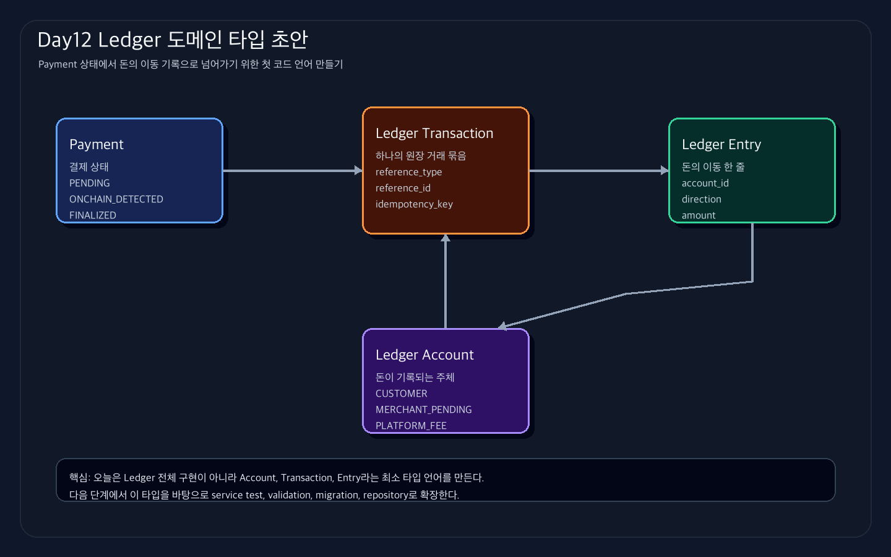

# Day 12 실습가이드 - Ledger 도메인 타입 초안 작성

관련 Jira: [SPN-29](https://aslan0.atlassian.net/browse/SPN-29)

Day12의 퇴근 후 실습은 코드 작업 하나만 합니다.

```text
internal/ledger/ledger.go 파일을 만들고 Ledger 도메인 타입 초안을 작성한다.
```

## 실습 흐름



## 오늘 만들 코드의 위치

새로 만들 폴더:

```text
internal/ledger
```

새로 만들 파일:

```text
internal/ledger/ledger.go
```

## Step 1. 폴더 만들기

프로젝트 루트에서 실행합니다.

```bash
mkdir -p internal/ledger
```

## Step 2. `ledger.go` 파일 만들기

파일:

```text
internal/ledger/ledger.go
```

작성할 코드:

```go
package ledger

import "time"

// AccountType은 원장에서 계정의 역할을 구분한다.
type AccountType string

const (
	AccountTypeCustomer         AccountType = "CUSTOMER"
	AccountTypeMerchantPending AccountType = "MERCHANT_PENDING"
	AccountTypePlatformFee     AccountType = "PLATFORM_FEE"
)

// EntryDirection은 원장 항목의 방향을 나타낸다.
type EntryDirection string

const (
	EntryDirectionDebit  EntryDirection = "DEBIT"
	EntryDirectionCredit EntryDirection = "CREDIT"
)

// Account는 원장에서 돈이 기록되는 주체다.
type Account struct {
	ID        string
	Type      AccountType
	OwnerID   string
	Currency  string
	CreatedAt time.Time
}

// Transaction은 여러 Entry를 하나의 원장 거래로 묶는다.
type Transaction struct {
	ID             string
	ReferenceType  string
	ReferenceID    string
	IdempotencyKey string
	CreatedAt      time.Time
}

// Entry는 하나의 원장 거래 안에서 발생한 돈의 이동 한 줄이다.
type Entry struct {
	ID            string
	TransactionID string
	AccountID     string
	Direction     EntryDirection
	Amount        int64
	Currency      string
	CreatedAt     time.Time
}
```

## Step 3. 코드 해석

### `package ledger`

이 파일은 `ledger` 패키지에 속합니다.

Go에서는 폴더가 패키지 경계가 됩니다.

```text
internal/ledger/ledger.go
```

위 파일은 보통 아래처럼 시작합니다.

```go
package ledger
```

### `type AccountType string`

`AccountType`은 string을 기반으로 만든 새 타입입니다.

그냥 string을 쓰면 아무 문자열이나 들어갈 수 있습니다.

```go
Type: "HELLO"
```

하지만 `AccountType`과 상수를 사용하면 계정 종류를 더 명확하게 제한할 수 있습니다.

```go
Type: AccountTypeMerchantPending
```

### `time.Time`

`time.Time`은 Go 표준 라이브러리의 시간 타입입니다.

생성 시각, 확정 시각, 처리 시각처럼 “언제 발생했는가”를 남길 때 사용합니다.

### `Amount int64`

돈은 `float64`가 아니라 정수로 다룹니다.

예를 들어 USDC를 6자리 최소 단위로 다루면:

```text
10 USDC = 10_000_000
```

그래서 `Amount int64`로 둡니다.

## Step 4. 포맷 실행

```bash
gofmt -w internal/ledger/ledger.go
```

또는 전체 Go 파일을 포맷하려면:

```bash
go fmt ./...
```

## Step 5. 테스트 실행

오늘은 아직 테스트 파일을 만들지 않습니다.

다만 새 패키지가 컴파일되는지 확인하기 위해 전체 테스트를 실행합니다.

```bash
go test ./...
```

성공하면 새 `ledger` 패키지가 아래처럼 보일 수 있습니다.

```text
?    github.com/HoBaeBang/2030-korea-stablepay-network/internal/ledger    [no test files]
```

## Step 6. 완성본 확인

오늘 완성 기준:

```text
internal/ledger/ledger.go 파일이 있다.
AccountType 상수가 있다.
EntryDirection 상수가 있다.
Account 구조체가 있다.
Transaction 구조체가 있다.
Entry 구조체가 있다.
go test ./... 가 성공한다.
```

## Step 7. 실습산출물 작성

`Day12_실습산출물.md`에는 5개 질문만 답합니다.

```text
1. 오늘 만든 타입은 무엇인가?
2. Account, Transaction, Entry는 각각 무엇인가?
3. Amount를 int64로 둔 이유는 무엇인가?
4. 이 타입들이 다음 구현에서 어디로 이어지는가?
5. 아직 헷갈리는 개념은 무엇인가?
```

## Step 8. 커밋 메시지

코드 작업까지 완료했다면 아래 커밋 메시지를 사용합니다.

```bash
git status
git add internal/ledger/ledger.go
git commit -m "feat: Ledger 도메인 타입 초안 추가"
```

산출물 문서를 함께 작성했다면 커밋을 분리하는 것이 좋습니다.

```bash
git add docs/domain/07_Ledger_Core/Day12_Ledger_도메인타입_초안/Day12_실습산출물.md
git commit -m "docs: Day12 Ledger 타입 학습 산출물 정리"
```

커밋을 나누는 이유:

```text
코드 변경과 학습 산출물은 목적이 다르기 때문이다.
```
