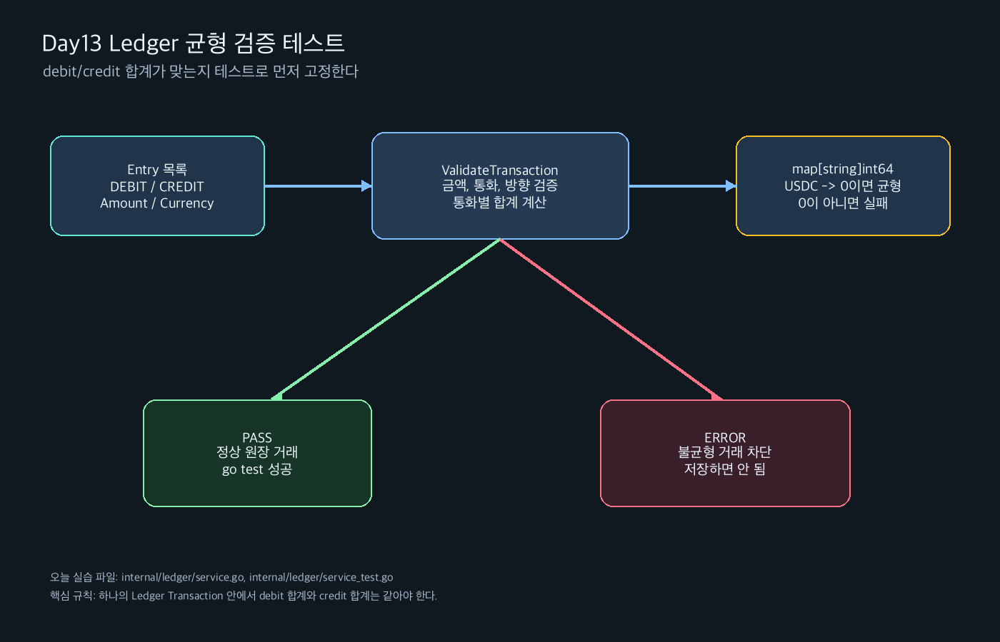

# Day 13 실습가이드 - Ledger 균형 검증 테스트 작성

관련 Jira: [SPN-30](https://aslan0.atlassian.net/browse/SPN-30)

Day13의 퇴근 후 실습은 작은 코드 작업 하나입니다.

```text
Ledger Transaction의 debit/credit 합계가 맞는지 검증하는 Service 메서드와 테스트를 작성한다.
```

## 실습 흐름



## 사전 조건

Day12 실습이 완료되어 있어야 합니다.

아래 파일이 있어야 합니다.

```text
internal/ledger/ledger.go
```

그리고 최소한 아래 타입이 있어야 합니다.

```text
Account
Transaction
Entry
EntryDirectionDebit
EntryDirectionCredit
```

Day12 코드가 Day13 실습과 맞는지 아래 명령으로 확인합니다.

```bash
grep -nE "AccountID|TransactionID|ReferenceID|CreatedAt" internal/ledger/ledger.go
```

`rg`가 설치되어 있다면 아래 명령도 사용할 수 있습니다.

```bash
rg -n "AccountID|TransactionID|ReferenceID|CreatedAt" internal/ledger/ledger.go
```

예상되는 핵심 필드명:

```text
AccountID
TransactionID
ReferenceID
CreatedAt
```

만약 `AccountId`, `TransactionId`, `ReferenceId`, `CreateAt`처럼 보인다면 먼저 Day12 코드 필드명을 정리해야 합니다.

## 오늘 만들 코드의 위치

새로 만들 파일:

```text
internal/ledger/service.go
internal/ledger/service_test.go
```

이미 파일이 있다면 새로 덮어쓰기 전에 내용을 먼저 확인합니다.

```bash
sed -n '1,220p' internal/ledger/service.go
sed -n '1,260p' internal/ledger/service_test.go
```

아직 없다면 오늘 문서의 코드를 그대로 작성하면 됩니다.

## Step 1. `service.go` 작성

파일:

```text
internal/ledger/service.go
```

작성할 코드:

```go
package ledger

import (
	"context"
	"fmt"
)

// Service는 Ledger 도메인 규칙을 검증하고 실행한다.
type Service struct{}

// NewService는 Ledger Service 인스턴스를 만든다.
func NewService() *Service {
	return &Service{}
}

// ValidateTransaction은 원장 거래의 기본 규칙을 검증한다.
func (s *Service) ValidateTransaction(ctx context.Context, entries []Entry) error {
	if ctx == nil {
		return fmt.Errorf("context가 필요합니다")
	}

	if err := ctx.Err(); err != nil {
		return err
	}

	if len(entries) < 2 {
		return fmt.Errorf("원장 거래는 최소 2개 이상의 항목이 필요합니다")
	}

	totals := make(map[string]int64)

	for _, entry := range entries {
		if entry.Amount <= 0 {
			return fmt.Errorf("원장 항목 금액은 0보다 커야 합니다")
		}

		if entry.Currency == "" {
			return fmt.Errorf("원장 항목 통화가 필요합니다")
		}

		switch entry.Direction {
		case EntryDirectionDebit:
			totals[entry.Currency] += entry.Amount
		case EntryDirectionCredit:
			totals[entry.Currency] -= entry.Amount
		default:
			return fmt.Errorf("알 수 없는 원장 항목 방향입니다: %s", entry.Direction)
		}
	}

	for currency, total := range totals {
		if total != 0 {
			return fmt.Errorf("원장 거래의 debit과 credit 합계가 일치하지 않습니다: %s", currency)
		}
	}

	return nil
}
```

## Step 2. 코드 해석

### `type Service struct{}`

아직 저장소나 외부 의존성이 없기 때문에 빈 구조체입니다.

```go
type Service struct{}
```

Java로 비유하면 아직 필드가 없는 서비스 클래스와 비슷합니다.

```java
public class LedgerService {
}
```

### `func NewService() *Service`

새로운 Service 인스턴스의 포인터를 반환합니다.

```go
return &Service{}
```

여기서 `&Service{}`는 “Service 구조체 값을 만들고, 그 주소를 반환한다”는 뜻입니다.

### `func (s *Service) ValidateTransaction(...) error`

`(s *Service)`는 receiver입니다.

Java의 instance method처럼 `Service`에 속한 메서드라고 보면 됩니다.

```go
svc := NewService()
err := svc.ValidateTransaction(ctx, entries)
```

### `totals := make(map[string]int64)`

통화별 합계를 저장하기 위한 map입니다.

```text
key   = currency
value = debit과 credit을 반영한 합계
```

예시:

```text
USDC -> 0
```

최종 합계가 0이면 debit과 credit이 균형을 이룬 것입니다.

처음에는 아래처럼 생각하면 됩니다.

```text
DEBIT  10 USDC  -> totals["USDC"] += 10
CREDIT 9.8 USDC -> totals["USDC"] -= 9.8
CREDIT 0.2 USDC -> totals["USDC"] -= 0.2

결과: 10 - 9.8 - 0.2 = 0
```

실제 코드는 소수점 금액이 아니라 최소 단위 정수로 계산합니다.

```text
10 USDC  = 10_000_000
9.8 USDC = 9_800_000
0.2 USDC = 200_000
```

### `switch entry.Direction`

Entry의 방향에 따라 합계를 다르게 반영합니다.

```go
case EntryDirectionDebit:
	totals[entry.Currency] += entry.Amount
case EntryDirectionCredit:
	totals[entry.Currency] -= entry.Amount
```

오늘 실습에서는 debit은 더하고 credit은 뺍니다.

최종 결과가 0이면 균형이 맞습니다.

## Step 3. `service_test.go` 작성

파일:

```text
internal/ledger/service_test.go
```

작성할 코드:

```go
package ledger

import (
	"context"
	"testing"
)

func TestServiceValidateTransaction(t *testing.T) {
	svc := NewService()
	ctx := context.Background()

	t.Run("debit과 credit 합계가 같으면 성공한다", func(t *testing.T) {
		entries := []Entry{
			{
				AccountID: "acct_customer_1",
				Direction: EntryDirectionDebit,
				Amount:    10_000_000,
				Currency:  "USDC",
			},
			{
				AccountID: "acct_merchant_pending_1",
				Direction: EntryDirectionCredit,
				Amount:    9_800_000,
				Currency:  "USDC",
			},
			{
				AccountID: "acct_platform_fee_1",
				Direction: EntryDirectionCredit,
				Amount:    200_000,
				Currency:  "USDC",
			},
		}

		if err := svc.ValidateTransaction(ctx, entries); err != nil {
			t.Fatalf("원장 거래의 균형이 맞아야 하는데 에러가 발생했습니다: %v", err)
		}
	})

	t.Run("credit 합계가 부족하면 실패한다", func(t *testing.T) {
		entries := []Entry{
			{
				AccountID: "acct_customer_1",
				Direction: EntryDirectionDebit,
				Amount:    10_000_000,
				Currency:  "USDC",
			},
			{
				AccountID: "acct_merchant_pending_1",
				Direction: EntryDirectionCredit,
				Amount:    9_000_000,
				Currency:  "USDC",
			},
		}

		if err := svc.ValidateTransaction(ctx, entries); err == nil {
			t.Fatal("원장 거래의 균형이 맞지 않아야 하는데 nil이 반환되었습니다")
		}
	})

	t.Run("금액이 0이면 실패한다", func(t *testing.T) {
		entries := []Entry{
			{
				AccountID: "acct_customer_1",
				Direction: EntryDirectionDebit,
				Amount:    0,
				Currency:  "USDC",
			},
			{
				AccountID: "acct_merchant_pending_1",
				Direction: EntryDirectionCredit,
				Amount:    0,
				Currency:  "USDC",
			},
		}

		if err := svc.ValidateTransaction(ctx, entries); err == nil {
			t.Fatal("금액이 0인 원장 항목은 실패해야 하는데 nil이 반환되었습니다")
		}
	})

	t.Run("알 수 없는 방향이면 실패한다", func(t *testing.T) {
		entries := []Entry{
			{
				AccountID: "acct_customer_1",
				Direction: EntryDirection("UNKNOWN"),
				Amount:    10_000_000,
				Currency:  "USDC",
			},
			{
				AccountID: "acct_merchant_pending_1",
				Direction: EntryDirectionCredit,
				Amount:    10_000_000,
				Currency:  "USDC",
			},
		}

		if err := svc.ValidateTransaction(ctx, entries); err == nil {
			t.Fatal("알 수 없는 방향은 실패해야 하는데 nil이 반환되었습니다")
		}
	})
}
```

## Step 4. 테스트 코드 해석

### `svc := NewService()`

Ledger Service를 하나 만듭니다.

`:=`는 Go의 짧은 변수 선언입니다.

```text
타입은 오른쪽 값을 보고 Go가 추론한다.
```

### `ctx := context.Background()`

가장 기본적인 context를 만듭니다.

오늘은 DB나 API 요청이 없지만, Service 메서드 모양을 실제 백엔드처럼 유지하기 위해 context를 넘깁니다.

### `entries := []Entry{...}`

`Entry` 여러 개를 담은 slice를 만듭니다.

Java의 `List<Entry>`와 비슷하게 생각하면 됩니다.

Go의 slice는 아래처럼 여러 구조체 값을 나열해서 만들 수 있습니다.

```go
entries := []Entry{
	{
		AccountID: "acct_customer_1",
		Direction: EntryDirectionDebit,
		Amount:    10_000_000,
		Currency:  "USDC",
	},
}
```

여기서 `AccountID: "acct_customer_1"` 같은 문법은 구조체 필드 이름을 지정해서 값을 넣는 방식입니다.

### `if err := svc.ValidateTransaction(ctx, entries); err != nil`

Go에서 자주 쓰는 에러 처리 패턴입니다.

```text
ValidateTransaction을 실행한다.
반환된 error를 err 변수에 담는다.
err가 nil이 아니면 실패로 처리한다.
```

## Step 5. 포맷 실행

프로젝트 루트에서 실행합니다.

```bash
gofmt -w internal/ledger/service.go internal/ledger/service_test.go
```

전체 Go 파일을 한 번에 포맷하려면 아래 명령도 가능합니다.

```bash
go fmt ./...
```

## Step 6. 테스트 실행

Ledger 패키지만 테스트합니다.

```bash
go test ./internal/ledger -v
```

전체 테스트도 실행합니다.

```bash
go test ./...
```

예상 결과:

```text
PASS
ok   github.com/HoBaeBang/2030-korea-stablepay-network/internal/ledger
```

테스트 출력에서 한글 테스트 이름이 보이면 정상입니다.

예시:

```text
=== RUN   TestServiceValidateTransaction/debit과_credit_합계가_같으면_성공한다
--- PASS: TestServiceValidateTransaction/debit과_credit_합계가_같으면_성공한다
```

## Step 7. 자주 만날 수 있는 오류

### `unknown field AccountID`

Day12의 `Entry` 구조체 필드명이 `AccountID`가 아니라 `AccountId`로 되어 있을 때 발생할 수 있습니다.

해결:

```text
AccountId     -> AccountID
TransactionId -> TransactionID
ReferenceId   -> ReferenceID
CreateAt      -> CreatedAt
```

Go에서는 `ID`처럼 약어는 대문자로 유지하는 관례가 많습니다.

### `undefined: EntryDirectionDebit`

`ledger.go`에 아래 상수가 없거나 이름이 다를 때 발생합니다.

```go
const (
	EntryDirectionDebit  EntryDirection = "DEBIT"
	EntryDirectionCredit EntryDirection = "CREDIT"
)
```

해결하려면 Day12 타입 정의를 먼저 확인합니다.

### 테스트가 실패했는데 이유가 잘 안 보이는 경우

먼저 Ledger 패키지만 자세히 실행합니다.

```bash
go test ./internal/ledger -v
```

`-v`는 verbose의 약자이고, 테스트 이름과 실행 결과를 더 자세히 보여줍니다.

## Step 8. 완성 기준

오늘 완성 기준:

```text
internal/ledger/service.go 파일이 있다.
internal/ledger/service_test.go 파일이 있다.
debit과 credit 합계가 같으면 테스트가 성공한다.
합계가 맞지 않으면 테스트가 실패한다.
0 이하 금액은 실패한다.
알 수 없는 direction은 실패한다.
go test ./... 가 성공한다.
```

## Step 9. 실습산출물 작성

`Day13_실습산출물.md`에는 5개 질문만 답합니다.

```text
1. 오늘 만든 Service 메서드는 어떤 규칙을 검증하는가?
2. debit과 credit 합계가 같아야 하는 이유는 무엇인가?
3. `map[string]int64`는 어떤 역할을 하는가?
4. 오늘 테스트 4개는 각각 어떤 버그를 막는가?
5. 아직 헷갈리는 Go 문법 또는 Ledger 개념은 무엇인가?
```

## Step 10. 커밋 메시지

코드 작업까지 완료했다면 아래 커밋 메시지를 사용합니다.

```bash
git status
git add internal/ledger/service.go internal/ledger/service_test.go
git commit -m "test: Ledger 균형 검증 테스트 추가"
```

산출물 문서를 함께 작성했다면 문서 커밋을 분리하는 것이 좋습니다.

```bash
git add docs/domain/07_Ledger_Core/Day13_Ledger_균형검증_테스트/Day13_실습산출물.md
git commit -m "docs: Day13 Ledger 균형 검증 산출물 정리"
```
