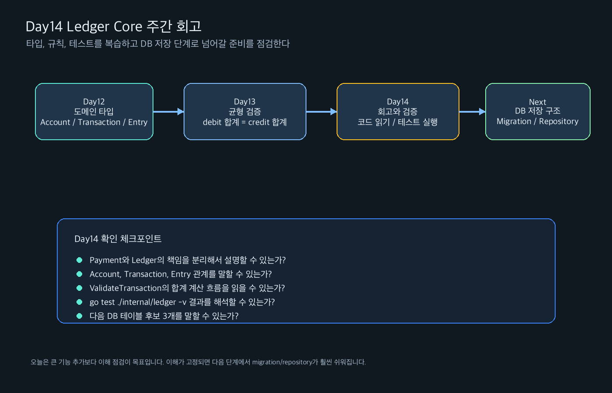

# Day 14 기초학습 - Ledger Core 주간 회고와 검증

관련 Jira: [SPN-31](https://aslan0.atlassian.net/browse/SPN-31)

Day14는 새 기능을 크게 추가하는 날이 아닙니다.

Day12와 Day13에서 만든 흐름을 복습하고, 다음 구현으로 넘어갈 준비가 되었는지 확인하는 날입니다.

## 오늘의 큰 그림



## 오늘의 핵심 문장

```text
Ledger Core는 타입을 만들고,
균형 규칙을 테스트로 고정한 뒤,
저장 구조로 확장한다.
```

Day12에서는 Ledger의 언어를 만들었습니다.

```text
Account
Transaction
Entry
```

Day13에서는 Ledger의 첫 번째 안전 규칙을 만들었습니다.

```text
debit 합계 = credit 합계
```

Day14에서는 이 둘을 연결해서 “우리가 지금 뭘 만들고 있는지”를 다시 확인합니다.

## 오늘 읽을 순서

| 순서 | 문서 | 목적 |
| --- | --- | --- |
| 1 | [Day14_기초학습.md](Day14_기초학습.md) | 오늘의 회고 목표와 진행 순서를 확인한다 |
| 2 | [Day14_개념학습.md](Day14_개념학습.md) | Day12~13 핵심 개념을 한 번에 복습한다 |
| 3 | [Day14_실습가이드.md](Day14_실습가이드.md) | 코드 읽기, 테스트 실행, 산출물 작성 순서를 따라간다 |
| 4 | [Day14_실습산출물.md](Day14_실습산출물.md) | 5문항으로 이해도를 점검한다 |
| 5 | [Day14_검증문제_답변가이드.md](Day14_검증문제_답변가이드.md) | 문제를 먼저 풀고 답변가이드와 비교한다 |

## 출퇴근 학습에서 잡을 것

출퇴근 시간에는 아래 질문을 중심으로 복습합니다.

```text
Payment와 Ledger는 왜 분리되는가?
Account, Transaction, Entry는 각각 어떤 책임을 가지는가?
debit과 credit 균형 검증은 어떤 버그를 막는가?
테스트를 먼저 만든 것이 다음 구현에 어떤 도움을 주는가?
다음 단계에서 DB 테이블은 어떤 모양으로 나뉠 것 같은가?
```

## 퇴근 후 작업

퇴근 후에는 새 기능을 크게 추가하지 않습니다.

아래 작업을 합니다.

```text
1. Day12 코드 읽기
2. Day13 코드와 테스트 읽기
3. Ledger 패키지 테스트 실행
4. 전체 테스트 실행
5. Day14 실습산출물 작성
```

## 완료 기준

- [ ] Day12에서 만든 타입 3개를 설명할 수 있다.
- [ ] Day13에서 만든 균형 검증 로직을 설명할 수 있다.
- [ ] `go test ./internal/ledger -v` 실행 결과를 해석할 수 있다.
- [ ] 다음 단계가 DB migration/repository로 이어지는 이유를 설명할 수 있다.
- [ ] Day14 실습산출물 5문항을 작성할 수 있다.

## 다음 작업 예고

Day14를 통과하면 다음 구현 후보는 아래와 같습니다.

```text
ledger_accounts
ledger_transactions
ledger_entries
```

즉 Ledger 타입과 검증 규칙을 DB 테이블로 옮기는 작업입니다.
