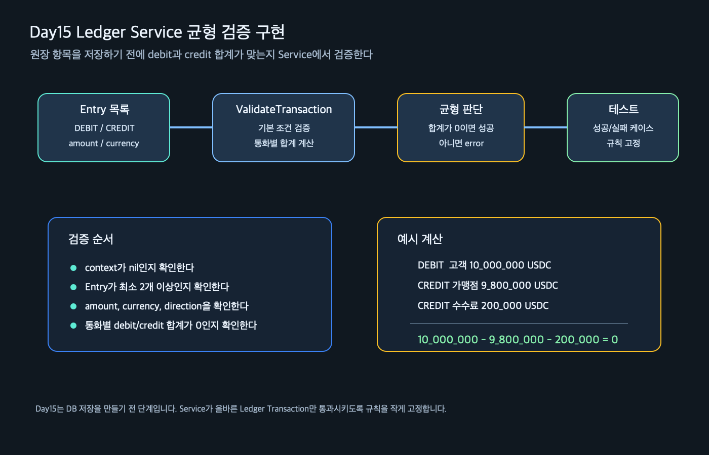

# Day 15 기초학습 - Ledger Service 균형 검증 구현

관련 Jira: SPN-32

Day15는 Ledger Core의 첫 번째 실제 서비스 로직을 완성하는 날입니다.

Day12에서는 Ledger에서 사용할 도메인 타입을 만들었습니다.

```text
Account
Transaction
Entry
```

Day13과 Day14에서는 debit/credit 균형 검증이 왜 중요한지 학습했습니다.

Day15에서는 그 내용을 실제 코드로 고정합니다.

```text
internal/ledger/service.go
internal/ledger/service_test.go
```

## 오늘의 큰 그림



## 오늘의 핵심 문장

```text
Ledger는 돈의 이동 기록이므로,
저장하기 전에 반드시 균형이 맞는지 검증해야 한다.
```

Payment는 결제가 어떤 상태인지 알려줍니다.

Ledger는 돈이 어떻게 이동했는지 기록합니다.

따라서 Ledger에는 단순 CRUD보다 강한 규칙이 필요합니다.

```text
잘못된 Entry를 저장하지 않는다.
debit과 credit 합계가 맞지 않으면 실패시킨다.
테스트로 그 규칙을 계속 보장한다.
```

## 오늘 읽을 순서

| 순서 | 문서 | 목적 |
| --- | --- | --- |
| 1 | [Day15_기초학습.md](Day15_기초학습.md) | 오늘 구현할 범위와 이유를 잡는다 |
| 2 | [Day15_개념학습.md](Day15_개념학습.md) | Service, 검증 로직, 테스트 설계를 이해한다 |
| 3 | [Day15_실습가이드.md](Day15_실습가이드.md) | 실제 코드를 작성하고 테스트한다 |
| 4 | [Day15_실습산출물.md](Day15_실습산출물.md) | 오늘 만든 코드 기준으로 5개 질문에 답한다 |
| 5 | [Day15_검증문제_답변가이드.md](Day15_검증문제_답변가이드.md) | 먼저 문제를 풀고 답변가이드와 비교한다 |

## 출퇴근 학습에서 잡을 것

출퇴근 시간에는 코드 자체를 외우기보다 아래 흐름을 잡습니다.

```text
1. Ledger Transaction은 여러 Entry로 구성된다.
2. Entry에는 DEBIT 또는 CREDIT 방향이 있다.
3. 같은 통화 안에서 DEBIT 합계와 CREDIT 합계는 같아야 한다.
4. 이 규칙이 깨지면 돈이 생기거나 사라진 것처럼 보일 수 있다.
5. Service는 이 규칙을 DB 저장 전에 검증한다.
```

영어 용어도 같이 잡습니다.

| 용어 | 한글 감각 | 오늘 코드에서의 의미 |
| --- | --- | --- |
| Service | 서비스, 도메인 규칙 실행 영역 | Ledger 규칙을 검증하는 Go 타입 |
| Validate | 검증하다 | 저장해도 되는 데이터인지 확인한다 |
| Transaction | 거래 묶음 | 여러 Entry를 하나의 원장 거래로 묶는다 |
| Entry | 원장 항목 | 돈의 이동 한 줄 |
| Balance | 균형 | debit 합계와 credit 합계가 같음 |

## 퇴근 후 작업

퇴근 후에는 아래 작은 코드 작업 하나만 합니다.

```text
Ledger Transaction의 Entry 목록을 받아서
금액, 통화, 방향, debit/credit 균형을 검증하는 Service와 테스트를 작성한다.
```

오늘 만들 파일:

```text
internal/ledger/service.go
internal/ledger/service_test.go
```

오늘 수정하지 않는 것:

```text
DB migration
repository
HTTP API
Payment FINALIZED와 Ledger 자동 연결
Settlement
```

## 완료 기준

- [ ] `internal/ledger/service.go`를 작성했다.
- [ ] `internal/ledger/service_test.go`를 작성했다.
- [ ] `go test ./internal/ledger -v`가 성공한다.
- [ ] `go test ./...`가 성공한다.
- [ ] `ValidateTransaction`이 어떤 순서로 검증하는지 설명할 수 있다.
- [ ] Day15 실습산출물 5문항을 작성할 수 있다.

## 다음 작업 예고

Day15가 끝나면 다음 단계는 Ledger 저장 구조입니다.

```text
Service가 검증한다.
Repository가 저장한다.
DB가 기록을 보존한다.
```

즉 Day16부터는 아래 후보로 넘어갈 수 있습니다.

```text
ledger_accounts
ledger_transactions
ledger_entries
```
