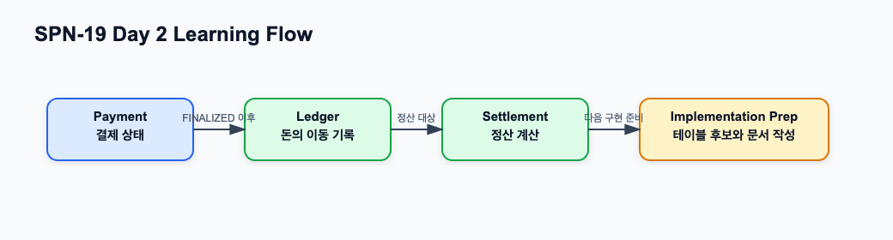

# Ledger와 Settlement 기초 학습

관련 Jira: [SPN-19](https://aslan0.atlassian.net/browse/SPN-19)

Confluence 문서: [Ledger와 Settlement 기초 학습](https://aslan0.atlassian.net/wiki/spaces/SPN/pages/5013611)

이 페이지는 Ledger와 Settlement 학습 허브입니다.

목표는 `Payment`, `Ledger`, `Settlement`의 책임을 분리해서 이해하고, 퇴근 후 직접 `docs/domain/ledger-and-settlement.md` 문서를 작성할 준비를 하는 것입니다.

## 오늘의 큰 그림



## 오늘의 목표

1. Ledger가 왜 필요한지 이해한다.
2. Settlement가 Payment `FINALIZED` 이후 어떤 역할을 하는지 이해한다.
3. Payment, Ledger, Settlement의 책임을 구분해서 설명할 수 있게 한다.
4. 퇴근 후 직접 작성할 `docs/domain/ledger-and-settlement.md`의 구조를 잡는다.

## 읽기 순서

| 순서 | 문서 | 목적 |
| --- | --- | --- |
| 1 | [Ledger와 Settlement 개념 학습](ledger-and-settlement-concepts.md) | 출퇴근 시간에 읽을 핵심 개념 자료 |
| 2 | [Ledger와 Settlement 실습 가이드](ledger-and-settlement-practice-guide.md) | 퇴근 후 직접 작성할 문서 가이드 |
| 3 | [Ledger와 Settlement 검증문제와 답변가이드](ledger-and-settlement-verification-guide.md) | 학습 후 스스로 확인할 문제와 답변 기준 |

## 오늘 꼭 잡아야 하는 문장

```text
Payment는 결제가 어디까지 진행됐는지를 나타내고,
Ledger는 돈이 왜 어떻게 이동했는지를 기록하고,
Settlement는 확정된 돈을 가맹점에게 지급 가능한 묶음으로 계산한다.
```

## 퇴근 후 작업의 원칙

퇴근 후 작업은 사용자가 직접 진행합니다.

Codex가 대신 완성 문서를 작성하는 것이 아니라, 사용자가 아래 작업을 직접 수행합니다.

1. GitHub repo에서 `docs/domain/ledger-and-settlement.md` 파일을 만든다.
2. Confluence 실습가이드의 목차를 따라 직접 내용을 작성한다.
3. Payment, Ledger, Settlement 책임 비교표를 직접 채운다.
4. 10 USDC 결제 예시를 ledger entry 형태로 직접 적어본다.
5. 검증문제를 풀고 답변가이드와 비교한다.

## 관련 GitHub 원본 문서

- [Phase 2 Domain Map](phase-2-domain-map.md)
- [Phase 2 Roadmap](../roadmap/phase-2-roadmap.md)
- [Target Architecture](../architecture/target-architecture.md)

## 완료 기준

- [ ] Ledger와 Settlement의 차이를 설명할 수 있다.
- [ ] Payment `FINALIZED`가 정산 완료가 아니라는 점을 문서화한다.
- [ ] 이후 Ledger 구현을 위한 최소 테이블 후보를 정리한다.
- [ ] `docs/domain/ledger-and-settlement.md`를 직접 작성한다.
