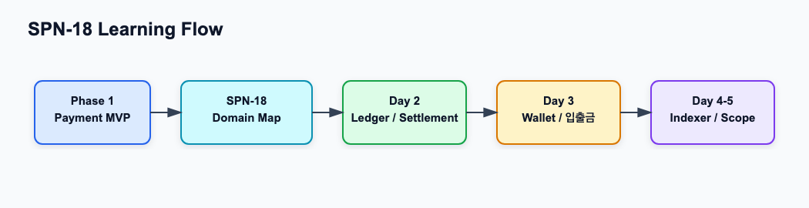

# Phase 2 도메인 학습 시작 가이드

관련 Jira: [SPN-18](https://aslan0.atlassian.net/browse/SPN-18)

Confluence 문서: [Phase 2 도메인 학습 시작 가이드](https://aslan0.atlassian.net/wiki/spaces/SPN/pages/5013561)

이 페이지는 Phase 2 도메인 학습을 시작할 때 확인하는 학습 허브입니다.

목표는 구현이 아니라, Phase 1에서 만든 결제 백엔드가 Phase 2에서 어떤 블록체인 금융 백엔드로 확장되는지 이해하는 것입니다.

## 읽기 순서

| 순서 | 문서 | 집중해서 볼 내용 |
| --- | --- | --- |
| 1 | [Phase 2 전체 도메인 지도](phase-2-domain-map.md) | Phase 1과 Phase 2의 차이, 핵심 용어 10개, 전체 흐름 |
| 2 | [포트폴리오 프로젝트 범위](../portfolio/project-scope.md) | 이 프로젝트로 어떤 개발자 역량을 보여줄지 |
| 3 | [목표 아키텍처](../architecture/target-architecture.md) | 현재 구조와 Phase 2/3 목표 구조 |
| 4 | [Phase 2 구현 로드맵](../roadmap/phase-2-roadmap.md) | 앞으로 어떤 순서로 구현할지 |

## 오늘의 큰 그림

## 오늘 이해해야 할 핵심

1. Phase 1은 Merchant, Invoice, Payment를 중심으로 한 스테이블코인 결제 백엔드 MVP입니다.
2. Phase 2는 Ledger, Settlement, Blockchain Event Indexer, Deposit, Withdrawal, Wallet, Key Security로 확장됩니다.
3. 현재는 사람이 API로 Payment 상태를 바꾸지만, Phase 2에서는 Indexer가 블록체인을 읽고 자동으로 상태를 바꾸게 됩니다.
4. Payment는 결제 상태를 추적하고, Ledger는 돈의 이동 기록을 남기며, Settlement는 가맹점에게 지급할 금액을 계산합니다.
5. Rust는 Go 백엔드를 대체하기보다 Signer와 Chain Prototype 같은 핵심 컴포넌트 학습에 붙입니다.

## 완료 기준

- [x] 확인해야 하는 4개 Markdown 문서가 Confluence 자료로 정리된다.
- [x] Jira 작업에서 Confluence 자료 링크를 확인할 수 있다.
- [x] Phase 2 전체 도메인 지도를 다시 확인할 수 있다.
- [x] 다음 학습인 Ledger/Settlement로 넘어갈 준비가 된다.
