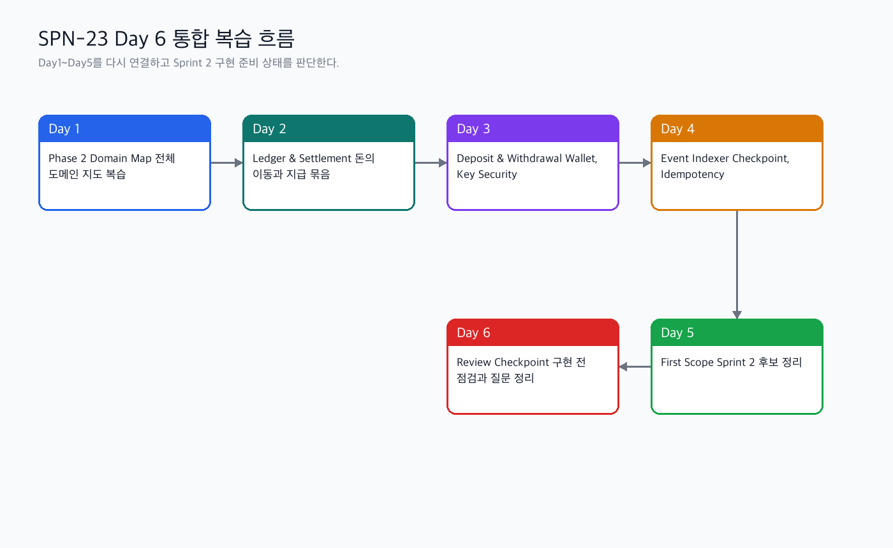

# Phase 2 Day 1~5 통합 복습과 구현 전 점검

관련 Jira: [SPN-23](https://aslan0.atlassian.net/browse/SPN-23)

이 문서는 Phase 2 Day 6 학습 허브입니다.

Day 6의 목표는 새로운 기능을 더 배우는 것이 아니라, Day 1~5에서 배운 내용을 한 번에 다시 연결하고 Sprint 2 Backend Core 구현을 시작할 준비가 되었는지 점검하는 것입니다.

## 오늘의 큰 그림



Day 6는 잠깐 멈춰서 보는 날입니다. 지금까지 많이 따라왔지만, 실제 구현에 들어가려면 다음 질문에 답할 수 있어야 합니다.

```text
Payment 상태만 바꾸던 Phase 1 백엔드가
왜 Ledger, Settlement, Indexer, Deposit, Withdrawal, Wallet, Key Security로 확장되어야 하는가?
```

## 오늘의 목표

1. Day 1~5의 핵심 내용을 본인 말로 다시 설명할 수 있다.
2. Payment, Ledger, Settlement, Indexer, Deposit, Withdrawal, Wallet의 역할을 구분할 수 있다.
3. On-chain과 Off-chain의 차이를 설명할 수 있다.
4. Sprint 2 첫 구현 범위가 왜 Backend Core vertical slice인지 이해한다.
5. 아직 약한 개념을 숨기지 않고 질문 목록으로 정리한다.
6. Sprint 2 구현을 바로 시작할 수 있는지 판단한다.

## 읽기 순서

| 순서 | 문서 | 목적 |
| --- | --- | --- |
| 1 | [Phase 2 통합 복습 개념 학습](phase-2-review-checkpoint-concepts.md) | 출퇴근 시간에 읽을 핵심 복습 자료 |
| 2 | [Phase 2 통합 복습 실습 가이드](phase-2-review-checkpoint-practice-guide.md) | 퇴근 후 직접 작성할 점검 문서 가이드 |
| 3 | [Phase 2 통합 복습 검증문제와 답변가이드](phase-2-review-checkpoint-verification-guide.md) | 학습 후 스스로 확인할 문제와 답변 기준 |

## 오늘 꼭 잡아야 하는 문장

```text
Day 6의 목적은 많이 아는 척하는 것이 아니라,
구현 전에 무엇을 알고 있고 무엇을 아직 모르는지 분명하게 나누는 것이다.
```

## 퇴근 후 작업의 원칙

퇴근 후 작업은 사용자가 직접 진행합니다.

1. `docs/domain/phase-2-review-checkpoint.md` 파일을 채운다.
2. Day 1~5 핵심 개념을 한 문장씩 요약한다.
3. 아직 약한 개념을 따로 표시한다.
4. Sprint 2 구현 전 준비도 체크리스트를 작성한다.
5. 다음 구현 티켓으로 만들 수 있는 후보를 정리한다.

## 완료 기준

- [ ] Day 1~5 핵심 개념을 본인 말로 요약했다.
- [ ] 아직 약한 개념과 질문을 따로 정리했다.
- [ ] Backend Core 구현을 시작할 수 있는지 판단했다.
- [ ] Sprint 2 구현 전 체크리스트를 작성했다.
