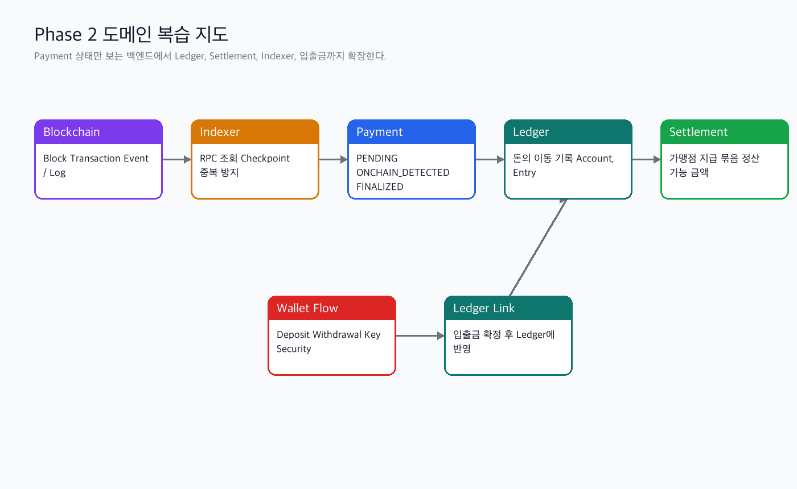
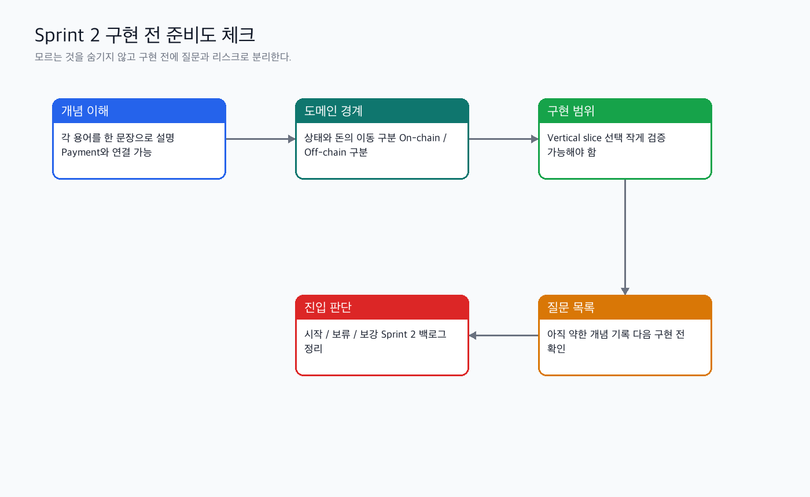

# Phase 2 통합 복습 개념 학습

관련 Jira: [SPN-23](https://aslan0.atlassian.net/browse/SPN-23)

이 문서는 출퇴근 시간에 읽는 Day 6 개념 복습 자료입니다.

## Day 6의 역할

Day 1~5는 Phase 2의 각 조각을 하나씩 배운 흐름이었습니다.

| Day | 주제 | 핵심 질문 |
| --- | --- | --- |
| Day 1 | Phase 2 Domain Map | Phase 1 결제 백엔드는 Phase 2에서 무엇으로 확장되는가? |
| Day 2 | Ledger & Settlement | 결제 상태와 돈의 이동 기록은 왜 분리해야 하는가? |
| Day 3 | Deposit, Withdrawal, Wallet, Key Security | 입금과 출금은 왜 서로 다른 위험을 가지는가? |
| Day 4 | Blockchain Event Indexer | 블록체인 이벤트를 어떻게 읽고 중복 없이 반영할 것인가? |
| Day 5 | First Implementation Scope | 무엇을 먼저 작게 구현해야 하는가? |
| Day 6 | Review Checkpoint | 지금 구현을 시작해도 되는가? |

Day 6는 이 조각들을 다시 하나의 흐름으로 연결합니다.

## Phase 2 도메인 복습 지도



## 핵심 흐름 1: Payment에서 Ledger로

Phase 1에서는 Payment 상태가 중심이었습니다.

```text
PENDING -> ONCHAIN_DETECTED -> FINALIZED -> SETTLED
```

하지만 상태만으로는 돈이 어디에서 어디로 이동했는지 알 수 없습니다.

그래서 Phase 2에서는 `FINALIZED` 이후 Ledger가 필요합니다.

```text
Payment FINALIZED
-> Ledger Transaction 생성
-> Ledger Entry 생성
-> Settlement 대상 후보가 됨
```

Payment는 결제 진행 상태를 말합니다.

Ledger는 돈의 이동 기록을 말합니다.

이 둘을 분리해야 장애 복구, 중복 결제 방지, 정산 검증이 가능해집니다.

## 핵심 흐름 2: Ledger에서 Settlement로

Settlement는 확정된 결제 금액을 가맹점에게 지급 가능한 묶음으로 계산하는 과정입니다.

여기서 지급 가능하지 않은 금액이 생길 수 있습니다.

예를 들어 다음과 같은 경우입니다.

| 상황 | 바로 정산하면 위험한 이유 |
| --- | --- |
| 결제는 감지됐지만 finality가 부족함 | 나중에 되돌아갈 가능성이 있음 |
| Ledger entry가 중복 생성됐는지 확인 전 | 가맹점에게 과지급할 수 있음 |
| 환불이나 실패 상태와 충돌함 | 실제 지급 가능 금액이 달라질 수 있음 |
| 정산 주기나 최소 정산 금액을 만족하지 않음 | 운영 정책상 다음 묶음으로 넘길 수 있음 |

그래서 Settlement는 단순히 더하기가 아니라, 지급 가능한 상태인지 확인하고 묶는 과정입니다.

## 핵심 흐름 3: Blockchain에서 Indexer로

Blockchain Event Indexer는 블록체인 안에서 실행되는 코드가 아닙니다.

우리 백엔드의 off-chain worker가 블록체인 RPC를 조회해서 block, transaction, event를 읽습니다.

```text
Blockchain RPC
-> Block 조회
-> Transaction 조회
-> Event/Log 조회
-> 우리 서비스와 관련된 이벤트 선별
-> Payment 또는 Deposit 상태 변경
-> Ledger 반영
```

중요한 것은 빠르게 읽는 것보다 안전하게 읽는 것입니다.

| 개념 | 왜 필요한가 |
| --- | --- |
| Checkpoint | 어디까지 읽었는지 저장해서 장애 후 이어서 처리하기 위해 |
| Idempotency | 같은 이벤트를 여러 번 읽어도 한 번만 반영하기 위해 |
| Reconciliation | 내부 DB와 온체인 상태가 맞는지 대조하기 위해 |
| Finality | 거래가 충분히 확정됐는지 판단하기 위해 |

## 핵심 흐름 4: Deposit과 Withdrawal

Deposit과 Withdrawal은 둘 다 자산 이동이지만 방향과 위험이 다릅니다.

| 구분 | Deposit | Withdrawal |
| --- | --- | --- |
| 방향 | 외부 지갑에서 우리 시스템으로 들어옴 | 우리 시스템에서 외부 지갑으로 나감 |
| 핵심 작업 | 이미 발생한 온체인 입금을 감지 | 출금 transaction을 만들고 서명하고 전송 |
| 주요 위험 | 잘못된 입금 감지, 중복 반영 | 잘못된 주소, 키 노출, 중복 출금 |
| Ledger 반영 | 확정된 입금 후 credit | 출금 요청/확정에 따라 debit |

Deposit은 이미 발생한 일을 안전하게 감지하는 문제에 가깝습니다.

Withdrawal은 우리가 직접 transaction을 만들어 내보내는 문제라서 승인, 서명, 키 보안이 훨씬 중요합니다.

## 구현 전 준비도 체크



Sprint 2를 시작하기 전에는 다음을 확인해야 합니다.

| 점검 항목 | 질문 |
| --- | --- |
| 개념 이해 | 각 도메인을 한 문장으로 설명할 수 있는가? |
| 경계 이해 | Payment 상태와 Ledger 기록을 구분할 수 있는가? |
| 데이터 이해 | 어떤 테이블 후보가 필요한지 대략 말할 수 있는가? |
| 위험 이해 | 중복 이벤트, 중복 출금, 키 노출이 왜 위험한지 설명할 수 있는가? |
| 구현 범위 | 첫 구현 범위를 작게 자를 수 있는가? |

## Day6에서 중요한 태도

모르는 개념이 남아있는 것은 문제가 아닙니다.

문제는 모르는 개념을 모르는 상태로 구현에 들어가는 것입니다.

Day6에서는 약한 부분을 다음처럼 적어두면 좋습니다.

```text
약한 개념: Reconciliation
현재 이해: DB와 온체인을 비교한다는 것은 알지만, 어떤 테이블을 어떤 순서로 비교하는지는 약하다.
다음 질문: Payment, Ledger, Blockchain Event 중 무엇을 기준으로 대사를 시작해야 할까?
```
