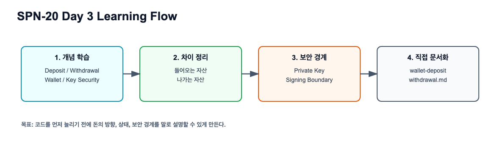

# Wallet, Deposit, Withdrawal 실습 가이드

관련 Jira: [SPN-20](https://aslan0.atlassian.net/browse/SPN-20)

이 문서는 퇴근 후 직접 진행할 Day 3 실습가이드입니다.

오늘의 실습은 코드를 구현하는 것이 아니라, 이후 Deposit/Withdrawal/Wallet 구현에 들어가기 전 도메인 문서를 직접 작성하는 것입니다.

## 실습 흐름



실습은 `개념 이해 -> 차이 정리 -> 보안 경계 정리 -> 직접 문서화` 순서로 진행합니다.

## 실습 목표

`docs/domain/wallet-deposit-withdrawal.md` 파일을 직접 만들고, 다음 내용을 정리합니다.

1. Deposit, Withdrawal, Wallet, Key Security의 책임 비교
2. Deposit 상태 흐름
3. Withdrawal 상태 흐름
4. Wallet address와 private key의 차이
5. 개인키를 DB에 평문 저장하면 안 되는 이유
6. Rust signer가 필요한 이유

## 작업 전 준비

로컬 public repo 위치에서 작업합니다.

```shell
cd /Users/banghobae/Documents/2030-korea-stablepay/2030-korea-stablepay-network
```

작업 전 상태를 확인합니다.

```shell
git status
```

새 파일을 만듭니다.

```shell
touch docs/domain/wallet-deposit-withdrawal.md
```

## 작성할 문서 구조

아래 목차를 그대로 사용해도 됩니다.

```markdown
# Wallet, Deposit, Withdrawal

## 한 문장 요약

## Deposit과 Withdrawal의 차이

## Deposit 상태 흐름

## Withdrawal 상태 흐름

## Wallet과 Key Security

## Rust Signer가 필요한 이유

## 최소 테이블 후보

## 아직 모르는 것과 다음 질문

## 검증 체크리스트
```

## 섹션별 작성 가이드

### 1. 한 문장 요약

아래 문장을 참고하되, 그대로 복사하지 말고 본인 말로 바꿔보세요.

```text
Deposit은 외부 지갑에서 들어온 자산을 감지하고 내부 원장에 반영하는 흐름이고,
Withdrawal은 내부 잔액을 검증한 뒤 외부 지갑으로 안전하게 전송하는 흐름이다.
```

### 2. Deposit과 Withdrawal의 차이

아래 표를 직접 채웁니다.

| 구분 | Deposit | Withdrawal |
| --- | --- | --- |
| 자산 방향 |  |  |
| 온체인 역할 |  |  |
| 주요 위험 |  |  |
| Ledger 연결 |  |  |
| 보안 포인트 |  |  |

### 3. Deposit 상태 흐름 작성

예시:

```text
DETECTED
-> CONFIRMING
-> CONFIRMED
-> CREDITED
```

각 상태가 무엇을 의미하는지 한 줄씩 적어보세요.

### 4. Withdrawal 상태 흐름 작성

예시:

```text
REQUESTED
-> APPROVED
-> SIGNED
-> BROADCASTED
-> CONFIRMED
```

각 상태가 무엇을 의미하는지 한 줄씩 적어보세요.

### 5. Wallet과 Key Security 작성

다음 질문에 답하는 방식으로 작성합니다.

```text
address는 왜 공개되어도 되는가?
private key는 왜 노출되면 안 되는가?
signing은 무엇을 의미하는가?
private key를 DB에 평문 저장하면 어떤 문제가 생기는가?
```

### 6. Rust Signer가 필요한 이유 작성

아래 문장을 참고해서 본인 말로 한 문단을 작성합니다.

```text
Rust signer는 전체 백엔드를 Rust로 바꾸기 위한 것이 아니라,
개인키와 transaction 서명 경계를 작게 분리하기 위한 컴포넌트다.
```

### 7. 최소 테이블 후보 작성

아래 표를 직접 작성합니다.

| 테이블 후보 | 필요한 이유 | 저장할 주요 값 |
| --- | --- | --- |
| wallets |  |  |
| deposit_addresses |  |  |
| deposits |  |  |
| withdrawals |  |  |
| withdrawal_approvals |  |  |

## 검증 체크리스트

문서 작성 후 아래 질문에 답할 수 있는지 확인합니다.

- [ ] Deposit과 Withdrawal의 차이를 설명할 수 있다.
- [ ] Deposit 상태 흐름을 설명할 수 있다.
- [ ] Withdrawal 상태 흐름을 설명할 수 있다.
- [ ] Wallet address와 private key의 차이를 설명할 수 있다.
- [ ] Rust signer가 왜 필요한지 한 문단으로 설명할 수 있다.

## 권장 커밋 메시지

문서를 직접 작성한 뒤 커밋할 때는 아래 메시지를 추천합니다.

```shell
git add docs/domain/wallet-deposit-withdrawal.md
git commit -m "docs: SPN-20 입출금과 지갑 보안 도메인 정리"
git push
```
