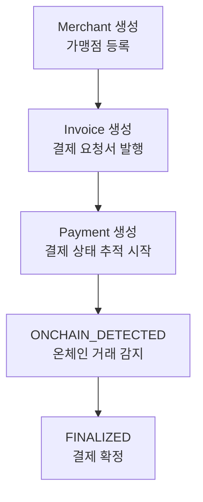
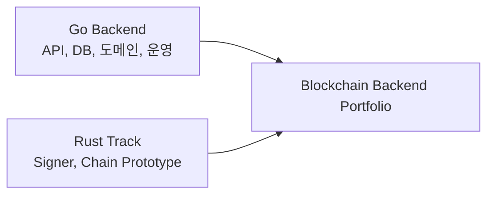

# Portfolio Project Scope

이 문서는 `2030 KOREA StablePay Network`가 포트폴리오에서 무엇을 보여주기 위한 프로젝트인지 정리한다.

중요한 기준은 하나다.

```text
현재 구현된 것과 미래에 확장할 것을 과장 없이 분리한다.
```

이 프로젝트는 "이미 완성된 블록체인 네트워크"가 아니다.

현재는 스테이블코인 결제 백엔드의 핵심 흐름을 Go로 구현하고, 이후 블록체인 금융 백엔드와 Rust 기반 signer/chain track으로 확장하기 위한 포트폴리오 프로젝트다.

## 한 줄 설명

`2030 KOREA StablePay Network`는 스테이블코인 결제 흐름을 Go 백엔드로 구현하고, Phase 2에서 원장, 정산, 온체인 인덱서, 입출금, 지갑 보안, Rust signer까지 확장하는 블록체인 결제 백엔드 포트폴리오다.

## 채용 타깃

이 프로젝트가 겨냥하는 직무는 다음과 같다.

| 타깃 | 설명 |
| --- | --- |
| Go Backend Developer | Go로 HTTP API, PostgreSQL, 테스트 가능한 도메인 서비스를 구현하는 백엔드 개발자 |
| Blockchain Backend Developer | 스테이블코인 결제, 온체인 이벤트, 입출금, 원장, 정산을 이해하는 백엔드 개발자 |
| Crypto Payment Backend Developer | 결제 요청서, 결제 상태, 정산 흐름을 구현할 수 있는 개발자 |
| Wallet/Exchange Backend Junior+ | 입금, 출금, 지갑, 키 보안의 구조를 이해하고 구현에 참여할 수 있는 개발자 |
| Rust Blockchain Track Candidate | Rust signer나 chain prototype으로 저수준 블록체인 영역까지 확장하려는 개발자 |

현재 단계에서 가장 현실적인 1차 타깃은 `Go 기반 블록체인 결제 백엔드 개발자`다.

Rust는 바로 메인 언어를 대체하는 포지션이 아니라, signer와 chain prototype으로 핵심 강점을 보여주는 확장 트랙이다.

## 프로젝트가 보여주려는 역량

현재 Phase 1에서 보여주려는 역량:

| 역량 | 이 프로젝트에서 드러나는 부분 |
| --- | --- |
| Go 프로젝트 구조 | `cmd/api`, `internal/httpapi`, `internal/merchant`, `internal/invoice`, `internal/payment` 구조 |
| HTTP API 설계 | Merchant, Invoice, Payment 생성과 Payment 상태 변경 API |
| PostgreSQL 사용 | migration, repository, `database/sql` 기반 저장 |
| 도메인 중심 설계 | merchant, invoice, payment를 패키지 단위로 분리 |
| 상태 전이 모델링 | `PENDING -> ONCHAIN_DETECTED -> FINALIZED -> SETTLED` 흐름 |
| 테스트 작성 | service layer 단위 테스트와 한글 subtest |
| 결제 도메인 이해 | 가맹점, 결제 요청서, 결제 상태, 정산 전 단계 이해 |
| 확장 설계 | Phase 2 roadmap과 target architecture 문서 |

Phase 2에서 추가로 보여주려는 역량:

| 역량 | 목표 |
| --- | --- |
| Ledger | 돈의 이동을 원장 기록으로 남기는 구조 이해 |
| Settlement | 가맹점 정산 금액 계산과 정산 상태 관리 |
| Blockchain Event Indexer | 온체인 이벤트를 읽고 결제 상태를 자동 변경 |
| Deposit/Withdrawal | 입금/출금 상태 machine과 ledger 연동 |
| Wallet/Key Security | 개인키를 직접 DB에 저장하지 않는 보안 경계 설계 |
| Idempotency | 중복 이벤트가 들어와도 상태가 깨지지 않게 처리 |
| Reconciliation | DB 상태와 온체인 상태를 다시 대조하는 운영 개념 |
| Rust Signer | Rust로 transaction 서명 컴포넌트 실험 |

## 현재 구현된 기능

현재 구현된 기능은 Phase 1 MVP다.



현재 구현 목록:

| 영역 | 구현 상태 |
| --- | --- |
| Health API | 구현됨 |
| Merchant 생성 | 구현됨 |
| Invoice 생성 | 구현됨 |
| Payment 생성 | 구현됨 |
| Payment 상태 변경 | 구현됨 |
| Payment 상태 전이 규칙 | 구현됨 |
| PostgreSQL migration | 구현됨 |
| Service layer test | 구현됨 |
| API 실행 예시 | 구현됨 |
| Architecture 문서 | 작성됨 |
| Phase 2 Roadmap 문서 | 작성됨 |

## 아직 구현하지 않은 기능

아직 구현하지 않은 영역은 명확히 미래 범위다.

| 영역 | 현재 상태 | 이유 |
| --- | --- | --- |
| 실제 블록체인 RPC 연동 | 미구현 | 먼저 결제 도메인과 상태 흐름을 Go 백엔드로 안정화해야 한다 |
| 온체인 이벤트 자동 감지 | 미구현 | Phase 2의 Blockchain Event Indexer에서 다룬다 |
| 실제 지갑 결제 | 미구현 | wallet/key security 경계가 먼저 필요하다 |
| Ledger | 미구현 | Phase 2에서 결제 확정 이후 돈의 이동을 기록하기 위해 추가한다 |
| Settlement | 미구현 | Ledger 이후 가맹점 정산 모델로 확장한다 |
| Deposit/Withdrawal | 미구현 | Phase 2에서 월렛/거래소 백엔드 역량을 보여주기 위해 추가한다 |
| Rust Signer | 미구현 | Phase 2 후반 또는 별도 Rust track에서 다룬다 |
| Rust Chain Prototype | 미구현 | 장기 목표인 자체 네트워크 이해를 위한 실험 범위다 |
| 인증/권한 | 미구현 | Backend Core 정리 단계에서 추가한다 |

## 왜 결제 백엔드부터 시작하는가

처음부터 자체 코인과 네트워크를 만들 수도 있다.

하지만 주니어 백엔드 개발자에서 블록체인 개발자로 전환하려면 먼저 다음 역량이 필요하다.

```text
API 설계
DB 저장
상태 전이
테스트
장애와 실패 흐름
돈의 이동 기록
외부 시스템 연동
```

결제 백엔드는 이 역량을 자연스럽게 훈련할 수 있다.

자체 네트워크와 코인은 Phase 3에서 Rust chain prototype으로 확장한다.

## Go와 Rust의 역할

이 프로젝트에서 Go와 Rust는 경쟁 관계가 아니다.



Go 역할:

```text
HTTP API server
Service/repository 구조
PostgreSQL persistence
Payment, Ledger, Settlement 도메인
Blockchain Event Indexer
운영 자동화와 검증 절차
```

Rust 역할:

```text
Transaction signer
개인키/서명 경계 실험
작은 chain prototype
블록/트랜잭션/state transition 이해
```

## 면접에서 설명할 포인트

면접에서 이 프로젝트를 설명할 때는 다음 순서가 좋다.

1. 이 프로젝트는 스테이블코인 결제 백엔드 MVP에서 시작한다.
2. 현재는 Merchant, Invoice, Payment와 Payment 상태 전이를 구현했다.
3. 실제 블록체인 RPC는 아직 붙이지 않았고, 현재는 API로 상태를 직접 변경한다.
4. Phase 2에서는 Indexer가 온체인 이벤트를 읽어 상태를 자동 변경하도록 확장한다.
5. 결제가 확정되면 Ledger와 Settlement로 돈의 이동과 가맹점 정산을 분리해서 관리한다.
6. 입출금과 지갑 보안까지 확장하면 거래소/월렛 백엔드에 가까운 역량을 보여줄 수 있다.
7. Rust는 signer와 chain prototype으로 확장해 블록체인의 저수준 영역까지 이해하려는 트랙이다.

짧게 말하면:

```text
이 프로젝트는 단순 CRUD가 아니라, 스테이블코인 결제 상태와 결제 이후의 금융 백엔드 확장을 학습하기 위한 Go 기반 블록체인 백엔드 포트폴리오입니다.
```

## 과장하지 말아야 할 표현

아래 표현은 현재 단계에서 쓰지 않는다.

```text
자체 메인넷을 구현했다.
실제 스테이블코인 결제를 처리한다.
실제 지갑과 개인키를 운영한다.
실제 온체인 이벤트를 자동으로 감지한다.
실서비스 수준의 결제 시스템이다.
```

현재 단계에서 정확한 표현:

```text
스테이블코인 결제 백엔드의 핵심 흐름을 Go로 구현했다.
Payment 상태 전이를 모델링했다.
PostgreSQL에 Merchant, Invoice, Payment를 저장한다.
실제 블록체인 연동은 Phase 2에서 Indexer로 확장할 계획이다.
Rust는 signer와 chain prototype으로 확장할 계획이다.
```

## Phase 2 용어 학습 체크포인트

Phase 2에 들어가기 전에 반드시 한 번 짚고 넘어갈 용어:

| 용어 | 한글 의미 | 왜 중요한가 |
| --- | --- | --- |
| Ledger | 원장 | 돈의 이동을 신뢰할 수 있게 기록한다 |
| Settlement | 정산 | 가맹점에게 지급할 금액과 상태를 관리한다 |
| Deposit | 입금 | 외부 지갑에서 시스템으로 들어오는 자산 흐름이다 |
| Withdrawal | 출금 | 시스템에서 외부 지갑으로 나가는 자산 흐름이다 |
| Wallet | 지갑 | 주소와 자산 보관/전송의 기준이 된다 |
| Key Security | 키 보안 | 개인키 유출을 막기 위한 핵심 영역이다 |
| Idempotency | 멱등성 | 같은 이벤트가 여러 번 들어와도 결과가 깨지지 않게 한다 |
| Reconciliation | 대사 | DB 상태와 온체인 상태가 맞는지 확인한다 |
| Finality | 최종성 | 블록체인 거래가 되돌아가기 어려운 상태인지 판단한다 |

이 용어들은 지금 완벽히 알 필요는 없다.

다만 Phase 2를 구현할 때 각 용어를 하나씩 코드와 연결해서 다시 학습해야 한다.

## 다음 범위

이 문서 이후의 다음 작업:

```text
SPN-16 테스트 실행 결과와 검증 절차 문서화
Sprint 2 백로그 생성
Phase 2 핵심 용어 학습/정리
Backend Core 구현 시작
```

