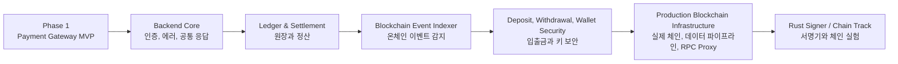
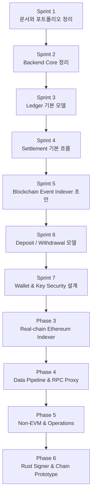
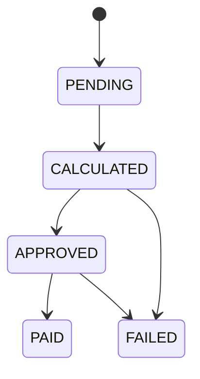
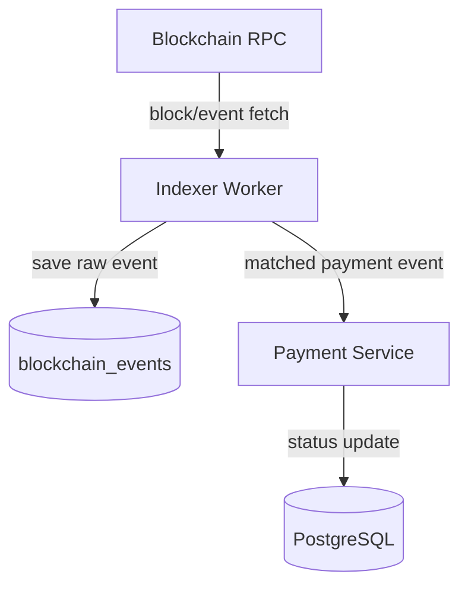
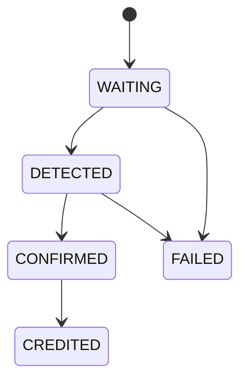
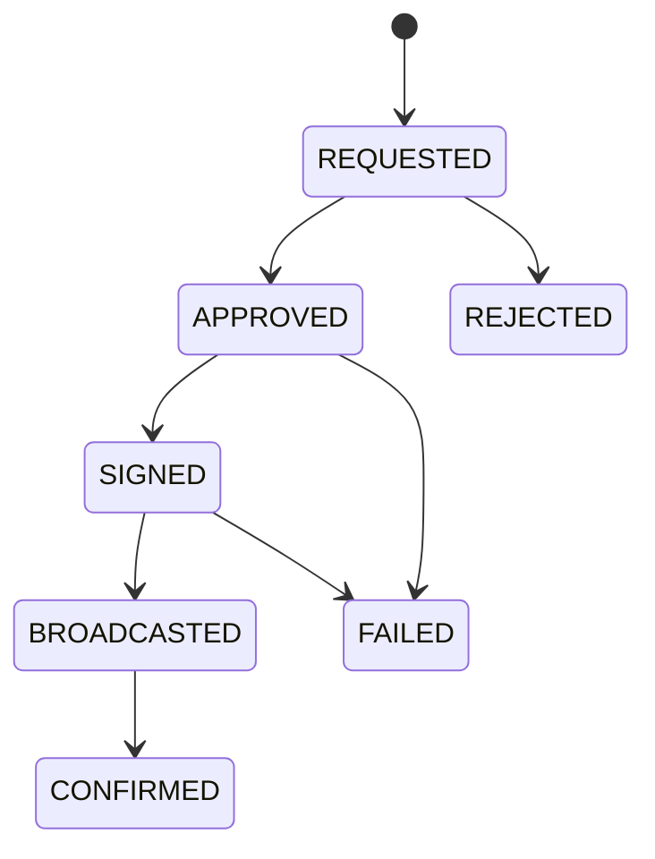
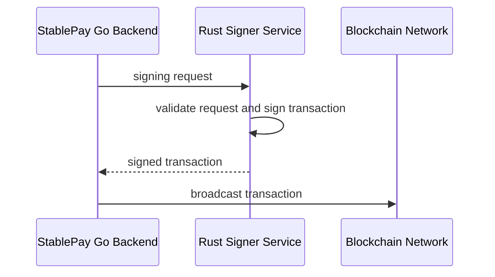

# Phase 2 Roadmap

이 문서는 `2030 KOREA StablePay Network`의 Phase 2 확장 계획을 정리한다.

Phase 1은 스테이블코인 결제 백엔드 MVP다. Merchant, Invoice, Payment를 만들고 payment 상태를 직접 API로 변경하는 구조까지 구현했다.

Phase 2의 목표는 이 MVP를 실제 블록체인 금융 백엔드에 가까운 구조로 확장하는 것이다.

## Phase 2 목표

Phase 2에서 만들려는 것은 단순 API 추가가 아니다.

목표는 다음 네 가지다.

1. Payment 상태를 사람이 직접 바꾸는 구조에서 벗어난다.
2. 온체인 이벤트를 읽어 결제 상태를 자동으로 바꾼다.
3. Ledger와 Settlement로 돈의 이동과 정산을 분리해서 관리한다.
4. Deposit, Withdrawal, Wallet, Key Security까지 확장 가능한 기반을 만든다.



## 큰 방향

Phase 2의 중심 언어는 Go다.

Go는 다음 영역을 담당한다.

```text
HTTP API
도메인 서비스
PostgreSQL 저장
Payment 상태 관리
Ledger와 Settlement
Deposit과 Withdrawal 상태 관리
Blockchain Event Indexer
운영용 배치와 재처리 도구
```

Rust는 바로 전체 백엔드를 대체하는 목적이 아니다.

Rust는 다음 영역에서 강점을 잡는 트랙으로 둔다.

```text
Transaction 서명
개인키를 직접 다루는 작은 signer service
체인 자료구조와 블록 생성 실험
로컬 devnet 이해
```

즉, Phase 2의 전략은 다음과 같다.

```text
Go로 블록체인 금융 백엔드 실무 역량을 만든다.
Rust로 서명기와 체인 코어 이해를 쌓는다.
둘을 연결해 "블록체인을 이용한 백엔드 개발자" 포트폴리오를 만든다.
```

Phase 2를 완료한 뒤에는 Event Indexer 초안을 실제 Ethereum RPC에 연결하고, 대용량 데이터 처리와 RPC 안정화 영역으로 확장한다. Kafka, Redis, Elasticsearch, RPC Proxy, Solana, Kubernetes는 Phase 2에 한꺼번에 넣지 않고 해결할 문제가 확인되는 순서대로 도입한다.

상세한 Phase 3~6 계획은 [블록체인 인프라 확장 로드맵](Phase_3-6_블록체인_인프라_확장_로드맵.md)을 따른다.

## 에픽별 구현 순서

Jira 에픽과 Phase 2 로드맵은 다음 순서로 연결한다.

| 순서 | Jira Epic | 목적 | 먼저 하는 이유 |
| --- | --- | --- | --- |
| 1 | Public Portfolio Packaging | 현재 프로젝트를 설명 가능한 상태로 정리 | 채용자와 미래의 내가 프로젝트 목적을 빠르게 이해해야 한다 |
| 2 | Blockchain Backend Core | 인증, 에러, 설정, 공통 응답, API 경계 정리 | 이후 기능이 붙을 때 구조가 흔들리지 않게 만든다 |
| 3 | Ledger and Settlement | 원장과 정산 모델 구현 | 결제 시스템의 핵심은 단순 상태 변경이 아니라 돈의 이동 기록이다 |
| 4 | Blockchain Event Indexer | 온체인 이벤트 감지 | 사람이 상태를 바꾸는 MVP에서 자동 감지 구조로 넘어간다 |
| 5 | Deposit and Withdrawal | 입금과 출금 상태 관리 | 실제 월렛/거래소 백엔드에 가까운 기능이다 |
| 6 | Wallet and Key Security | 지갑 주소, 키, 서명 경계 설계 | 출금과 서명은 보안 경계가 가장 중요하다 |
| 7 | Real-chain Ethereum Indexer | 실제 RPC와 재시작 가능한 인덱서 | 개념 수준의 인덱서를 실제 체인 데이터 처리 경험으로 바꾼다 |
| 8 | Data Pipeline and RPC Proxy | Kafka 기반 처리와 RPC 안정화 | 대용량 데이터, 동시성, 장애 복구 역량을 증명한다 |
| 9 | Non-EVM and Operations | Solana, Kubernetes, AWS 운영 | 멀티체인 차이와 운영 환경을 경험한다 |
| 10 | Rust Signer Lab | Rust로 transaction signer 실험 | Rust의 강점을 작은 보안 컴포넌트로 보여준다 |
| 11 | Rust Chain Prototype | 작은 자체 체인/코인 실험 | 장기 목표인 자체 네트워크 이해로 넘어간다 |

## Sprint 1 이후 우선순위

Sprint 1은 public portfolio packaging이다.

Sprint 1 이후에는 바로 코인을 만들기보다 Go 백엔드의 핵심을 더 단단히 만드는 순서가 좋다.



## Sprint 2: Backend Core

목표:

```text
Phase 1 MVP 코드를 더 실무적인 백엔드 구조로 다듬는다.
```

주요 작업:

| 작업 | 설명 |
| --- | --- |
| 공통 에러 응답 | API 실패 응답 형식을 통일한다 |
| 요청 validation 정리 | request body, path variable 검증을 일관되게 만든다 |
| 설정 구조 정리 | PORT, DATABASE_URL 같은 환경변수를 config 구조로 모은다 |
| logging 정리 | 요청, 실패, 상태 변경 로그를 남긴다 |
| API boundary 정리 | public API와 internal API의 방향을 나눈다 |
| 테스트 보강 | handler/service 테스트 전략을 정리한다 |

완료 기준:

```text
에러 응답 형식이 통일된다.
환경변수 설정 위치가 명확하다.
새 API를 추가할 때 따라갈 패턴이 생긴다.
```

포트폴리오에서 보여줄 역량:

```text
Go API 설계
운영 가능한 백엔드 구조
테스트 가능한 서비스 설계
```

## Sprint 3: Ledger 기본 모델

목표:

```text
돈의 이동을 단순 amount 변경이 아니라 원장 entry로 기록한다.
```

Ledger는 결제/정산/입출금의 기초다.

기본 개념:

```text
Account
= 돈이 들어가거나 나가는 주체

Entry
= 특정 account에 기록되는 증가 또는 감소 기록

Transaction
= 여러 entry를 하나의 묶음으로 다루는 단위
```

예시:

```text
고객이 10 USDC를 결제했다.

Customer Account     -10 USDC
Merchant Pending     +10 USDC
```

주요 작업:

| 작업 | 설명 |
| --- | --- |
| ledger_accounts 테이블 | 사용자, 가맹점, 시스템 계정 정의 |
| ledger_entries 테이블 | 증가/감소 기록 저장 |
| ledger_transactions 테이블 | 여러 entry를 하나의 거래로 묶기 |
| double-entry 규칙 | debit/credit 또는 signed amount 정책 정하기 |
| payment finalized 연동 | payment가 FINALIZED 될 때 ledger 기록 생성 |

완료 기준:

```text
Payment가 FINALIZED 될 때 ledger entry가 생성된다.
원장 합계가 깨지지 않는 테스트가 있다.
중복 처리 방지 기준이 있다.
```

## Sprint 4: Settlement 기본 흐름

목표:

```text
가맹점에게 정산할 금액을 계산하고 settlement 상태로 관리한다.
```

Payment가 `FINALIZED` 되었다고 해서 바로 정산이 끝난 것은 아니다.

정산 흐름:



주요 작업:

| 작업 | 설명 |
| --- | --- |
| settlements 테이블 | 정산 묶음 저장 |
| settlement_items 테이블 | 어떤 payment가 정산에 포함됐는지 저장 |
| 정산 계산 service | 기간별/가맹점별 정산 금액 계산 |
| 정산 상태 machine | PENDING, CALCULATED, APPROVED, PAID, FAILED |
| ledger 연동 | 정산 지급 시 merchant balance 이동 기록 |

완료 기준:

```text
특정 가맹점의 정산 대상 payment를 묶을 수 있다.
정산 금액 계산 테스트가 있다.
정산 상태 전이 규칙이 있다.
```

## Sprint 5: Blockchain Event Indexer 초안

목표:

```text
블록체인 RPC에서 block, transaction, event를 읽고 payment 상태를 자동 변경하는 구조를 만든다.
```

초기에는 실제 메인넷보다 mock chain 또는 local devnet을 우선한다.

구조:



주요 작업:

| 작업 | 설명 |
| --- | --- |
| blockchain_events 테이블 | 읽은 이벤트를 저장한다 |
| indexer checkpoint | 어디까지 읽었는지 block height를 저장한다 |
| idempotency key | 같은 이벤트가 여러 번 들어와도 중복 처리하지 않는다 |
| payment matching | transaction hash, amount, address 기준으로 payment를 찾는다 |
| retry 설계 | RPC 실패나 DB 실패를 재시도한다 |

완료 기준:

```text
같은 이벤트가 두 번 들어와도 payment가 중복 변경되지 않는다.
Indexer가 payment를 ONCHAIN_DETECTED로 바꿀 수 있다.
Indexer 진행 위치를 저장한다.
```

## Sprint 6: Deposit and Withdrawal

목표:

```text
월렛/거래소 백엔드에 가까운 입금과 출금 상태 흐름을 만든다.
```

Deposit 흐름:



Withdrawal 흐름:



주요 작업:

| 작업 | 설명 |
| --- | --- |
| deposits 테이블 | 입금 요청과 감지 상태 저장 |
| withdrawals 테이블 | 출금 요청과 처리 상태 저장 |
| withdrawal approval | 출금 승인 단계 추가 |
| ledger 연동 | 입금 credit, 출금 debit 기록 |
| 실패 처리 | 실패 상태와 재시도 가능 상태 분리 |

완료 기준:

```text
입금과 출금 상태 전이가 테스트된다.
입금 confirmed 시 ledger credit이 생성된다.
출금 approved 이후 signer 연동 지점이 보인다.
```

## Sprint 7: Wallet and Key Security

목표:

```text
지갑 주소와 개인키를 일반 CRUD처럼 다루지 않고 보안 경계를 분리한다.
```

중요한 원칙:

```text
개인키를 PostgreSQL에 평문 저장하지 않는다.
서명 권한은 별도 컴포넌트로 분리한다.
출금은 요청, 승인, 서명, 전송을 단계별로 나눈다.
```

주요 작업:

| 작업 | 설명 |
| --- | --- |
| wallets 테이블 | 관리 대상 주소와 metadata 저장 |
| key reference | 실제 key 대신 key id/reference 저장 |
| signer boundary | Go backend와 signer service의 API 경계 정의 |
| withdrawal policy | 출금 승인 조건, 금액 제한, 운영자 승인 정책 |
| audit log | 누가 어떤 출금 상태를 바꿨는지 기록 |

완료 기준:

```text
서명 책임이 Go API 안에 섞이지 않는다.
출금 상태 변경 기록을 추적할 수 있다.
Rust signer와 연결할 인터페이스가 문서화된다.
```

## Phase 6 후보: Rust Signer Lab

목표:

```text
Rust로 transaction signer의 핵심을 작은 실험 프로젝트로 만든다.
```

이 단계는 Go 백엔드를 대체하는 작업이 아니다.

Go 백엔드와 Rust signer의 관계:



주요 작업:

| 작업 | 설명 |
| --- | --- |
| Rust project scaffold | signer 실험 프로젝트 생성 |
| signing request model | 어떤 데이터를 받아 서명할지 정의 |
| key handling mock | 실제 private key 대신 안전한 mock/key fixture 사용 |
| Go interface 문서화 | Go backend가 signer를 호출하는 방식 정리 |
| signer test | 잘못된 요청을 거부하는 테스트 |

완료 기준:

```text
Rust signer가 입력 검증과 서명 결과 생성을 분리한다.
Go backend에서 호출할 수 있는 API 계약이 생긴다.
실제 private key를 노출하지 않는 원칙이 문서화된다.
```

## Phase 6 후보: Rust Chain Prototype

목표:

```text
자체 코인과 네트워크를 이해하기 위한 작은 체인 프로토타입을 만든다.
```

이 단계의 목표는 상용 메인넷을 만드는 것이 아니다.

배우려는 것:

```text
block 구조
transaction 구조
state transition
mempool의 기본 개념
consensus가 왜 필요한지
node가 서로 데이터를 교환하는 방식
```

주요 작업:

| 작업 | 설명 |
| --- | --- |
| Block struct | block header, transaction list 정의 |
| Transaction struct | sender, receiver, amount, signature 정의 |
| State transition | transaction 적용 후 balance 변경 |
| Simple validation | signature, nonce, balance 검증 |
| Local node loop | block 생성과 상태 업데이트 실험 |

완료 기준:

```text
작은 transaction이 block에 포함되고 state를 변경한다.
잘못된 transaction은 거부된다.
Go 백엔드와는 별도의 학습 트랙임이 분명하다.
```

## Phase 5 후보: Devnet and Operations

목표:

```text
프로젝트를 실행, 검증, 관찰할 수 있는 운영 관점으로 정리한다.
```

주요 작업:

| 작업 | 설명 |
| --- | --- |
| local devnet 실행 문서 | 로컬 체인 또는 mock chain 실행 방법 정리 |
| docker compose 확장 | DB, API, indexer 등 로컬 실행 구성 |
| health check 확장 | API, DB, indexer 상태 확인 |
| metrics 후보 정리 | payment status count, indexer height, error count |
| recovery runbook | 장애 시 어떤 순서로 확인할지 문서화 |

완료 기준:

```text
새로운 사람이 README와 docs만 보고 로컬 실행이 가능하다.
Indexer 상태를 확인할 수 있다.
실패 상황에서 확인할 순서가 문서화된다.
```

## 구현 원칙

Phase 2에서는 다음 원칙을 지킨다.

```text
작은 vertical slice로 구현한다.
DB schema, service, repository, test, API 문서를 함께 갱신한다.
돈의 이동은 ledger로 남긴다.
상태 변경은 state machine으로 제한한다.
중복 이벤트와 재시도를 처음부터 고려한다.
실제 private key는 프로젝트 초기에 다루지 않는다.
```

Vertical slice란 하나의 기능을 얇게 끝까지 연결하는 방식이다.

예를 들면 `ledger account 생성`을 한다면 DB만 만들고 끝내는 것이 아니라 다음을 함께 만든다.

```text
migration
domain model
repository
service
test
API or internal function
docs
```

## 하지 않을 것

Phase 2 초반에 하지 않을 것:

```text
처음부터 자체 메인넷 만들기
실제 private key를 운영 수준으로 보관하기
복잡한 합의 알고리즘 직접 구현하기
프론트엔드 대시보드에 먼저 집중하기
토큰 발행만 먼저 만들고 백엔드 정합성을 미루기
```

이 프로젝트의 핵심은 "코인을 만들었다"가 아니라 "블록체인 기반 결제/금융 백엔드를 설계하고 구현할 수 있다"를 보여주는 것이다.

## 다음 작업 후보

SPN-14 이후 바로 이어가기 좋은 작업은 다음 순서다.

1. `SPN-15 portfolio project scope 문서 작성`
2. `SPN-16 테스트 실행 결과와 검증 절차 문서화`
3. Sprint 2 백로그 생성
4. Backend Core 첫 작업: 공통 에러 응답 구조 정리
5. Ledger 기본 모델 설계

추천 순서는 `SPN-15`와 `SPN-16`을 먼저 끝내는 것이다.

이유는 Phase 2 구현에 들어가기 전에 public repo가 채용자에게 설명 가능한 상태가 되어야 하기 때문이다.
